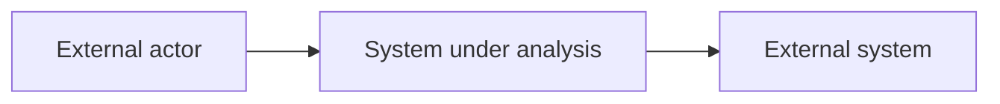
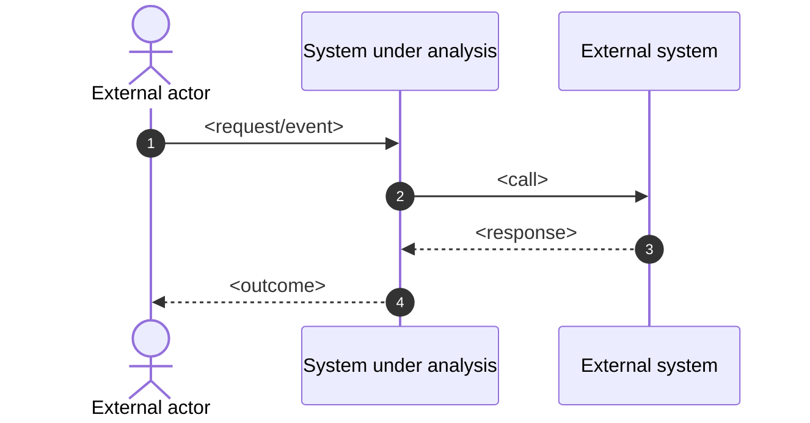

# Systems Analysis Template

> Use this template to capture project-level systems analysis after `./docs/business-requirements.md` is drafted/approved and before creating any `./docs/00x-work/` work packages.
>
> This document refines business requirements into system boundary/context, key domain concepts, use cases, business rules, analysis-level requirements, and quality attributes. It must remain implementation-agnostic.

## 1. Summary

- **Project**: <short name>
- **Document**: `./docs/systems-analysis.md`
- **Owner**: <name/team>
- **Date**: <yyyy-mm-dd>
- **Status**: <draft|review|approved>
- **Inputs**:
  - `./docs/business-requirements.md`
- **Outputs**:
- Work packages under `./docs/00x-work/` with `requirements.md`, `technical-specification.md`, and numbered plan files under `plans/`

### 1.1 Links

| Document | Path |
| --- | --- |
| Business requirements | `./docs/business-requirements.md` |
| Systems analysis | `./docs/systems-analysis.md` |

## 2. System Overview

### 2.1 Problem statement

<Concise restatement of the problem/opportunity and why this system exists.>

### 2.2 System boundary

| Item | In scope | Notes |
| --- | --- | --- |
| <capability/boundary item> | Yes/No | <notes> |

### 2.3 Key assumptions

- <assumption>

### 2.4 Architectural decisions (analysis-level)

Remove this section if not used.

Use `AD1`, `AD2`, ... for analysis-level architectural decisions.
These decisions capture system-level behavioral constraints and invariants that are expected to influence multiple work packages.
They must remain implementation-agnostic.

| ID | Decision | Rationale | Related UC IDs | Related SAR IDs | Notes |
| --- | --- | --- | --- | --- | --- |
| AD1 | <decision statement> | <why> | <UCx list> | <SARx list> | <optional> |

## 3. Context and External Interactions

### 3.1 Actors and external systems catalog

| ID | Name | Type (Actor/System) | Purpose | Information exchanged | Notes |
| --- | --- | --- | --- | --- | --- |
| ES1 | <name> | <Actor/System> | <purpose> | <information> | <optional> |

### 3.2 Context diagram (optional)

Remove this section if not used.

### 3.3 Interaction diagrams (optional)

Remove this section if not used.

Use this section to document analysis-level interactions for high-risk or high-ambiguity use cases.
Diagrams SHOULD focus on system boundary interactions and cross-cutting concerns (for example: authentication/session continuity, market data freshness gating, order submit/confirm traceability, risk stops, and notifications).
Diagrams MUST remain implementation-agnostic (avoid internal component design and deployment topology).

## 4. Domain Concepts

### 4.1 Glossary

| Term | Definition |
| --- | --- |
| <term> | <definition> |

### 4.2 Domain entities (conceptual)

| Entity | Description | Key attributes (conceptual) | Notes |
| --- | --- | --- | --- |
| <entity> | <description> | <attributes> | <optional> |

## 5. User Journeys and Use Cases

Use `UC1`, `UC2`, ... for use cases.

| ID | Primary actor | Goal | Trigger | Main success outcome | Exceptions / failure outcomes | Related BR IDs | Priority |
| --- | --- | --- | --- | --- | --- | --- | --- |
| UC1 | <actor> | <goal> | <trigger> | <outcome> | <exceptions> | <BRx list> | <Must|Should|Could|Won't> |

## 6. Business Rules

Use `RULE1`, `RULE2`, ... for business rules.

| ID | Rule statement | Rationale | Related UC IDs | Related BR IDs | Notes |
| --- | --- | --- | --- | --- | --- |
| RULE1 | <rule> | <why> | <UCx list> | <BRx list> | <optional> |

## 7. Analysis-level Requirements

Use `SAR1`, `SAR2`, ... for system analysis requirements. These should be business-testable and describe what the system must do, without prescribing implementation.

| ID | Requirement | Acceptance criteria (business-testable) | Related UC IDs | Related BR IDs | Priority | Notes |
| --- | --- | --- | --- | --- | --- | --- |
| SAR1 | <requirement> | <criteria> | <UCx list> | <BRx list> | <Must|Should|Could|Won't> | <optional> |

## 8. Quality Attributes (non-functional)

Use `NFR1`, `NFR2`, ... for quality attributes.

| ID | Category | Requirement | Target | How it will be assessed | Related BR IDs | Priority | Notes |
| --- | --- | --- | --- | --- | --- | --- | --- |
| NFR1 | <Security/Performance/Availability/etc> | <requirement> | <target> | <assessment> | <BRx list> | <Must|Should|Could|Won't> | <optional> |

## 9. Data, Audit, and Reporting Needs (analysis-level)

### 9.1 Records to retain

| Record type | Purpose | Retention need | Source of truth | Notes |
| --- | --- | --- | --- | --- |
| <record> | <purpose> | <retention> | <source> | <optional> |

### 9.2 Reporting needs

| Report/Metric | Purpose | Audience | Frequency | Notes |
| --- | --- | --- | --- | --- |
| <item> | <purpose> | <audience> | <frequency> | <optional> |

## 10. Operational Scenarios

| Scenario | Desired behavior | Success criteria | Notes |
| --- | --- | --- | --- |
| <scenario> | <behavior> | <criteria> | <optional> |

## 11. Risks, Dependencies, and Open Questions

### 11.1 Risks

- <risk>
  - **Mitigation**: <mitigation>

### 11.2 Dependencies

- <dependency>

### 11.3 Open questions

- <question>

## 12. Work Package Candidates

List candidate work packages suggested by this analysis. Keep these as outcomes/capabilities, not implementation tasks.

| Candidate work package | Summary | Related BR IDs | Related UC IDs | Related SAR IDs | Related NFR IDs | Notes |
| --- | --- | --- | --- | --- | --- | --- |
| <00x-name> | 
 | <BRx list> | <UCx list> | <SARx list> | <NFRx list> | <optional> |
