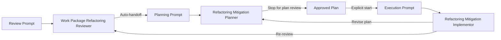

# HVE Agent Recommendations for the Refactoring Workflow

This document recommends a set of new agents for the existing refactoring review, mitigation planning, and mitigation execution workflow. The goal is to keep the current workflow shape intact while adopting the main HVE ideas: prompts as entry points, agents as orchestrators, bounded subagent delegation, and durable workflow artifacts. It also recommends that the Review and Planning stages run as one uninterrupted flow, while the process pauses after the mitigation plan is created so that the plan can be checked before any implementation begins.

## Why New Agents Are Worth Adding

The current workflow is already well structured at the prompt level:

1. Review a work package refactoring approach.
2. Plan mitigation for the findings.
3. Execute the mitigation plan.

That sequence already mirrors the HVE idea of separating discovery, planning, and execution. The main gap is that the current prompts are still centered on one general agent rather than a purpose-built agent system with explicit orchestration boundaries.

Adopting an HVE-style agent design would improve:

- consistency of tool usage
- reuse of intermediate artifacts
- cleaner handoff between review, planning, and execution
- automatic continuation from review into planning without a manual restart
- an explicit human approval gate before execution starts
- bounded delegation for evidence gathering and validation
- resilience when context grows large across multi-step refactoring work

## Recommended HVE-Aligned Shape

The recommended model is:

1. Keep the existing prompts as the user-facing workflow entry points.
2. Replace the generic prompt target agent with specialized agents.
3. Automatically continue from review into mitigation planning when the review completes successfully.
4. Stop after the mitigation plan is created so the user can review and approve it.
5. Add internal subagents for the repeated narrow tasks inside review, planning, and execution.
6. Use durable artifacts as the source of truth between phases instead of relying on chat context.

In other words, the prompts should continue to answer what the user wants to do, while the agents answer how that work should be carried out. The main workflow change is that review and planning should feel like one connected stage, while execution remains a separate, explicitly approved stage.

## Recommended Automation Boundary

The strongest automation boundary is between planning and execution, not between review and planning.

Recommended behavior:

1. The user starts the review workflow.
2. The review agent completes its findings and writes the review report.
3. The workflow automatically hands off into the mitigation planning agent.
4. The planning agent creates the mitigation plan and writes it to the work package.
5. The workflow stops and presents the completed plan for review.
6. Execution starts only after the user explicitly resumes with the execution prompt or an execution handoff.

This preserves human control at the highest-risk transition point: the move from approved plan to code changes.

## Mapping the Existing Workflow to HVE

The current prompts map cleanly to an HVE-style workflow, with one important adjustment: the review and planning prompts should behave as one continuous upstream flow, while the execution prompt remains a deliberate downstream start point.

### Existing Review Prompt

The current review prompt should target a dedicated review agent rather than a general agent. That review agent should normally hand off directly into planning without requiring a separate user restart.

Recommended target agent:

- Work Package Refactoring Reviewer

### Existing Planning Prompt

The current mitigation planning prompt should target a dedicated planning agent. In the automated flow, this planning prompt is primarily used as the handoff destination from review or as a manual re-entry point when planning needs to be rerun.

Recommended target agent:

- Refactoring Mitigation Planner

### Existing Execution Prompt

The current mitigation execution prompt should target a dedicated implementation agent. Unlike review and planning, execution should not start automatically after planning.

Recommended target agent:

- Refactoring Mitigation Implementor

## Recommended Top-Level Agents

### Work Package Refactoring Reviewer

This agent should own the review workflow currently described by the review prompt.

Primary responsibilities:

- read the work-package requirements and technical specification
- inspect existing numbered plan files when relevant
- locate the related implementation and safety-net tests
- evaluate maintainability, cohesion, coupling, duplication, and testability
- produce a physical refactoring review report in the work package
- assign stable finding identifiers such as F1, F2, and F3

Why it fits HVE:

- it is a dedicated review orchestrator
- it creates a durable artifact that becomes the next phase input
- it can delegate evidence gathering to narrow read-only subagents

Recommended handoffs:

- label: Plan Mitigation
- target: Refactoring Mitigation Planner
- prompt: `/plan-refactoring-mitigation`

Automation note:

- this handoff should normally auto-send so review flows directly into planning
- the reviewer should treat plan creation as the default next step unless the review is blocked

### Refactoring Mitigation Planner

This agent should own the mitigation planning workflow currently described by the planning prompt.

Primary responsibilities:

- load the refactoring review report
- read the work-package requirements and technical specification
- inspect existing plans for sequencing and numbering context
- group findings into mitigation themes
- create a new numbered mitigation plan file
- define work items, checklists, validation gates, rollback guidance, and behavior-preservation boundaries

Why it fits HVE:

- it translates evidence into an execution-ready artifact
- it narrows planning to one job rather than mixing planning and implementation
- it can delegate validation-command discovery and scope confirmation to bounded helpers

Recommended handoffs:

- label: Review More
- target: Work Package Refactoring Reviewer
- prompt: `/review-refactoring-approach`

Stop behavior:

- when planning completes, the agent should stop and present the created mitigation plan
- it should not auto-handoff into implementation
- execution should remain pending explicit user approval

Recommended handoffs:

- label: Execute Mitigation
- target: Refactoring Mitigation Implementor
- prompt: `/execute-refactoring-mitigation`
- send: false

### Refactoring Mitigation Implementor

This agent should own the implementation workflow currently described by the execution prompt.

Primary responsibilities:

- locate and read the numbered mitigation plan
- establish the baseline validation gate
- execute work items in order
- update plan checkboxes progressively
- run required build and test gates before and after each work item
- keep related documentation aligned when the plan requires it
- stop only on real blockers or unresolved scope decisions

Why it fits HVE:

- it is an implementation orchestrator rather than a general-purpose coder
- it executes from a durable plan artifact
- it can use phase-bounded subagents for local refactoring tasks and focused validation

Recommended handoffs:

- label: Review Result
- target: Work Package Refactoring Reviewer
- prompt: `/review-refactoring-approach`
- label: Revise Plan
- target: Refactoring Mitigation Planner
- prompt: `/plan-refactoring-mitigation`

Entry rule:

- this agent should start only from explicit user action or an explicit execution handoff after plan review

## Recommended Internal Subagents

The biggest improvement from an HVE perspective is not only the top-level agents. It is the addition of narrow subagents that handle repeated specialist work.

### Scope-to-Implementation Mapper

Purpose:

- map work-package artifacts to likely implementation files and test files
- identify the minimum code surface needed for review or planning

Best used by:

- Work Package Refactoring Reviewer
- Refactoring Mitigation Planner

Why it helps:

- it keeps repository scanning bounded
- it produces a repeatable scope discovery step

### Refactoring Evidence Collector

Purpose:

- gather evidence for maintainability findings
- identify specific files, symbols, duplicate logic, coupling points, and test gaps

Best used by:

- Work Package Refactoring Reviewer

Why it helps:

- it separates evidence collection from judgment
- it makes findings easier to justify and reuse

### Validation Command Resolver

Purpose:

- infer explicit build, test, and lint commands from the repository and work-package context
- fall back to repo-root defaults when commands cannot be inferred precisely

Best used by:

- Refactoring Mitigation Planner
- Refactoring Mitigation Implementor

Why it helps:

- it avoids re-deriving validation gates in every plan
- it standardizes how cross-cutting validation is populated

### Mitigation Phase Implementor

Purpose:

- execute one mitigation work item or one bounded implementation slice
- report files changed, validation run, blockers, and additional follow-up tasks

Best used by:

- Refactoring Mitigation Implementor

Why it helps:

- it mirrors HVE's phase implementor pattern
- it keeps implementation delegation local and controlled

### Test Safety-Net Reviewer

Purpose:

- inspect whether an upcoming refactor has adequate lower-level or behavior-preserving tests
- identify where test comments need stronger requirement traceability and rationale

Best used by:

- Work Package Refactoring Reviewer
- Refactoring Mitigation Planner
- Refactoring Mitigation Implementor

Why it helps:

- it aligns strongly with the existing workflow's emphasis on safe refactoring
- it reduces the risk of under-tested structural changes

### Wiki Impact Assessor

Purpose:

- determine whether a mitigation item affects architecture, local development guidance, testing guidance, or runtime behavior documented in `docs/wiki/`
- recommend the minimum wiki updates required

Best used by:

- Refactoring Mitigation Planner
- Refactoring Mitigation Implementor

Why it helps:

- it turns the existing wiki-update requirement into a deliberate, repeatable decision step

## Recommended Artifact Strategy

To align more closely with HVE, the agent system should use durable artifacts as phase inputs and outputs.

Recommended durable artifacts:

- work-package refactoring review report
- numbered mitigation plan
- mitigation execution notes or changes log
- validation results summary when execution spans multiple work items

The current workflow already persists the two most important artifacts:

- review report
- mitigation plan

The main addition worth considering is a lightweight execution log for the mitigation implementor. That log would make long-running implementation sessions easier to resume and review.

## Recommended Handoff Flow

The top-level handoff flow should look like this:

This preserves the existing workflow while making the orchestration responsibilities explicit. It also makes the review-to-plan transition automatic and the plan-to-execution transition deliberate.

## Recommended Agent Responsibilities by Prompt

### For Review a Work Package Refactoring Approach

Recommended agent change:

- replace the generic `agent` target with `Work Package Refactoring Reviewer`

Recommended agent behavior:

- orchestrate only review work
- delegate bounded evidence gathering
- write the physical review report
- auto-handoff to mitigation planning when the review is complete and not blocked

### For Plan Mitigation for a Work Package Refactoring Review

Recommended agent change:

- replace the generic `agent` target with `Refactoring Mitigation Planner`

Recommended agent behavior:

- orchestrate only planning work
- validate plan numbering and artifact placement
- reuse review finding identifiers directly
- stop after writing the mitigation plan
- expose an execution handoff without auto-starting implementation

### For Execute a Work Package Refactoring Mitigation Plan

Recommended agent change:

- replace the generic `agent` target with `Refactoring Mitigation Implementor`

Recommended agent behavior:

- orchestrate only plan execution
- reuse recent successful validation gates when allowed by the plan
- update checklist state progressively
- expose handoffs back to review and planning when execution reveals gaps

Execution gating note:

- this agent should be intentionally decoupled from plan completion so the user can inspect and approve the mitigation plan first

## Suggested First Agent Set

If the goal is to introduce HVE ideas incrementally rather than redesign everything at once, the best initial set is:

1. Work Package Refactoring Reviewer
2. Refactoring Mitigation Planner
3. Refactoring Mitigation Implementor
4. Validation Command Resolver
5. Mitigation Phase Implementor

This set gives the biggest architectural improvement with the smallest change surface.

## Suggested Second-Wave Additions

After the first agent set is stable, the next useful additions are:

1. Scope-to-Implementation Mapper
2. Refactoring Evidence Collector
3. Test Safety-Net Reviewer
4. Wiki Impact Assessor

These are more specialized and improve precision, but they are not required to get the core HVE orchestration benefits.

## Practical Recommendation

The best path is not to replace the current workflow. The best path is to preserve the current three-prompt flow and attach purpose-built HVE-style agents behind it.

That means:

- keep the prompts because they are already strong workflow entry points
- add top-level agents that match the three prompt purposes exactly
- let the review agent auto-continue into planning
- stop automatically once the planning agent has produced the mitigation plan
- add a small set of bounded subagents for evidence gathering, validation discovery, and phase implementation
- add at least one durable execution artifact so the execution phase becomes easier to resume and audit

This would keep the workflow familiar while bringing it much closer to the HVE model described in the earlier process note.

## Summary Recommendation

Based on the existing workflow and the HVE model, the most appropriate new agents are:

- Work Package Refactoring Reviewer
- Refactoring Mitigation Planner
- Refactoring Mitigation Implementor
- Scope-to-Implementation Mapper
- Refactoring Evidence Collector
- Validation Command Resolver
- Mitigation Phase Implementor
- Test Safety-Net Reviewer
- Wiki Impact Assessor

The three top-level agents should map directly to the three existing prompts. The remaining agents should be internal helpers that keep discovery, planning, implementation, and validation bounded and reusable.

The key workflow refinement is that Review and Planning should act as one continuous upstream process, while Execution should remain a downstream phase that begins only after the plan has been explicitly checked.