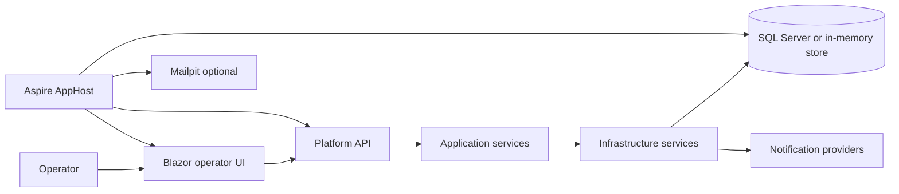

# Application overview

This document explains the implemented application at a high level so a developer or reviewer can quickly understand its current purpose, boundaries, and major moving parts.

## Purpose

TNC Trading Platform is currently a foundation for safe environment selection, operator-managed configuration, auth-state supervision, and operator visibility.

The implemented application is focused on:

- showing the active platform and broker environment
- storing operator-managed configuration durably
- protecting IG credentials through write-only update flows
- exposing current runtime and retry state through an API and Blazor UI
- recording operational and notification history
- preparing the platform for later broker, market-data, and trading features

## What is implemented today

### Delivered capabilities

- Aspire-based local orchestration through `src/TNC.Trading.Platform.AppHost`
- Blazor Server operator UI through `src/TNC.Trading.Platform.Web`
- Minimal API backend through `src/TNC.Trading.Platform.Api`
- shared observability and health defaults through `src/TNC.Trading.Platform.ServiceDefaults`
- application services for platform configuration, schedule gating, runtime state, and auth supervision
- SQL Server persistence when a `platformdb` connection string is available
- in-memory persistence fallback when no SQL connection string is available
- protected credential storage using ASP.NET Core Data Protection
- operational event recording and notification recording
- retry-state tracking, retry-limit handling, and manual retry initiation
- local notification validation through Mailpit when infrastructure containers are enabled

### Important current limitation

The platform does not yet perform real IG authentication, price streaming, instrument discovery, order execution, or strategy automation.

Instead, the current codebase models and exposes the operational control plane needed before those features are added:

- configuration state
- schedule state
- credential presence
- auth degradation and recovery state
- retry policy and retry-cycle visibility
- notification and audit records

## Solution projects

| Project | Role |
| --- | --- |
| `src/TNC.Trading.Platform.AppHost` | Aspire composition root for local development. Starts the API and Blazor UI, and optionally SQL Server and Mailpit. |
| `src/TNC.Trading.Platform.Api` | HTTP service that exposes platform status, configuration, event history, manual retry, and metadata endpoints. |
| `src/TNC.Trading.Platform.Web` | Blazor Server operator UI for status and configuration management. |
| `src/TNC.Trading.Platform.Application` | Application-level models, feature handlers, runtime coordination, retry policy logic, and schedule evaluation. |
| `src/TNC.Trading.Platform.Infrastructure` | Persistence, credential protection, notification providers, retention processing, and configuration storage. |
| `src/TNC.Trading.Platform.ServiceDefaults` | Shared health, service discovery, resilience, and OpenTelemetry defaults. |
| `test/*` | Unit, integration, functional, and end-to-end test suites. |

## Current system context

## Core platform concepts

### Platform environment

The platform environment is either `Test` or `Live`.

It influences whether the broker `Live` option is actually available. In the current implementation:

- the `Live` broker option is always visible
- the `Live` broker option is blocked when the platform environment is `Test`

### Broker environment

The broker environment is either `Demo` or `Live`.

The current implementation is intentionally foundation-only. It records and validates this choice, but does not yet connect to real IG services.

### Trading schedule

The trading schedule controls when the platform considers broker connectivity to be active.

It includes:

- start of day
- end of day
- trading days
- weekend behavior
- bank-holiday exclusions
- time zone

### Auth state

The auth state expresses the current platform operating condition for broker-connected features.

The main states exposed today are:

- `Active`
- `Degraded`
- `OutOfSchedule`
- `Blocked`
- `Unknown`

### Retry state

When the platform is degraded during an active schedule, it tracks:

- retry phase
- automatic attempt number
- next retry time
- whether the retry limit has been reached
- whether manual retry is available

## Current user experience

The operator UI currently has two main pages:

- `/status` shows environment, trading schedule, auth state, retry state, and recent auth events
- `/configuration` shows editable configuration, secret-presence indicators, and write-only credential update fields

See [Operator guide](operator-guide.md) for full behavior details.

## Persistence overview

The current implementation persists or models the following record types:

- platform configuration
- protected credentials
- auth runtime state
- auth retry cycles
- operational events
- configuration audits
- notification records

See [Architecture](architecture.md) and [Runtime behavior](runtime-behavior.md) for more detail.

## What is intentionally not in scope yet

The following capabilities are planned at the product level but are not implemented in the application today:

- real IG session establishment
- market-data acquisition and freshness enforcement
- tracked instruments
- strategy execution
- order submission and trade lifecycle management
- end-of-day position flattening
- risk controls beyond environment and auth safety rules

## Recommended next reading

- [Architecture](architecture.md)
- [Operator guide](operator-guide.md)
- [Runtime behavior](runtime-behavior.md)
