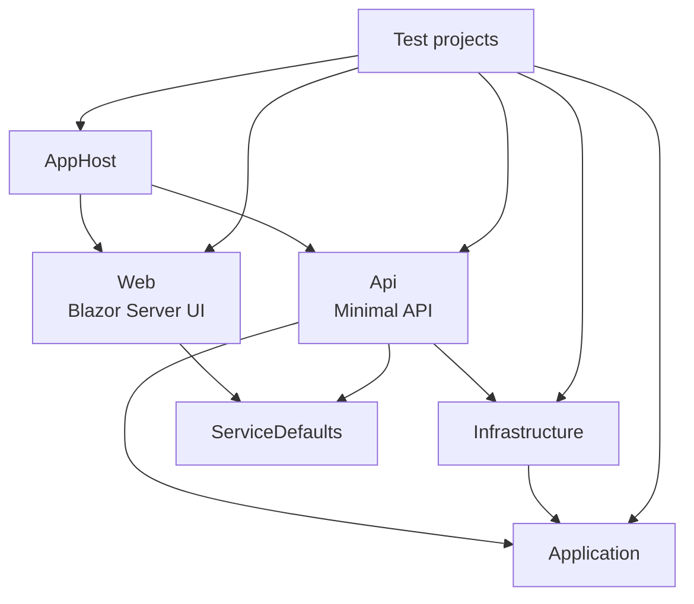
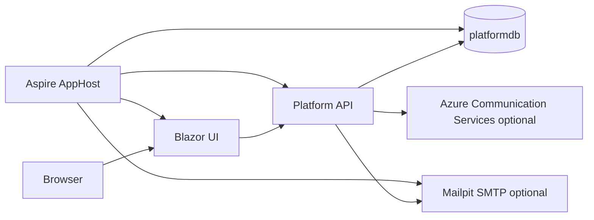
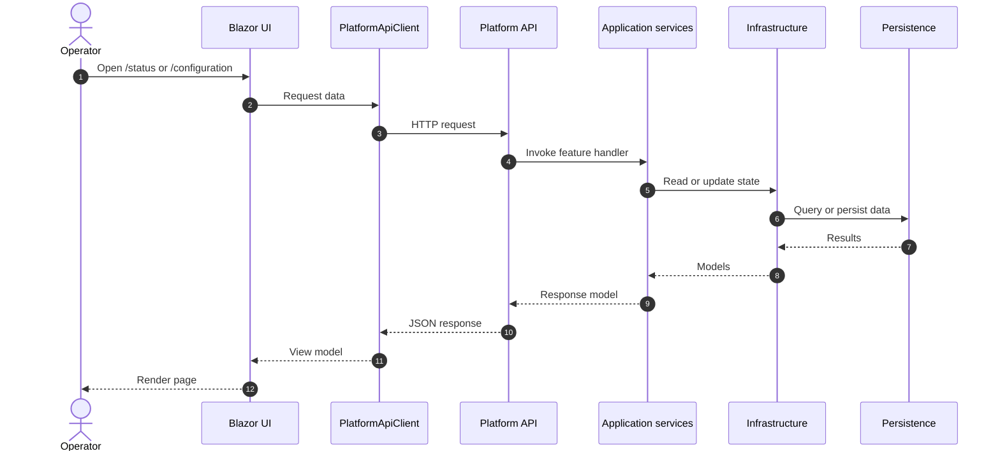
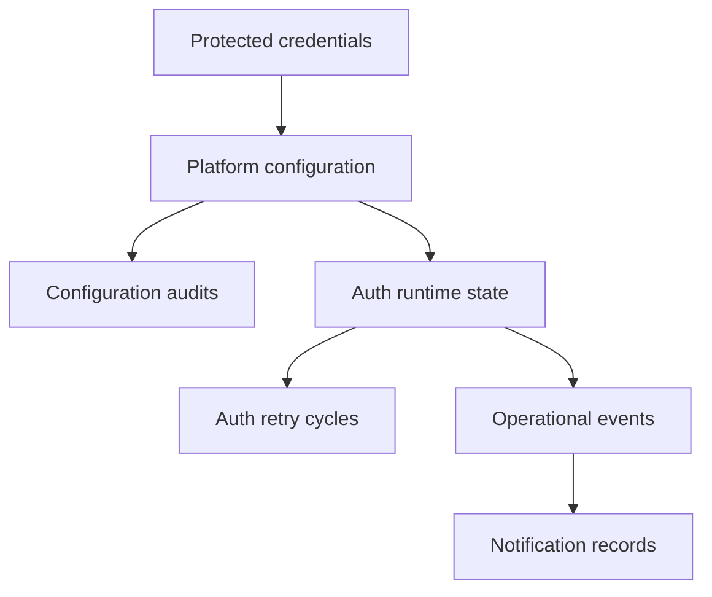

# Architecture

This document describes the implemented architecture of the current solution, including project boundaries, runtime topology, request flow, and persistence responsibilities.

## Architectural style

The solution currently uses a small distributed-application layout:

- Aspire AppHost composes local services
- a Minimal API hosts the control-plane backend
- a Blazor Server app provides the operator UI
- application and infrastructure concerns are split into separate projects
- feature endpoints in the API remain thin and delegate to application handlers

## Solution structure

## Runtime topology

### Local default topology

When infrastructure containers are not enabled:

- AppHost starts the API and Blazor UI
- the API uses the in-memory Entity Framework provider
- notification transports that need external configuration are skipped

### Container-assisted topology

When `AppHost:EnableInfrastructureContainers=true`:

- AppHost starts SQL Server
- AppHost creates the `platformdb` database
- AppHost starts Mailpit for local SMTP capture
- the API receives the SQL connection string and SMTP settings through environment variables

## Request and interaction flow

### Operator UI flow

The Blazor UI talks to the API through `PlatformApiClient`.

- `/status` loads platform status and recent auth events
- `/configuration` loads the active configuration and submits updates
- manual retry posts to the API and then refreshes status

## API composition

The API entry point keeps startup thin:

- registers service defaults, data protection, application services, infrastructure services, and validators
- ensures the database exists
- applies startup configuration
- applies retention processing
- performs an initial coordinator tick
- maps platform endpoints and health endpoints

The endpoint group under `/api/platform` is the current backend surface for operator workflows.

## Application-layer responsibilities

The `TNC.Trading.Platform.Application` project contains:

- configuration and runtime models
- feature request and response types
- feature handlers for status, configuration, events, and manual retry
- `TradingScheduleGate` for in-schedule evaluation
- `PlatformStateCoordinator` for current-state orchestration
- `PlatformAuthSupervisor` as the background loop that repeatedly ticks runtime state

### Coordinator responsibilities

`PlatformStateCoordinator` is the central runtime decision-maker. It:

- reads current configuration and runtime state
- evaluates the trading schedule
- applies blocked-live rules
- reacts to missing credentials
- updates retry state
- records operational events
- dispatches notification workflows
- exposes status and event read models

## Infrastructure responsibilities

The `TNC.Trading.Platform.Infrastructure` project contains:

- Entity Framework Core persistence
- Data Protection-backed credential storage
- SQL-backed configuration storage
- runtime-state storage
- retry-cycle storage
- operational-event storage
- notification providers
- retention processing for operational records

## Persistence model

The current `PlatformDbContext` stores these entities:

| Entity | Purpose |
| --- | --- |
| `PlatformConfigurationEntity` | Current operator-managed configuration snapshot. |
| `ProtectedCredentialEntity` | Protected IG credential values by broker environment and credential type. |
| `AuthRuntimeStateEntity` | Current runtime auth and retry projection. |
| `AuthRetryCycleEntity` | Retry-cycle tracking and scheduling metadata. |
| `OperationalEventEntity` | Append-style operational event history. |
| `ConfigurationAuditEntity` | Auditable record of configuration changes. |
| `NotificationRecordEntity` | Recorded notification dispatch outcomes. |

### Persistence relationships by responsibility

## Security and secret handling architecture

The current implementation keeps secret handling separate from normal configuration reads.

- non-secret configuration is returned through the API
- secret values are never returned after they are saved
- credential presence is exposed only as booleans
- `ProtectedCredentialService` encrypts stored secret material using Data Protection
- audit and event payloads are redacted before persistence

## Observability architecture

The `ServiceDefaults` project provides shared cross-cutting behavior for the API and web app:

- OpenTelemetry logging
- metrics and tracing instrumentation
- service discovery and standard HTTP resilience
- liveness endpoint at `/health/live`
- readiness endpoint at `/health/ready`

Health endpoint paths are configurable, but the default paths are used by this solution.

## Current architectural trade-offs

### Chosen trade-offs

- the auth control plane lives in the API instead of a dedicated worker service
- the operator UI uses Blazor Server to keep implementation simpler at this stage
- a single current configuration row is used rather than a more complex versioned configuration model
- in-memory persistence is allowed for lightweight local execution when SQL is not configured

### Consequences

- the current application is easy to run and test locally
- control-plane behavior is well covered before broker integrations are added
- some responsibilities are intentionally centralized in the coordinator until more domain features exist
- later work may split background supervision or broker integration into dedicated services

## Related documents

- [Application overview](application-overview.md)
- [Operator guide](operator-guide.md)
- [Runtime behavior](runtime-behavior.md)
- [API reference](api-reference.md)
