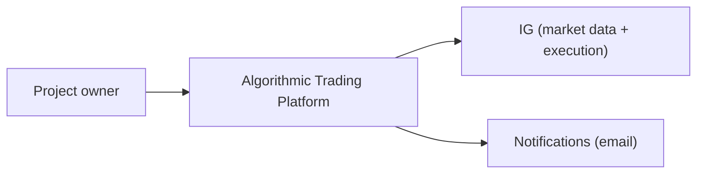
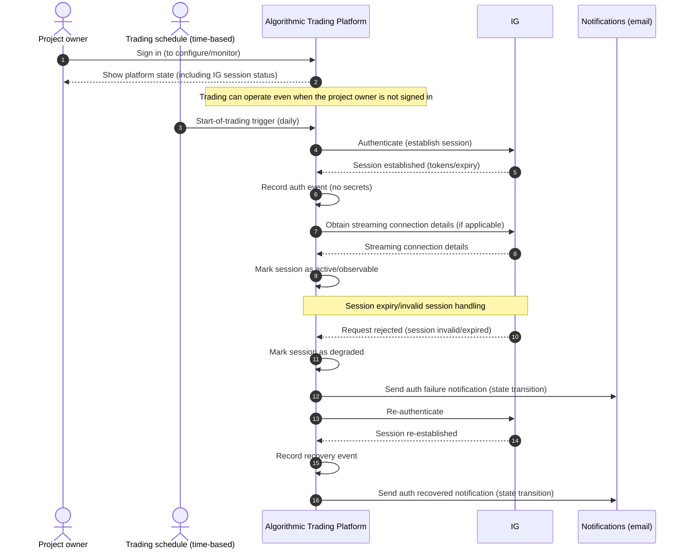
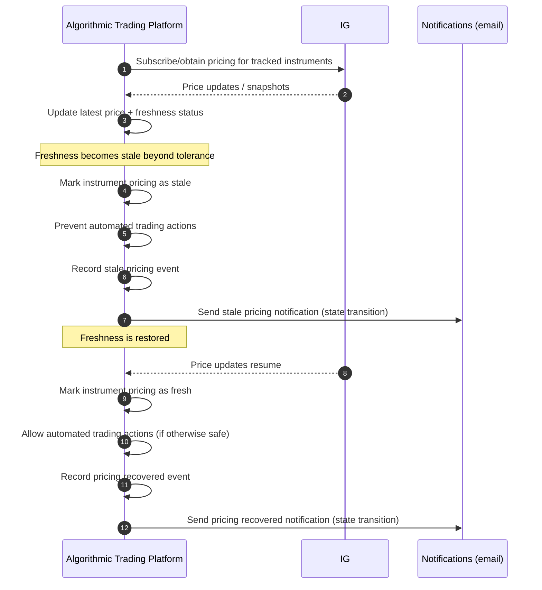
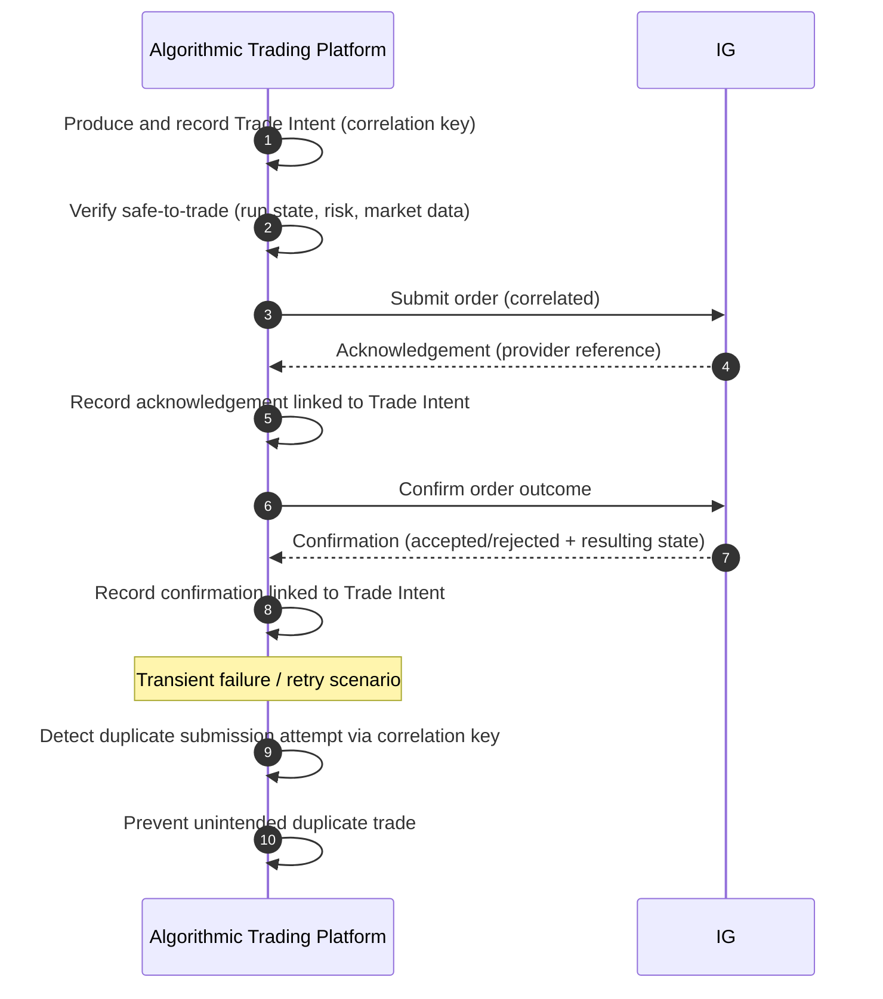
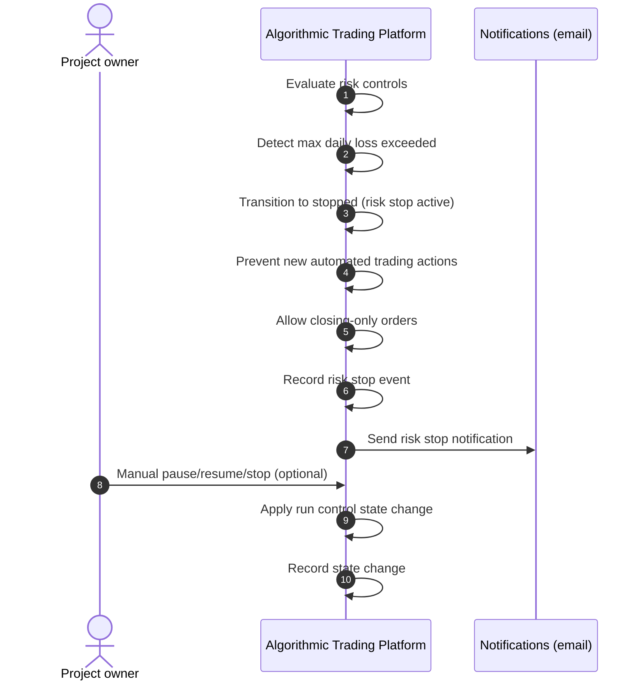

# Systems Analysis

This document captures project-level systems analysis for the Algorithmic Trading Platform. It refines `./docs/business-requirements.md` into a clear system boundary, external interactions, core use cases, business rules, analysis-level requirements, and quality attributes. It is intended to be implementation-agnostic and to guide decomposition into `./docs/00x-work/` work packages.

## 1. Summary

- **Project**: Algorithmic Trading Platform
- **Document**: `./docs/systems-analysis.md`
- **Owner**: TNC Trading
- **Date**: 2026-03-06
- **Status**: draft
- **Inputs**:
  - `./docs/business-requirements.md`
- **Outputs**:
  - Work packages under `./docs/00x-work/` with `requirements.md`, `technical-specification.md`, and `delivery-plan.md`

### 1.1 Links

| Document | Path |
| --- | --- |
| Business requirements | `./docs/business-requirements.md` |
| Systems analysis | `./docs/systems-analysis.md` |

## 2. System Overview

### 2.1 Problem statement

Create a profit-generating internal platform for TNC Trading that enables safe, resilient algorithmic trading against `IG`, including market data ingestion, strategy operation, order placement/management, and business-level risk controls. The Test platform environment is demo-only for trade execution.

### 2.2 System boundary

| Item | In scope | Notes |
| --- | --- | --- |
| Select and operate against the intended `IG` environment (demo or live) | Yes | Must include safeguards to reduce accidental live trading (`BR1`). In the Test platform environment, `IG` live is shown as unavailable; in the Live platform environment, switching between `IG` demo and live is allowed. |
| Authenticate to `IG` and maintain session continuity | Yes | Applies to sustained operation (`BR2`). |
| Browse, select, and manage tracked instruments | Yes | Initial release supports `FX` and `Indices` via `IG` (`BR4`). |
| Obtain timely market data for tracked instruments | Yes | Must prevent trading when pricing is stale/unavailable (`BR5`). |
| Define and operate automated trading strategies | Yes | Strategy lifecycle + observable running status (`BR6`). |
| Place and manage orders required by strategies | Yes | Submit/amend/cancel/confirm outcomes (`BR9`). |
| Configure and enforce business-level risk controls | Yes | Reject trades breaching controls (`BR7`). |
| Provide run controls (pause, resume, stop) | Yes | Prevent automated trading while paused/stopped (`BR8`). |
| Intraday-only operating model | Yes | Positions must be flattened end-of-day; no overnight positions. |
| Hold positions overnight | No | Out of scope per operating model decision. |
| Execute trades in `IG` live environment | No | Initial release is demo-only for execution. In the Test platform environment, `IG` live is unavailable. Live execution may be enabled in a future release in the Live platform environment with explicit safeguards. |
| Monitoring, reporting, and audit trail for personal/internal review | Yes | Operational visibility + traceability (`BR10`, `BR11`, `BR13`). |
| External customers and multi-tenant commercial offering | No | Initial release is not intended for external customers. |
| Manual/discretionary trading workflows or manual trading UX | No | Out of scope for initial release. |

### 2.3 Key assumptions

- An `IG` demo account exists and is available for use.
- Trading strategies will be developed and proven before being relied upon.

### 2.4 Architectural decisions (analysis-level)

Use `AD1`, `AD2`, ... for analysis-level architectural decisions.
These decisions capture system-level behavioral constraints and invariants that are expected to influence multiple work packages.
They must remain implementation-agnostic.

| ID | Decision | Rationale | Related UC IDs | Related SAR IDs | Notes |
| --- | --- | --- | --- | --- | --- |
| AD1 | Treat automated trading as a stateful operation with explicit run state (running/paused/stopped) and safety stops; trading actions are prevented when unsafe. | Provides predictable and testable safety behavior during abnormal conditions and manual intervention. | UC8, UC6, UC4, UC7 | SAR5, SAR3, SAR9 | “Unsafe” includes stale market data, risk stops, and session/auth failures. |
| AD2 | Treat order placement as a two-step lifecycle (submit then confirm) with end-to-end correlation from trade intent through provider acknowledgement/confirmation and resulting state. | Supports traceability, reconciliation, and safe recovery after transient failures without unintended duplicates. | UC6, UC9 | SAR4 | Correlation keys are required to de-duplicate repeated submissions. |
| AD3 | Prefer event-style recording of notable operational state transitions (for example fresh↔stale, throttled↔recovered, auth failure↔recovered, stop↔resume) and notify primarily on those transitions. | Reduces noise while preserving an audit trail that explains why behavior changed over time. | UC4, UC10, UC2, UC8 | SAR6 | Per-event duplicate suppression remains configurable where needed (for example order rejections). |
| AD4 | Enforce market data freshness gating as a prerequisite for any automated trading action. | Prevents unsafe trading when current pricing is unavailable or stale. | UC4, UC6 | SAR3 | Freshness tolerance is configurable with a default of 5 seconds. |

## 3. Context and External Interactions

### 3.1 Actors and external systems catalog

| ID | Name | Type (Actor/System) | Purpose | Information exchanged | Notes |
| --- | --- | --- | --- | --- | --- |
| ES1 | Project owner (you) | Actor | Define, operate, and monitor automated trading | Strategy definitions, configuration choices, run controls, review of reports | Single-user personal/internal use. |
| ES2 | `IG` | System | Provide market data and trade execution capabilities | Authentication/session, instrument catalog, pricing (including streaming), order and trade lifecycle events | Demo and live environments are distinct and require safeguards (`BR1`). |
| ES3 | Notifications channel (email) | System | Deliver operational alerts to the project owner | Alert messages (event type, timestamp, summary) | Email notifications. Initial events: safety stops, session/auth failures, stale market data, provider throttling/rate-limit events, and order rejections. |

### 3.2 Context diagram (optional)

### 3.3 Interaction diagrams (optional)

These diagrams illustrate key interactions at the system boundary for high-risk or high-ambiguity use cases.
They are intentionally conceptual (analysis-level) and avoid internal component design.

#### 3.3.1 Authenticate and maintain session continuity (UC2)

#### 3.3.2 Maintain timely market data and enforce freshness gating (UC4, RULE1, SAR3)

#### 3.3.3 Trade intent to provider confirmation with traceability and de-duplication (UC6, SAR4)

#### 3.3.4 Risk stop and run controls interaction (UC7, UC8, RULE8, SAR9)

## 4. Domain Concepts

### 4.1 Glossary

| Term | Definition |
| --- | --- |
| Algorithmic trading | Automated trading driven by a defined strategy. |
| Strategy | A defined set of rules that produces trade decisions from market data. |
| Tracked instrument | An instrument explicitly selected for monitoring and potential trading. |
| Market data | Current pricing for tracked instruments with an observable freshness/availability status. |
| Daily loss | Realized + unrealized P&L (mark-to-market) accumulated over the current trading day, excluding fees/commissions; resets at midnight UTC. |
| Trade intent | A recorded decision to place/modify/cancel an order based on strategy output. |
| Order | A submitted instruction to `IG` that can be accepted, rejected, amended, cancelled, or completed. |
| Position | The resulting exposure after order execution (for example an opened or closed trade). |
| Risk control | A business rule that prevents unacceptable trading behavior (for example rejecting trades). |
| Environment | The `IG` demo or live context that determines endpoints and separation of configuration and records. |
| Platform environment | The deployment environment for the platform (Test or Live) that constrains which `IG` environments can be selected. |
| Audit trail | Records sufficient for personal/internal review of decisions, actions, and outcomes. |

### 4.2 Domain entities (conceptual)

| Entity | Description | Key attributes (conceptual) | Notes |
| --- | --- | --- | --- |
| Environment | Selected operating context | Demo/Live, selection timestamp, change reason | Must be observable and separated (`BR1`). |
| Credential/secret | Access material to authenticate | Identifier, rotation history | Must be protected (`BR12`). |
| Session | Authenticated continuity to `IG` | Status, expiry, last refresh, related environment | Must be observable (`BR2`). |
| Instrument | Tradable item | Symbol/epic, asset class, status | Initial release supports `FX` and `Indices` (`BR4`). |
| TrackedInstrument | Instrument selected for monitoring | Enabled/disabled, since, status | Persisted set (`BR4`). |
| PriceSnapshot | Market data point | Bid/ask, timestamp, staleness indicator | Used for freshness gating (`BR5`). |
| Strategy | Automated decision logic | Name, status, configured instruments | Strategy lifecycle (`BR6`). |
| TradeIntent | Recorded decision | Intent type, timestamp, correlation keys | Traceability (`BR10`). |
| Order | Provider order/trade request | Provider reference, state, timestamps | Submit/amend/cancel/confirm (`BR9`). |
| RiskPolicy | Configured risk controls | Control set, thresholds, effective date | Controls configurable (`BR7`). |
| AuditEvent | Immutable record of operation | Event type, timestamp, correlation keys | Personal/internal audit (`BR13`). |

## 5. User Journeys and Use Cases

Use `UC1`, `UC2`, ... for use cases.

| ID | Primary actor | Goal | Trigger | Main success outcome | Exceptions / failure outcomes | Related BR IDs | Priority |
| --- | --- | --- | --- | --- | --- | --- | --- |
| UC1 | Project owner | Select `IG` environment (demo/live) with safeguards | Initial setup or explicit switch | Environment selection is explicit, visible, and records/config are separated per environment | Incorrect/ambiguous environment selection; accidental live trading risk | BR1 | Must |
| UC2 | System (automated) | Authenticate to `IG` and maintain session continuity | Start-of-trading trigger (daily); session expiry | Session established and maintained; session state is observable | Session expiry; invalid session; auth failure; secrets exposure risk | BR2, BR12 | Must |
| UC3 | Project owner | Discover and manage tracked instruments | User selects instruments | Tracked set persists and is visible with current status | Instrument discovery unavailable; tracked set inconsistent | BR4 | Must |
| UC4 | System (automated) | Maintain timely market data for tracked instruments | Continuous operation | Current pricing available with freshness status; staleness prevents unsafe trading | Pricing stale/unavailable; streaming disruptions; provider limits | BR3, BR5 | Must |
| UC5 | Project owner | Create/manage/run a strategy | User defines or activates a strategy | Strategy runs with observable status and produces trade intents | Strategy stopped; configuration invalid; no market data | BR6, BR8 | Must |
| UC6 | System (automated) | Place and manage orders for strategy decisions | Trade intent produced | Orders submitted and their outcomes confirmed without duplicates | Rejections; partial fills; retries causing duplicates | BR9, BR10 | Must |
| UC7 | System (automated) | Enforce risk controls before trading actions | Trade intent produced | Trade blocked when controls would be breached; rejection recorded | Controls misconfigured; false positives/negatives | BR7 | Must |
| UC8 | Project owner | Pause/resume/stop automated trading | Manual action or safety stop | Trading prevented while paused/stopped; state changes recorded | Unable to stop; inconsistent state after failure | BR8 | Must |
| UC9 | Project owner | Monitor activity and review outcomes | During/after operation | Activity history and outcome summary are available for a selected period | Missing records; insufficient reconciliation | BR10, BR11, BR13 | Should |
| UC10 | Project owner | Receive operational alerts | A notable operational condition occurs | The project owner receives a notification with enough context to decide whether to intervene | Notification not delivered; excessive noise | BR8, BR11 | Should |
| UC11 | System (automated) | Flatten positions end-of-day | End-of-day boundary reached | Positions are flattened and the platform ends the day in a safe state | Unable to flatten; provider unavailable; conflicts with safety stop | BR8, BR9, BR10 | Should |

## 6. Business Rules

Use `RULE1`, `RULE2`, ... for business rules.

| ID | Rule statement | Rationale | Related UC IDs | Related BR IDs | Notes |
| --- | --- | --- | --- | --- | --- |
| RULE1 | If pricing is stale or unavailable beyond the configured tolerance, automated trading must be prevented and the condition must be recorded. | Prevent unsafe trading when market data is not reliable. | UC4, UC6 | BR5 | Default freshness tolerance: 5 seconds (configurable). |
| RULE2 | While the platform is paused or stopped, automated trade placement must be prevented. | Ensure run controls are effective and safe. | UC8, UC6 | BR8 | Applies to both manual pause and automated safety stops. |
| RULE3 | Trades that breach configured risk controls must be prevented and recorded as rejected. | Reduce likelihood and impact of unacceptable trading behavior. | UC7, UC6 | BR7 | Initial control to implement first: max daily loss. |
| RULE4 | When `IG` rate limits or quota constraints are encountered, the platform must respond safely and avoid unsafe trading actions, and record the event. | Ensure operation within provider constraints and avoid undefined behavior under throttling. | UC4, UC6 | BR3 | Soft backoff: temporarily stop placing/amending/cancelling orders; continue market data ingestion where possible; retry with exponential backoff; record and notify. |
| RULE5 | When a configured notification event occurs, a notification must be issued and recorded. | Provide timely operational visibility for intervention. | UC10 | BR11 | Delivery style: immediate for every notification (no batching). Notification includes event type, timestamp, and a concise summary; notifications do not expose secrets. Noise tolerance/duplicate suppression is per-event-type. |
| RULE6 | The platform must not hold positions overnight; positions must be flattened end-of-day. | Align platform behavior to the intended operating model and reduce overnight risk exposure. | UC11 | BR8 | End-of-day is a fixed daily cut-off time (same time each day) and is configurable. |
| RULE7 | Live trading execution must be disabled in the initial release. | Reduce risk by ensuring the initial release can only trade in demo. | UC1, UC6, UC8 | BR1 | Demo-only safeguard selected. |
| RULE8 | When the max daily loss threshold is exceeded, automated trading must stop for the remainder of the trading day, and the condition must be recorded and notified. | Limit downside during the day and prevent runaway loss scenarios. | UC7, UC8, UC10 | BR7, BR8, BR11 | Threshold is a configurable parameter; start with £50. The precise daily loss calculation, total notional exposure definition, and notification content must conform to analysis requirement AR-MDL1. |
| RULE9 | After a max daily loss stop, automated trading must resume automatically at the next trading-day reset (midnight UTC). | Restore operation predictably once the daily-loss boundary resets. | UC8 | BR8 |  |
| RULE10 | When a max daily loss stop occurs, open positions must not be flattened by default, but the behavior must be configurable to flatten/close open positions immediately. | Support a safer default while enabling stricter risk-off behavior when desired. | UC7, UC11 | BR7, BR8 | Default: do not flatten on daily loss stop. Configuration scope: global (platform-wide). |
| RULE11 | When a max daily loss stop occurs, any existing working/pending orders must be left as-is (not cancelled). | Avoid unexpected side effects and preserve intended order lifecycle. | UC6, UC8 | BR8, BR9 | Applies to automated behavior. |
| RULE12 | While a max daily loss stop is active, the platform must allow orders solely for flattening/closing positions, but must prevent new trading activity. | Enable risk reduction and safe exit while enforcing the stop on further trading. | UC8, UC11 | BR8, BR9 | Always allowed (not configurable). |

### 6.1 Daily loss definition and notification content (AR-MDL1)

**Analysis requirement AR-MDL1** defines the canonical rules for the max daily loss calculation, total notional exposure, and associated notification content. RULE8, SAR6, and the "Max daily loss exceeded" operational scenario all reference this requirement.

- **Threshold configuration**: The max daily loss threshold is a configurable parameter; initial default is £50.
- **Daily loss definition**: Daily loss is defined as realized plus unrealized P&L (mark-to-market) accumulated over the current trading day, excluding fees and commissions. The value resets at midnight UTC.
- **Notification content**: When the max daily loss threshold is exceeded, the notification must include:
  - current daily loss;
  - configured threshold;
  - next reset time;
  - an open positions summary (instrument, direction, size, entry price, price (last traded if available; otherwise bid for long / ask for short), unrealized P&L); and
  - an aggregate summary (total unrealized P&L, total notional exposure, count of open positions).
- **Total notional exposure calculation**:
  - Total notional exposure is calculated as the sum of `abs(size * price)` across all open positions.
  - Exposure must be reported in the account currency using FX conversion via bid/ask prices (conservative), selecting the worst-case rate per position (the side that yields higher account-currency exposure).
  - For cross-rates, apply the worst-case selection per leg.
  - If no direct FX rate is available to convert a position's currency into the account currency, use a cross-rate via USD; if a USD cross-rate is unavailable, use a cross-rate via EUR.
  - If neither cross-rate is available, fall back to mid-rate conversion, where "mid" is the last traded FX price.

## 7. Analysis-level Requirements

Use `SAR1`, `SAR2`, ... for system analysis requirements. These should be business-testable and describe what the system must do, without prescribing implementation.

| ID | Requirement | Acceptance criteria (business-testable) | Related UC IDs | Related BR IDs | Priority | Notes |
| --- | --- | --- | --- | --- | --- | --- |
| SAR1 | Provide explicit and observable separation between `IG` demo and live environments. | The selected environment is always visible during operation and in audit records; switching environments requires an explicit action; configuration and recorded activity are separated per environment; in the Test platform environment, the `IG` live environment is visible but shown as unavailable. | UC1 | BR1 | Must |  |
| SAR2 | Establish and maintain an authenticated `IG` session suitable for sustained operation. | The platform can start and maintain a working session; expiry/invalid sessions are detected; recovery does not corrupt trading state; authentication events are recorded without exposing secrets. | UC2 | BR2, BR12 | Must |  |
| SAR3 | Prevent automated trading when market data is not sufficiently fresh or available. | For each tracked instrument, pricing has an observable freshness status; when pricing is stale or unavailable beyond the configured tolerance, order placement is prevented and the reason is recorded; once pricing is within tolerance, the system can resume safely. | UC4, UC6 | BR5, BR8 | Must | Default freshness tolerance: 5 seconds (configurable). |
| SAR4 | Provide end-to-end traceability from trade intent to provider confirmation and resulting state. | Every automated trade intent is recorded and correlated to provider acknowledgement and confirmation (submit then confirm) and resulting order/position state; duplicate submissions do not produce unintended duplicate trades. | UC6, UC9 | BR10 | Must |  |
| SAR5 | Provide run controls to pause, resume, and stop automated trading safely. | The project owner can pause/resume; the platform can enter a safe stopped state on critical failures; while paused/stopped, automated trade placement is prevented; all state changes are recorded with timestamps. | UC8 | BR8 | Must |  |
| SAR6 | Provide notifications to the project owner for notable operational conditions. | For each configured notification event (safety stops, session/auth failures, stale market data, provider throttling/rate-limit events, and order rejections), applying its configured noise-tolerance/duplicate-suppression policy, a notification is issued immediately and includes the event type, timestamp, and a concise summary; for a max daily loss stop, the notification content must conform to AR-MDL1; notifications do not expose secrets. | UC10 | BR11, BR12 | Should | Delivery style: immediate for every notification (no batching). Noise tolerance/duplicate suppression is per-event-type. Stale market data: notify on state transitions only (becomes stale; becomes fresh). Provider throttling/rate-limit: notify on state transitions only (first rate-limit hit; recovered). Session/auth failures: notify on state transitions only (failure detected; recovered). Order rejections: suppress duplicates within N minutes (N configurable). Safety stops: suppress duplicates within N minutes (N configurable). |
| SAR7 | Support an intraday-only operating model by ensuring positions are flattened end-of-day. | The platform provides a defined end-of-day flatten behavior; position-flattening outcomes are recorded and traceable; if flattening cannot be completed, automated trading remains stopped and the condition is notified/recorded. | UC11 | BR8, BR10, BR11 | Should | End-of-day is a fixed daily cut-off time (same time each day) and is configurable. No instrument exceptions are defined at this stage. |
| SAR8 | Enforce environment selection constraints by platform environment. | In the Test platform environment, selecting or executing trades in the `IG` live environment is prevented and the live option is shown as unavailable; in the Live platform environment, switching between `IG` demo and live is permitted via an explicit action with safeguards; attempted forbidden live actions are recorded and notified (if configured). | UC1, UC6, UC10 | BR1, BR11 | Must | Ensures safe separation while supporting a test-first operating model. |
| SAR9 | Enforce a max daily loss risk control. | The platform can be configured with a max daily loss threshold; when exceeded, automated trading stops for the remainder of the trading day; the event is recorded and notified; automated trading resumes at the next trading-day reset (midnight UTC); by default open positions are not flattened, but this is configurable (global platform setting) to flatten/close positions immediately; working/pending orders are left as-is; during the stop, closing-only orders are permitted. | UC7, UC8, UC10, UC11 | BR7, BR8, BR11 | Must | Threshold is a configurable parameter; start with £50. Daily loss definition: realized + unrealized P&L (mark-to-market), excluding fees/commissions; trading day resets at midnight UTC. |
| SAR10 | Operate within `IG` API usage quotas and rate limits while remaining safe. | The platform limits REST and streaming usage to configured caps; when rate-limit or quota responses are encountered, unsafe trading actions (for example order placement/amend/cancel) are prevented until recovery; the event and recovery are recorded and (if configured) notified. | UC4, UC6 | BR3, BR8, BR11 | Must | Applies to trading and non-trading requests. |

## 8. Quality Attributes (non-functional)

Use `NFR1`, `NFR2`, ... for quality attributes.

| ID | Category | Requirement | Target | How it will be assessed | Related BR IDs | Priority | Notes |
| --- | --- | --- | --- | --- | --- | --- | --- |
| NFR1 | Security | Protect `IG` credentials and platform secrets. | No secrets in repo; no secrets in logs/notifications; secrets stored outside source control; access restricted to the project owner. | Evidence that secrets are not exposed in operational outputs and are access-controlled; evidence of credential rotation capability. | BR12 | Must | Specific policies/locations are not defined at this stage. |
| NFR2 | Reliability/Availability | Operate continuously within provider constraints while remaining safe under outages/disconnects. | Auto-recover from transient disconnects/throttling and resume safe operation within 60 seconds; automated trading is prevented while unsafe. | Demonstrate safe behavior under disconnects/throttling (no unsafe trading actions); activity is recorded for review. | BR2, BR3, BR5, BR8 | Must | Detailed SLOs are not defined yet. |
| NFR3 | Auditability | Retain and recover operational and trading records for personal/internal review. | 90 days | Records remain available for 90 days; records can be exported; post-failure recovery preserves reviewability. | BR13, BR10 | Should | Retention period: 90 days. |

## 9. Data, Audit, and Reporting Needs (analysis-level)

### 9.1 Records to retain

| Record type | Purpose | Retention need | Source of truth | Notes |
| --- | --- | --- | --- | --- |
| Trade intent and correlation | Traceability and reconciliation | 90 days | Platform activity ledger | Must correlate to provider events (`BR10`). |
| Provider acknowledgements/confirmations | Confirm final outcomes | 90 days | `IG` account activity + platform ledger | Reconcile against `IG` statements where possible (`SM1`). |
| Strategy configuration changes | Explain behavior over time | 90 days | Platform configuration records | Include activation/pause/resume/stop changes. |
| Risk control rejections | Governance and review | 90 days | Platform audit trail |  |
| Connectivity/rate limit events | Operational review | 90 days | Platform audit trail | Includes stale pricing events and throttling (`BR3`, `BR5`). |
| Notifications sent | Operational review and traceability | 90 days | Platform audit trail | Record what was notified, when, and why. |

### 9.2 Reporting needs

| Report/Metric | Purpose | Audience | Frequency | Notes |
| --- | --- | --- | --- | --- |
| Net profitability | Success measure for the initiative | Project owner | Monthly | `IG` statements/account activity are authoritative; the platform ledger must reconcile to `IG` with a small rounding tolerance (up to £0.01 per trade). |
| Strategy activity summary | Operational visibility | Project owner | Daily/weekly | Per strategy, per day: runtime window, instruments, trade count, realized P&L, max unrealized drawdown, count of rejects, count of safety stops. |
| Exceptions and safety stops | Identify abnormal conditions | Project owner | On demand | Includes pauses/stops, stale data gating, and rejections. |

## 10. Operational Scenarios

| Scenario | Desired behavior | Success criteria | Notes |
| --- | --- | --- | --- |
| `IG` session expires | Detect and restore session safely | Trading state remains consistent; audit trail records the event | See `BR2`. Notification: state transitions only (failure detected; recovered). |
| Market data becomes stale/unavailable | Prevent automated trading until safe | No orders are placed while pricing is stale; condition is recorded | Default freshness tolerance: 5 seconds (configurable). Notification: state transitions only (becomes stale; becomes fresh). |
| Provider rate limits encountered | Respond safely within constraints | Unsafe trading actions are prevented; rate limit event is recorded | Soft backoff: temporarily stop placing/amending/cancelling orders; continue market data ingestion where possible; retry with exponential backoff; record and notify. Notification: state transitions only (first rate-limit hit; recovered). |
| Order is rejected by provider | Record outcome and notify the project owner | Rejection is recorded with enough context for review; notification is issued (if configured) | Related to `BR9`, `BR10`, and notifications. Notification: suppress duplicates within N minutes (N configurable). |
| Manual pause requested | Pause takes effect promptly | No automated trades while paused; state change recorded | See `BR8`. |
| Max daily loss exceeded | Stop automated trading for the remainder of the trading day | Automated trading stops; the reason is recorded; a notification is issued | Threshold is configurable (see AR-MDL1). Daily loss definition, notification content, and total notional exposure calculation conform to AR-MDL1. Automatic resume at midnight UTC. Default: do not flatten open positions (configurable; global setting). Working/pending orders are left as-is. Closing-only orders are permitted during the stop. |
| Critical failure occurs | Enter safe stopped state | Automated trading prevented; operator can review what happened | See `BR8`, `BR13`. Notification: suppress duplicates within N minutes (N configurable). |

## 11. Risks, Dependencies, and Open Questions

### 11.1 Risks

- **R1: Strategy performance risk**: Trading strategies may not perform as expected, resulting in financial loss.
  - **Mitigation**: Develop and prove strategies using the existing `IG` demo account before relying on them, and review outcomes regularly using the project audit trail.
- **R2: Operational risk**: Outages, disconnects, or other operational issues may prevent trading or monitoring.
  - **Mitigation**: Ensure the platform provides basic monitoring and reporting for activity and connectivity, and prefer IG streaming where appropriate to reduce polling.
- **R3: Execution risk**: Orders may not be placed or managed as intended (for example, wrong size or wrong instrument).
  - **Mitigation**: Validate order intent before submission, confirm order results after submission, and maintain an audit trail to support review and correction.

### 11.2 Dependencies

- `IG` APIs (REST and Streaming) remain accessible for demo usage.
- An `IG` API key is available and maintained.
- Stable internet connectivity is available for streaming and order placement.
- `IG` market data access for `FX` and `Indices` is enabled on the account.
- `IG` streaming uses Lightstreamer and provides connection details (including server address) as part of session establishment; subscription caps apply.
- `IG` streaming authentication uses session token credentials (for example CST and X-SECURITY-TOKEN) rather than OAuth access tokens.

### 11.3 Open questions

None at this stage.

## 12. Work Package Candidates

List candidate work packages suggested by this analysis. Keep these as outcomes/capabilities, not implementation tasks. These are candidates only and may be merged, split, or re-ordered during delivery.

| Candidate work package | Summary | Related BR IDs | Related UC IDs | Related SAR IDs | Related NFR IDs | Notes |
| --- | --- | --- | --- | --- | --- | --- |
| 001-project-scaffolding-and-devex | Establish a baseline solution structure and local run harness with consistent logging, configuration, and health checks suitable for iterative delivery. | BR12, BR13 | UC9 |  | NFR1, NFR2, NFR3 | Candidate only; intended to reduce delivery risk and support consistent implementation across packages. |
| 002-environment-and-auth-foundation | Establish safe environment selection (demo/live) and authenticated session continuity with observable state. | BR1, BR2, BR12 | UC1, UC2 | SAR1, SAR2 | NFR1, NFR2 | Candidate only; final scope to be confirmed during work package requirements. |
| 003-audit-ledger-and-record-retention | Provide durable event-style recording for traceability, auditability, and retention, including export capability. | BR10, BR13 | UC9 | SAR4 | NFR3 | Prefer recording notable state transitions (see `AD3`). |
| 004-notifications-and-alerting | Provide project-owner notifications for configured notable operational conditions. | BR11, BR12 | UC10 | SAR6 | NFR1, NFR2 | Candidate only; initial delivery style is immediate for every event. Confirm noise tolerance and delivery expectations in requirements. |
| 005-instrument-discovery-and-tracked-set | Provide instrument discovery and tracked-instrument management with persisted tracked sets and observable status. | BR4 | UC3 |  | NFR2 | Initial release scope: `FX` and `Indices` via `IG`. |
| 006-market-data-and-freshness-gating | Provide resilient pricing for tracked instruments (streaming preferred) with freshness status and enforcement of trading prevention when stale/unavailable. | BR5, BR8 | UC4, UC6 | SAR3 | NFR2 | Default freshness tolerance: 5 seconds (configurable). |
| 007-run-controls-and-safety-stops | Implement platform run state (running/paused/stopped) and safety stop behavior that prevents automated trading actions when unsafe. | BR8 | UC8, UC6 | SAR5 | NFR2 | Unsafe includes stale market data, risk stops, and session/auth failures (see `AD1`). |
| 008-strategy-lifecycle-and-runtime | Enable strategy definition, activation, and observable running status, producing trade intents from market data without prescribing specific strategy algorithms. | BR6, BR8 | UC5 |  | NFR2 | Treat strategy execution as gated by run state, market data freshness, and risk controls. |
| 009-rate-limits-and-throttling-resilience | Implement local rate limiting, safe handling of provider throttling, exponential backoff, and prevention of unsafe trading actions until recovery. | BR3, BR8 | UC4, UC6 | SAR10 | NFR2 | Notify on state transitions only (first throttled; recovered) per `SAR6` notes. |
| 010-order-execution-and-traceability | Implement order placement and management (submit then confirm) with correlation keys, de-duplication, and traceability to resulting order/position state. | BR9, BR10 | UC6, UC9 | SAR4 | NFR2, NFR3 | Aligns with `AD2` (two-step lifecycle) and reconciliation needs. |
| 011-risk-controls-max-daily-loss | Enforce max daily loss control with stop semantics, automatic reset at midnight UTC, and closing-only allowance during stop, plus configurable flatten-on-stop behavior. | BR7, BR8, BR11 | UC7, UC8, UC10, UC11 | SAR9 | NFR2 | Implements `RULE8` through `RULE12`. |
| 012-monitoring-reporting-and-reconciliation | Provide operational monitoring views and reporting (activity history, summaries, and reconciliation support against `IG` statements). | BR10, BR11, BR13 | UC9 |  | NFR3 | Supports success measure `SM1` via reconciliation tolerance and reporting needs. |
| 013-operator-ui-and-ops-console | Provide an operator interface to select environment, manage tracked instruments, view operational status, and apply pause/resume/stop controls. | BR1, BR4, BR8, BR11 | UC1, UC3, UC8, UC9 |  | NFR2 | Initial scope is personal/internal use; no manual trading UX required. |
| 014-end-of-day-flattening | Implement intraday-only end-of-day behavior to flatten positions, record outcomes, and stop and notify if flattening cannot be completed. | BR8, BR9, BR10, BR11 | UC11, UC10 | SAR7 | NFR2, NFR3 | End-of-day cut-off is fixed daily and configurable. |

### 12.1 Suggested sequencing

The following sequencing is informative only and is intended to reduce delivery risk:

1. Establish project scaffolding and baseline operational patterns.
2. Establish environment selection and authentication foundation.
3. Establish audit/event recording and notification plumbing early to support safe iteration.
4. Implement tracked instruments and market data with freshness gating.
5. Implement run controls and safety stops.
6. Implement strategy lifecycle and trade intent generation.
7. Implement rate limit resilience for safe operation under provider constraints.
8. Implement order execution lifecycle and traceability.
9. Implement risk controls.
10. Implement reporting and operator UI.
11. Implement end-of-day flattening.
