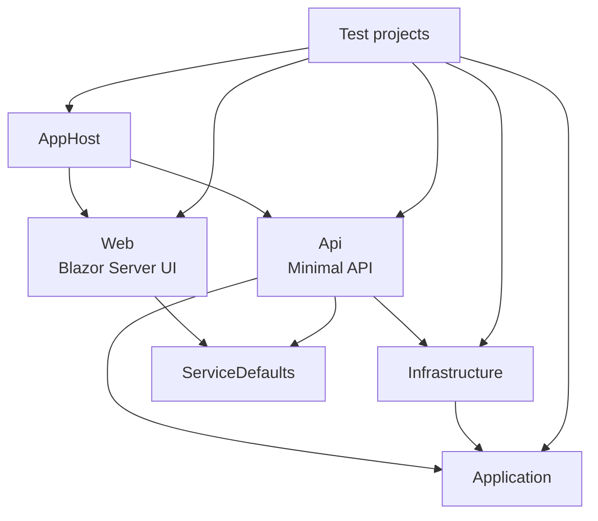
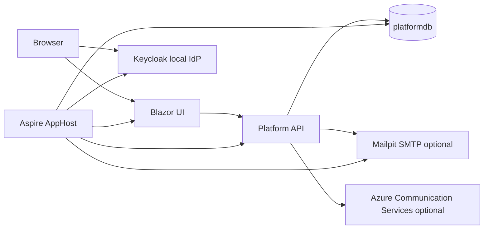
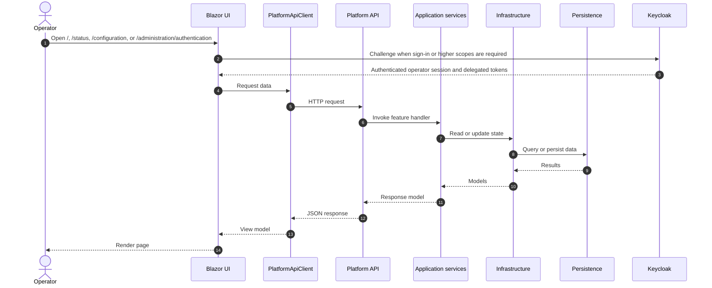
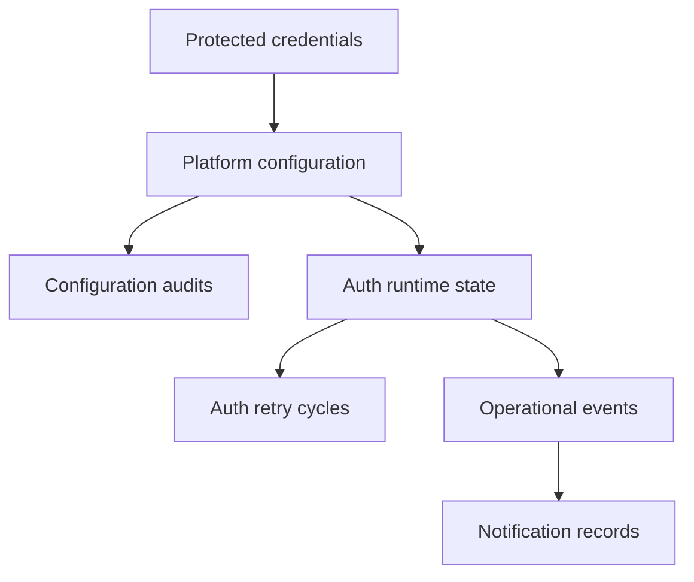

# Architecture

This document describes the implemented architecture of the current solution, including project boundaries, runtime topology, request flow, and persistence responsibilities.

## Architectural style

The solution currently uses a small distributed-application layout:

- Aspire AppHost composes local services
- a Minimal API hosts the control-plane backend
- a Blazor Server app provides the operator UI
- application and infrastructure concerns are split into separate projects
- feature endpoints in the API remain thin and delegate to application handlers

## Solution structure

## Runtime topology

### Local development topology

For supported local development:

- AppHost starts SQL Server
- AppHost creates the `platformdb` database
- AppHost starts Mailpit for local SMTP capture
- AppHost starts Keycloak on a stable local port with a repeatable realm import for seeded auth users, roles, scopes, and clients
- the API and Web hosts receive their SQL, SMTP, and authentication settings through environment variables
- Docker is required because Keycloak is part of the local authentication boundary and the in-memory SQL mode is not a supported application runtime

## Request and interaction flow

### Operator UI flow

The Blazor UI talks to the API through `PlatformApiClient`.

- `/status` loads protected platform status and recent auth events using a viewer-capable delegated token
- `/configuration` loads the active configuration and submits updates using an operator-capable delegated token
- `/administration/authentication` loads the admin-only auth summary using an administrator-capable delegated token
- manual retry posts to the API and then refreshes status

## API composition

The API entry point keeps startup thin:

- registers service defaults, authentication, authorization, data protection, application services, infrastructure services, and validators
- ensures the database exists
- applies startup configuration
- applies retention processing
- performs an initial coordinator tick
- maps platform endpoints and health endpoints

The endpoint group under `/api/platform` is the current backend surface for operator workflows and is protected by shared role policies.

The Web and API hosts now share authentication registration building blocks from the Application layer:

- `PlatformAuthorizationPolicyRegistration` centralizes the Viewer, Operator, and Administrator role-policy matrix
- `PlatformAuthenticationConfigurationResolver` centralizes provider validation plus shared authority, audience, and client-resolution rules
- host-specific registration code stays responsible only for cookie, OpenID Connect, or JWT bearer wiring

## Application-layer responsibilities

The `TNC.Trading.Platform.Application` project contains:

- configuration and runtime models
- shared authentication registration helpers for provider validation and role-policy definition
- feature request and response types
- feature handlers for status, configuration, events, and manual retry
- `TradingScheduleGate` for in-schedule evaluation
- `PlatformStateCoordinator` for current-state orchestration
- `PlatformAuthSupervisor` as the background loop that repeatedly ticks runtime state

### Coordinator responsibilities

`PlatformStateCoordinator` is the central runtime decision-maker. It:

- reads current configuration and runtime state
- evaluates the trading schedule
- applies blocked-live rules
- reacts to missing credentials
- updates retry state
- records operational events
- dispatches notification workflows
- exposes status and event read models

## Infrastructure responsibilities

The `TNC.Trading.Platform.Infrastructure` project contains:

- Entity Framework Core persistence
- Data Protection-backed credential storage
- SQL-backed configuration storage
- runtime-state storage
- retry-cycle storage
- operational-event storage, including persisted operator auth audit history
- notification providers
- retention processing for operational records

## AppHost composition responsibilities

The Aspire AppHost remains a composition root only.

- infrastructure resource creation is isolated from project registration
- API project wiring is isolated from Web project wiring
- authentication environment selection is isolated from infrastructure setup
- local SQL Server and Keycloak admin credentials use Aspire-managed default local secret handling instead of requiring manual dashboard input
- the supported local runtime remains Docker-backed SQL Server, Mailpit, and Keycloak, while synthetic auth and in-memory persistence stay limited to explicit automated-test composition

## Persistence model

The current `PlatformDbContext` stores these entities:

| Entity | Purpose |
| --- | --- |
| `PlatformConfigurationEntity` | Current operator-managed configuration snapshot. |
| `ProtectedCredentialEntity` | Protected IG credential values by broker environment and credential type. |
| `AuthRuntimeStateEntity` | Current runtime auth and retry projection. |
| `AuthRetryCycleEntity` | Retry-cycle tracking and scheduling metadata. |
| `OperationalEventEntity` | Append-style operational event history. |
| `ConfigurationAuditEntity` | Auditable record of configuration changes. |
| `NotificationRecordEntity` | Recorded notification dispatch outcomes. |

### Persistence relationships by responsibility

## Security and secret handling architecture

The current implementation keeps secret handling separate from normal configuration reads.

- non-secret configuration is returned through the API
- secret values are never returned after they are saved
- credential presence is exposed only as booleans
- `ProtectedCredentialService` encrypts stored secret material using Data Protection
- audit and event payloads are redacted before persistence

## Observability architecture

The `ServiceDefaults` project provides shared cross-cutting behavior for the API and web app:

- OpenTelemetry logging
- metrics and tracing instrumentation
- service discovery and standard HTTP resilience
- liveness endpoint at `/health/live`
- readiness endpoint at `/health/ready`

Health endpoint paths are configurable, but the default paths are used by this solution.

The operator auth audit path is implemented as a backend-for-frontend flow:

- the Blazor Server host records sign-in, sign-out, access-denied, and delegated-token failure outcomes through `PlatformAuthAuditClient`
- the client posts those events to the protected API route `POST /api/platform/auth/audit`
- the API persists the resulting auth events through the shared operational event store with correlation data and redacted details

This keeps audit persistence on the server side and avoids exposing secrets or delegated tokens to browser-delivered code.

## Current architectural trade-offs

### Chosen trade-offs

- the auth control plane lives in the API instead of a dedicated worker service
- the operator UI uses Blazor Server to keep implementation simpler at this stage
- a single current configuration row is used rather than a more complex versioned configuration model
- synthetic auth and in-memory persistence are retained only for isolated automated tests, not for the supported local runtime

### Consequences

- the current application has one supported local runtime topology for manual development and validation
- control-plane behavior is well covered before broker integrations are added
- some responsibilities are intentionally centralized in the coordinator until more domain features exist
- later work may split background supervision or broker integration into dedicated services

## Related documents

- [Application overview](application-overview.md)
- [Operator guide](operator-guide.md)
- [Runtime behavior](runtime-behavior.md)
- [API reference](api-reference.md)
