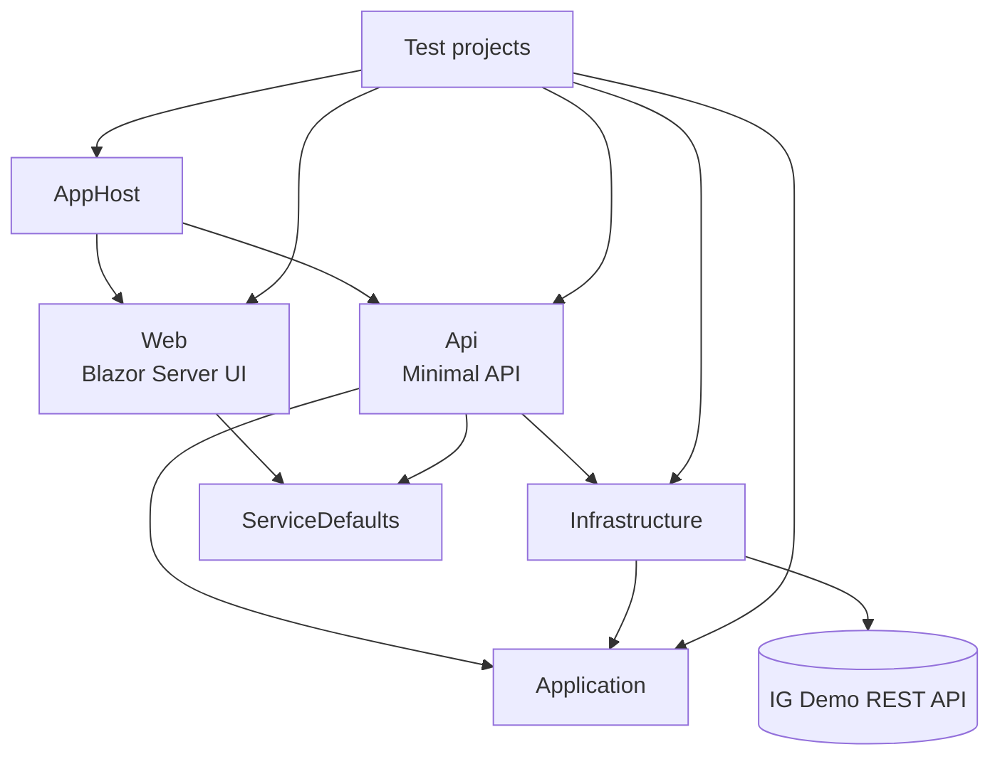
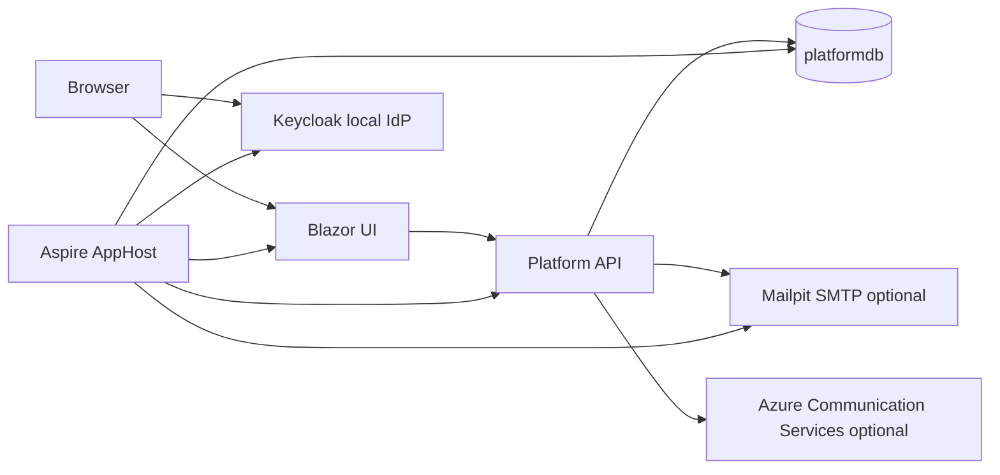
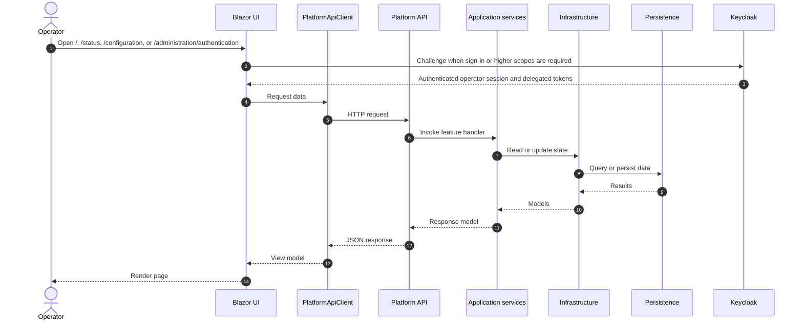
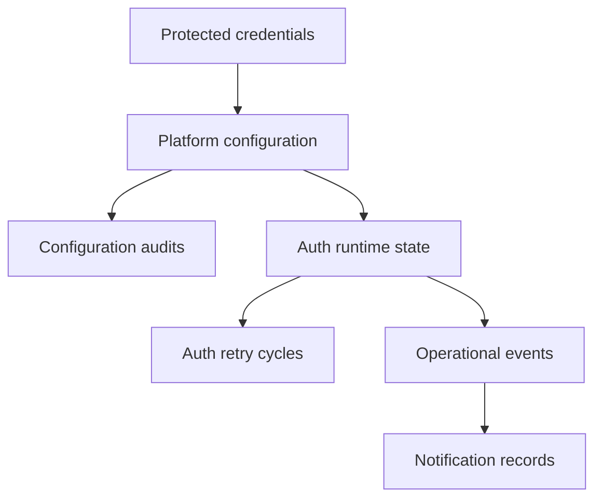

# Architecture

This document describes the implemented architecture of the current solution, including project boundaries, runtime topology, request flow, and persistence responsibilities. The current project layout is a transitional factual snapshot, not a target architecture or a universal mapping of project names to Clean Architecture roles.

## Architectural style

The solution currently uses a small distributed-application layout:

- Aspire AppHost composes local services
- a Minimal API hosts the control-plane backend
- a Blazor Server app provides the operator UI
- application and infrastructure concerns are split into separate projects
- feature endpoints in the API remain thin and delegate to application handlers
- successful backend IG auth transitions now also produce a secret-safe persisted login snapshot and read-only proof data for current and historical review

## Portable architectural direction

Clean Architecture is defined here by responsibility ownership and source-code
dependency direction, not by project names, project count, folder names, or a
mandatory set of layers. The following principles remain valid if the current
topology changes:

- Policy contains stable business rules and remains independent of transport,
    UI, persistence, frameworks, providers, and hosting details.
- Use cases contain application-specific policy and coordinate one user or
    system goal.
- Inbound adapters receive external input, translate it into simple data owned
    by the inward consumer, invoke a use case, and translate the result outward.
- Outbound adapters implement narrow ports owned by the inward consumer and
    translate between inward data and persistence, identity, notification, or
    external-service representations.
- Frameworks, drivers, hosts, and deployment mechanisms remain replaceable
    details at the boundary.

The Dependency Rule applies to source dependencies: references point inward
toward more general and stable policy. Runtime calls may travel outward through
dependency inversion, but a runtime call path does not justify reversing the
source dependency. Boundary data should use simple records, structures,
arguments, or maps shaped for the inner consumer. Framework contexts,
persistence entities, provider responses, transport models, and UI component
models must be translated before they cross inward.

Composition roots may reference concrete adapters for registration,
configuration, adapter selection, startup orchestration, and hosting. They must
not use that privilege to move business decisions into endpoints, hosts, or
integration code. Policy and use-case behavior should remain testable without a
web host, database, container, UI, broker, or external service when the behavior
permits.

Vertical slices and CQRS-style request/response contracts complement these
rules. They organize feature behavior and operation contracts, while Clean
Architecture governs responsibility and dependency direction. Neither requires
one project per role, a separate Domain project, or a fixed deployment shape.

## Solution structure

The following diagram records the implemented project topology at this point in
the refactoring. It is non-normative and may change as responsibilities move;
the project names and count are not the Clean Architecture target.

```mermaid
flowchart TD
    AppHost[AppHost]
    Web[Web\nBlazor Server UI]
    Api[Api\nMinimal API]
    App[Application]
    Infra[Infrastructure]
    IgDemo[(IG Demo REST API)]
    Defaults[ServiceDefaults]
    Tests[Test projects]

    AppHost --> Web
    AppHost --> Api
    Web --> Defaults
    Api --> Defaults
    Api --> App
    Api --> Infra
    Infra --> App
    Infra --> IgDemo
    Tests --> AppHost
    Tests --> Web
    Tests --> Api
    Tests --> App
    Tests --> Infra
```

## Runtime topology

### Local development topology

For supported local development:

- AppHost starts SQL Server
- AppHost creates the `platformdb` database
- AppHost starts Mailpit for local SMTP capture
- AppHost starts Keycloak on a stable local port with a repeatable realm import for seeded auth users, roles, scopes, and clients
- the API and Web hosts receive their SQL, SMTP, and authentication settings through environment variables
- Docker is required because Keycloak is part of the local authentication boundary and the in-memory SQL mode is not a supported application runtime

```mermaid
flowchart LR
    Operator[Browser] --> Web[Blazor UI]
    Operator --> Keycloak[Keycloak local IdP]
    Web --> Api[Platform API]
    Api --> Sql[(platformdb)]
    Api --> Mailpit[Mailpit SMTP optional]
    Api --> Acs[Azure Communication Services optional]
    AppHost[Aspire AppHost] --> Web
    AppHost --> Api
    AppHost --> Sql
    AppHost --> Mailpit
    AppHost --> Keycloak
```

## Request and interaction flow

### Operator UI flow

The Blazor UI talks to the API through `PlatformApiClient`.

- `/status` loads protected platform status and recent auth events using a viewer-capable delegated token
- `/configuration` loads the active configuration and submits updates using an operator-capable delegated token
- `/administration/authentication` loads the admin-only auth summary using an administrator-capable delegated token
- manual retry posts to the API and then refreshes status

```mermaid
sequenceDiagram
    autonumber
    actor Operator
    participant Web as Blazor UI
    participant Client as PlatformApiClient
    participant Api as Platform API
    participant App as Application services
    participant Infra as Infrastructure
    participant Db as Persistence

    Operator->>Web: Open /, /status, /configuration, or /administration/authentication
    Web->>Keycloak: Challenge when sign-in or higher scopes are required
    Keycloak-->>Web: Authenticated operator session and delegated tokens
    Web->>Client: Request data
    Client->>Api: HTTP request
    Api->>App: Invoke feature handler
    App->>Infra: Read or update state
    Infra->>Db: Query or persist data
    Db-->>Infra: Results
    Infra-->>App: Models
    App-->>Api: Response model
    Api-->>Client: JSON response
    Client-->>Web: View model
    Web-->>Operator: Render page
```

## API composition

The API entry point keeps startup thin:

- registers service defaults, authentication, authorization, data protection, application services, infrastructure services, and validators
- ensures the database exists
- applies startup configuration
- applies retention processing
- performs an initial coordinator tick
- maps platform endpoints and health endpoints

The endpoint group under `/api/platform` is the current backend surface for operator workflows and is protected by shared role policies.

The Web and API hosts now share authentication registration building blocks from the Application layer:

- `PlatformAuthorizationPolicyRegistration` centralizes the Viewer, Operator, and Administrator role-policy matrix
- `PlatformAuthenticationConfigurationResolver` centralizes provider validation plus shared authority, audience, and client-resolution rules
- host-specific registration code stays responsible only for cookie, OpenID Connect, or JWT bearer wiring

## Application-layer responsibilities

The `TNC.Trading.Platform.Application` project contains:

- configuration and runtime models
- shared authentication registration helpers for provider validation and role-policy definition
- feature request and response types
- feature handlers for status, configuration, events, and manual retry
- `TradingScheduleGate` for in-schedule evaluation
- `PlatformStateCoordinator` for current-state orchestration
- `PlatformAuthSupervisor` as the background loop that repeatedly ticks runtime state
- proof-data projection models and application-level abstractions for IG Demo read-only capture

### Coordinator responsibilities

`PlatformStateCoordinator` is the central runtime decision-maker. It:

- reads current configuration and runtime state
- evaluates the trading schedule
- applies blocked-live rules
- reacts to missing credentials
- captures a secret-safe IG login snapshot when a backend auth transition succeeds
- retrieves read-only IG Demo proof data after successful auth and stores the latest non-secret snapshot
- updates retry state
- records operational events
- dispatches notification workflows
- exposes status and event read models

## Infrastructure responsibilities

The `TNC.Trading.Platform.Infrastructure` project contains:

- Entity Framework Core persistence
- Data Protection-backed credential storage
- SQL-backed configuration storage
- runtime-state storage
- retry-cycle storage
- IG login snapshot storage for the latest successful payload and retained daily first-successful history
- the outbound `IgSessionClient` / `IIgSessionClient` adapter for the IG Demo REST API
- in-memory proof-data storage for the latest read-only IG Demo account snapshot
- operational-event storage, including persisted operator auth audit history
- notification providers
- retention processing for operational records

## IG REST client and token boundary

The `IgSessionClient` infrastructure adapter issues authenticated HTTP calls to the IG Demo REST API at `https://demo-api.ig.com/gateway/deal`.

Session tokens returned by IG (`CST` and `X-SECURITY-TOKEN`) are consumed transiently within the same `PlatformStateCoordinator` tick that received the authentication response. They are:

- never written to the `platformdb` database
- never included in any API response
- never surfaced in the Blazor UI or operator log output
- passed directly from the `IgAuthenticateResponse` into the proof-data query calls and then discarded

The `IgProofDataSnapshot` that is persisted to the in-memory store contains only safe read fields: account name, account ID, balance, open-position count, and the retrieval timestamp.

## AppHost composition responsibilities

The Aspire AppHost remains a composition root only.

- infrastructure resource creation is isolated from project registration
- API project wiring is isolated from Web project wiring
- authentication environment selection is isolated from infrastructure setup
- local SQL Server and Keycloak admin credentials use Aspire-managed default local secret handling instead of requiring manual dashboard input
- the supported local runtime remains Docker-backed SQL Server, Mailpit, and Keycloak, while synthetic auth and in-memory persistence stay limited to explicit automated-test composition

## Persistence model

The current `PlatformDbContext` stores these entities:

| Entity | Purpose |
| --- | --- |
| `PlatformConfigurationEntity` | Current operator-managed configuration snapshot. |
| `ProtectedCredentialEntity` | Protected IG credential values by broker environment and credential type. |
| `AuthRuntimeStateEntity` | Current runtime auth and retry projection. |
| `AuthRetryCycleEntity` | Retry-cycle tracking and scheduling metadata. |
| `IgLoginSnapshotEntity` | Secret-safe latest-success and retained daily IG login payload snapshots. |
| `OperationalEventEntity` | Append-style operational event history. |
| `ConfigurationAuditEntity` | Auditable record of configuration changes. |
| `NotificationRecordEntity` | Recorded notification dispatch outcomes. |

### Persistence relationships by responsibility

```mermaid
flowchart TD
    Config[Platform configuration] --> Audit[Configuration audits]
    Config --> Runtime[Auth runtime state]
    Runtime --> Retry[Auth retry cycles]
    Runtime --> Events[Operational events]
    Events --> Notifications[Notification records]
    Credentials[Protected credentials] --> Config
```

## Security and secret handling architecture

The current implementation keeps secret handling separate from normal configuration reads.

- non-secret configuration is returned through the API
- secret values are never returned after they are saved
- credential presence is exposed only as booleans
- `ProtectedCredentialService` encrypts stored secret material using Data Protection
- audit and event payloads are redacted before persistence

## Observability architecture

The `ServiceDefaults` project provides shared cross-cutting behavior for the API and web app:

- OpenTelemetry logging
- metrics and tracing instrumentation
- service discovery and standard HTTP resilience
- liveness endpoint at `/health/live`
- readiness endpoint at `/health/ready`

Health endpoint paths are configurable, but the default paths are used by this solution.

The operator auth audit path is implemented as a backend-for-frontend flow:

- the Blazor Server host records sign-in, sign-out, access-denied, and delegated-token failure outcomes through `PlatformAuthAuditClient`
- the client posts those events to the protected API route `POST /api/platform/auth/audit`
- the API persists the resulting auth events through the shared operational event store with correlation data and redacted details

This keeps audit persistence on the server side and avoids exposing secrets or delegated tokens to browser-delivered code.

## Current architectural trade-offs

### Chosen trade-offs

- the auth control plane lives in the API instead of a dedicated worker service
- the operator UI uses Blazor Server to keep implementation simpler at this stage
- a single current configuration row is used rather than a more complex versioned configuration model
- synthetic auth and in-memory persistence are retained only for isolated automated tests, not for the supported local runtime

### Consequences

- the current application has one supported local runtime topology for manual development and validation
- control-plane behavior is well covered before broker integrations are added
- some responsibilities are intentionally centralized in the coordinator until more domain features exist
- later work may split background supervision or broker integration into dedicated services

## Related documents

- [Application overview](application-overview.md)
- [Operator guide](operator-guide.md)
- [Runtime behavior](runtime-behavior.md)
- [API reference](api-reference.md)
