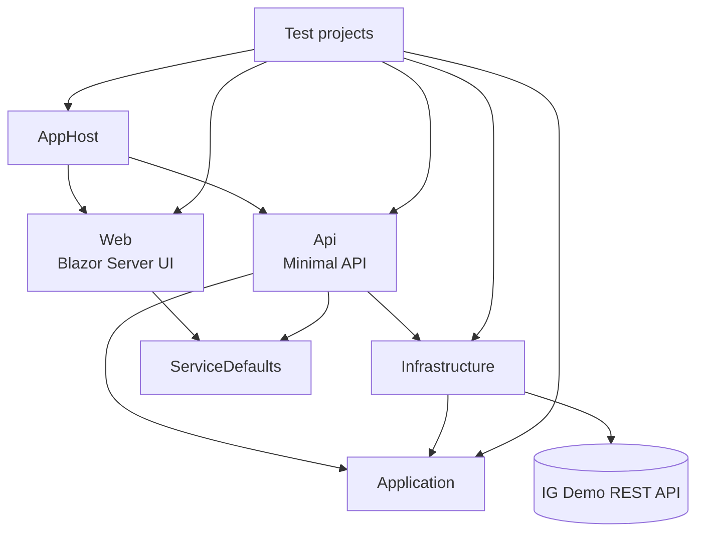
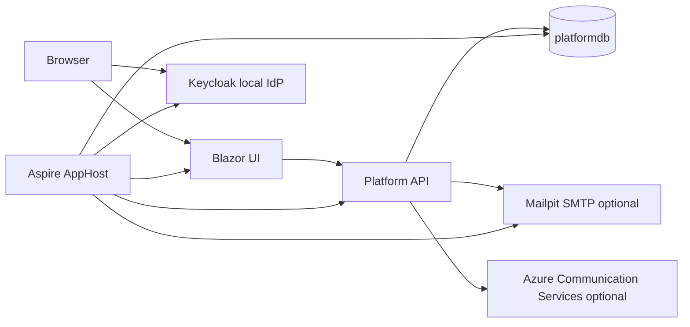
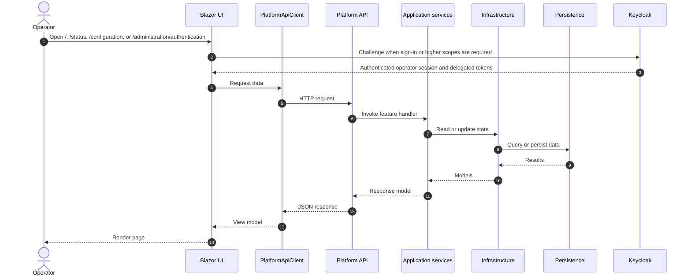
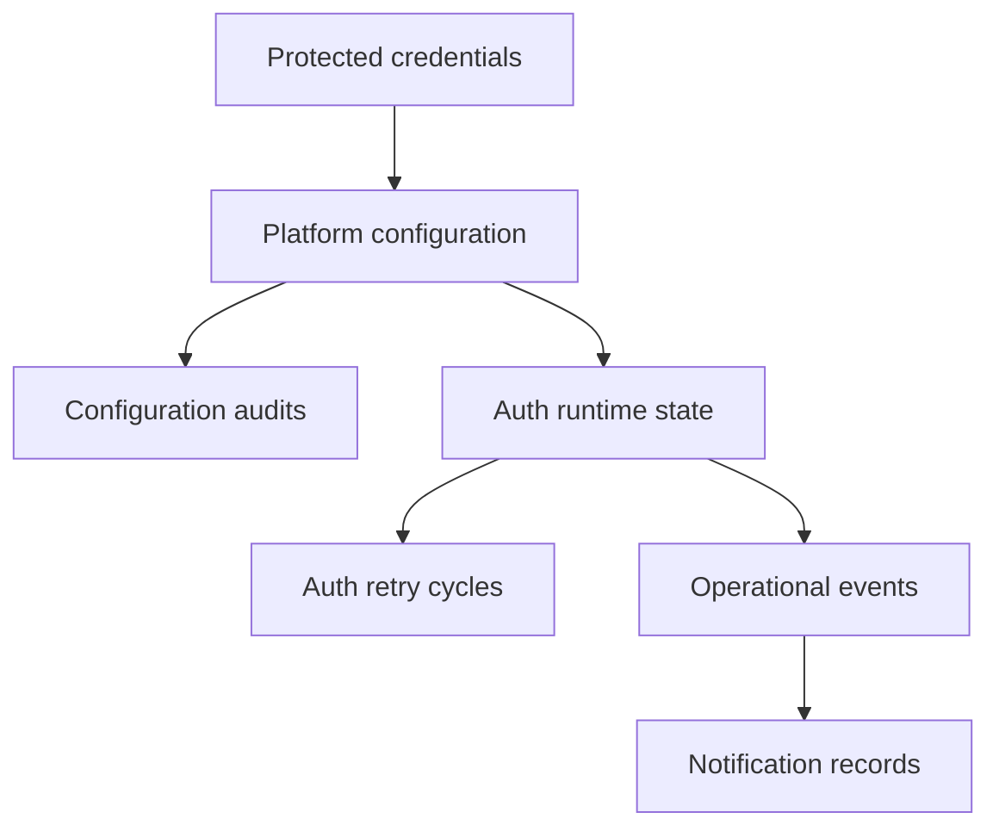

---
title: Architecture
description: Implemented project boundaries, runtime topology, request flow, and persistence responsibilities
author: TNC Trading
ms.date: 2026-07-27
ms.topic: concept
---

## Application framework boundary

The Application project is framework-neutral: it contains use cases, inward-owned ports, and policy, but no ASP.NET Core shared-framework reference or host registration APIs. API composition owns the Application service graph and selects concrete adapters at the host boundary. Web retains a narrow project reference because its authentication components consume contracts owned by Application; that reference can be retired only after those contracts move to an inward shared contract boundary or Web no longer consumes them.

This document describes the implemented architecture of the current solution, including project boundaries, runtime topology, request flow, and persistence responsibilities. The current project layout is a transitional factual snapshot, not a target architecture or a universal mapping of project names to Clean Architecture roles.

## Architectural style

The solution currently uses a small distributed-application layout:

- Aspire AppHost composes local services
- a Minimal API hosts the control-plane backend
- a Blazor Server app provides the operator UI
- application and infrastructure concerns are split into separate projects
- feature endpoints in the API remain thin and delegate to application handlers
- successful backend IG auth transitions now also produce a secret-safe persisted login snapshot and read-only proof data for current and historical review

## Portable architectural direction

Clean Architecture is defined here by responsibility ownership and source-code
dependency direction, not by project names, project count, folder names, or a
mandatory set of layers. The following principles remain valid if the current
topology changes:

- Policy contains stable business rules and remains independent of transport,
    UI, persistence, frameworks, providers, and hosting details.
- Use cases contain application-specific policy and coordinate one user or
    system goal.
- Inbound adapters receive external input, translate it into simple data owned
    by the inward consumer, invoke a use case, and translate the result outward.
- Outbound adapters implement narrow ports owned by the inward consumer and
    translate between inward data and persistence, identity, notification, or
    external-service representations.
- Frameworks, drivers, hosts, and deployment mechanisms remain replaceable
    details at the boundary.

The Dependency Rule applies to source dependencies: references point inward
toward more general and stable policy. Runtime calls may travel outward through
dependency inversion, but a runtime call path does not justify reversing the
source dependency. Boundary data should use simple records, structures,
arguments, or maps shaped for the inner consumer. Framework contexts,
persistence entities, provider responses, transport models, and UI component
models must be translated before they cross inward.

Composition roots may reference concrete adapters for registration,
configuration, adapter selection, startup orchestration, and hosting. They must
not use that privilege to move business decisions into endpoints, hosts, or
integration code. Policy and use-case behavior should remain testable without a
web host, database, container, UI, broker, or external service when the behavior
permits.

Vertical slices and CQRS-style request/response contracts complement these
rules. They organize feature behavior and operation contracts, while Clean
Architecture governs responsibility and dependency direction. Neither requires
one project per role, a separate Domain project, or a fixed deployment shape.

## Phase 0 migration decisions

The following decisions establish the migration baseline. They separate current
repository facts from provisional deployment choices. Product and deployment
owners may replace a provisional choice before the phase named below.

### Responsibility and host contracts

* The immediate target keeps Application and Infrastructure as the two core
    projects. A Domain project remains conditional on the policy extraction gate,
    rather than being introduced as an empty layer.
* Reconciliation uses one serialized writer at the application boundary. The
    `ReconcilePlatformAuthenticationHandler` is the explicit command entry point
    for startup, scheduled, and configuration-triggered reconciliation; the
    feature-local `PlatformAuthenticationReconciler` owns its workflow and
    operation-specific side effects. Manual retry
    is now owned by `TriggerManualAuthRetryHandler`, which loads state, applies
    schedule and eligibility policy, calls the inward broker gateway, and sends
    operation-specific local commit intents. Hosting ownership remains in
    Application until the later supervision phase.
* API and Web continue to own their host-specific authentication wiring. Web's
    Application reference is retained temporarily because shared authentication
    contracts still live there. Phase 8 may remove it only after equivalent
    host-owned contracts and parity tests exist.

### Persistence and external-effect boundaries

* Configuration, runtime-state, retry-cycle, login-snapshot, operational-event,
    audit, and notification-record writes are intended to commit as one local
    consistency unit for a single reconciliation outcome where the current data
    model permits it. This is a migration decision, not a claim that the current
    coordinator already provides that transaction boundary.
* A configuration update is a narrower established consistency boundary: the
    SQL committer stages the configuration row, protected credential replacements,
    and configuration audit in one relational `SaveChangesAsync` transaction.
    The Application handler awaits that commit before dispatching the explicit
    reconciliation command. A failed local write therefore leaves the previous
    durable configuration available to the next reconciliation.
* Latest IG Demo proof data is a durable Infrastructure concern. The
    `IPlatformIgProofDataStore` port remains Application-owned while
    `EfPlatformIgProofDataStore` maps one SQL row per broker environment and
    participates in the reconciliation transaction. The active production
    composition root registers this EF adapter; the in-memory store is only
    constructed explicitly by infrastructure unit tests. This guarantees
    readback across API process replacement, but not recovery after database
    loss.
* IG and notification I/O remain outside database transactions. Notification
    dispatch is best-effort at-least-once: a provider failure is persisted as a
    failed attempt, and a later supervised dispatch may try again. Repeated
    attempts are retained as separate notification records. The current model
    has no cross-process idempotency key or outbox, so exactly-once external
    delivery is not promised. Notification records remain the durable evidence
    for later diagnosis. The reconciler's degraded-auth suppression is
    process-local and only prevents repeated transition notifications within
    its tested process boundary.
* SQL Server migrations are source-controlled and owned by Infrastructure beside
    `PlatformDbContext`. The Infrastructure startup initializer applies them
    before bootstrap configuration and retention. It never deletes a persistent
    local database; an existing schema without compatible migration history fails
    startup with operator guidance.

Migration recovery is fail-closed and non-destructive. If a migration fails after
earlier migrations have committed, the recorded history and the incompatible
schema object remain available for diagnosis. Bootstrap configuration, retention,
and readiness do not proceed. An operator must correct the affected schema using
an approved database procedure, then restart the application so the initializer
can apply the remaining migrations. Automatic database deletion, silent baseline
guessing, and destructive reset are not recovery mechanisms.

The Infrastructure integration suite runs against a unique database created in
the existing Docker SQL Server container. It proves the current schema, SQL
transaction rollback, and provider-specific retention behavior without claiming
an optimistic-concurrency contract that the model does not currently define.

### Shared Data Protection boundary

Data Protection is registered at the API and Web composition roots through the
shared `ServiceDefaults` extension. Both hosts use the stable application name
`TNC.Trading.Platform`, the existing `platformdb` connection, and the
Infrastructure-owned `DataProtectionKeys` migration. The key context is a
cross-cutting persistence adapter; it does not enter Application or alter the
protected credential service's purpose string or ciphertext contract.

The default key lifetime is 90 days and is configurable through
`DataProtection:KeyLifetimeDays`. Rotation creates newer keys while retaining
older keys for unprotect operations. SQL persistence is durable only for the
configured database and its backups; the implementation does not claim
survival after key material or database loss.

The reconciliation writer uses an asynchronous semaphore at the command
boundary. It serializes automatic reconciliation and manual retry across
scoped instances, propagates cancellation while waiting or executing, and does
not hold a database transaction while IG or notification I/O runs. The command
response is a typed projection of the persisted runtime outcome, including
degraded state and its secret-safe failure summary.

### Supervision hosting

The API owns reconciliation supervision as a host adapter. Its hosted service
creates a scope for each tick, invokes the inward-owned reconciliation command,
logs transient failures, observes host cancellation, and preserves the existing
one-second cadence. Application contains the command and transitional workflow,
but no `BackgroundService` or scheduling mechanics. The API composition root
also performs the first reconciliation synchronously before hosted execution
and normal readiness, so an unavailable initial state still prevents startup.

### Query projection boundary

`GetPlatformStatusHandler` and `GetPlatformEventsHandler` are read use cases.
Each depends only on a feature-local projection reader port. The Infrastructure
adapters translate persisted state and event history into application
projections without invoking the reconciliation workflow, provider gateways,
notification dispatch, state creation, or persistence writes. This keeps query
runtime calls separate from the serialized reconciliation writer while
preserving the existing API response mappings.

## Phase 1 architecture safety rails

The repository now enforces two complementary architecture checks:

* The existing topology-neutral graph validator detects unresolved project
    references and cycles without prescribing project names, counts, folders, or
    a Domain project.
* The production role validator inspects project files for stable responsibility
    boundaries. Application must not reference production projects, the
    ASP.NET Core shared framework, or outward framework/provider package families.
    Infrastructure must continue to reference Application.

The role policy deliberately does not freeze the complete package inventory or
source-file layout. Web may still reference Application while shared
authentication contracts remain there. This is an explicit migration exception;
Phase 8 retires it after host-owned contracts and parity tests are complete.
If a Domain project is introduced, its no-production-reference rule activates
automatically. No Domain project is required in the current transitional state.

The role validator has focused tests that use a disposable local forbidden-
reference probe. The probe proves the new rule rejects an Application to
Infrastructure edge and is removed after each test; it is not part of the
repository production tree.

## Solution structure

The following diagram records the implemented project topology at this point in
the refactoring. It is non-normative and may change as responsibilities move;
the project names and count are not the Clean Architecture target.

```mermaid
flowchart TD
    AppHost[AppHost]
    Web[Web\nBlazor Server UI]
    Api[Api\nMinimal API]
    App[Application]
    Infra[Infrastructure]
    IgDemo[(IG Demo REST API)]
    Defaults[ServiceDefaults]
    Tests[Test projects]

    AppHost --> Web
    AppHost --> Api
    Web --> Defaults
    Api --> Defaults
    Api --> App
    Api --> Infra
    Infra --> App
    Infra --> IgDemo
    Tests --> AppHost
    Tests --> Web
    Tests --> Api
    Tests --> App
    Tests --> Infra
```

## Runtime topology

### Local development topology

For supported local development:

- AppHost starts SQL Server
- AppHost creates the `platformdb` database
- AppHost starts Mailpit for local SMTP capture
- AppHost starts Keycloak on a stable local port with a repeatable realm import for seeded auth users, roles, scopes, and clients
- the API and Web hosts receive their SQL, SMTP, and authentication settings through environment variables
- Docker is required because Keycloak is part of the local authentication boundary and the in-memory SQL mode is not a supported application runtime

```mermaid
flowchart LR
    Operator[Browser] --> Web[Blazor UI]
    Operator --> Keycloak[Keycloak local IdP]
    Web --> Api[Platform API]
    Api --> Sql[(platformdb)]
    Api --> Mailpit[Mailpit SMTP optional]
    Api --> Acs[Azure Communication Services optional]
    AppHost[Aspire AppHost] --> Web
    AppHost --> Api
    AppHost --> Sql
    AppHost --> Mailpit
    AppHost --> Keycloak
```

## Request and interaction flow

### Operator UI flow

The Blazor UI talks to the API through `PlatformApiClient`.

- `/status` loads protected platform status and recent auth events using a viewer-capable delegated token
- `/configuration` loads the active configuration and submits updates using an operator-capable delegated token
- `/administration/authentication` loads the admin-only auth summary using an administrator-capable delegated token
- manual retry posts to the API and then refreshes status

```mermaid
sequenceDiagram
    autonumber
    actor Operator
    participant Web as Blazor UI
    participant Client as PlatformApiClient
    participant Api as Platform API
    participant App as Application services
    participant Infra as Infrastructure
    participant Db as Persistence

    Operator->>Web: Open /, /status, /configuration, or /administration/authentication
    Web->>Keycloak: Challenge when sign-in or higher scopes are required
    Keycloak-->>Web: Authenticated operator session and delegated tokens
    Web->>Client: Request data
    Client->>Api: HTTP request
    Api->>App: Invoke feature handler
    App->>Infra: Read or update state
    Infra->>Db: Query or persist data
    Db-->>Infra: Results
    Infra-->>App: Models
    App-->>Api: Response model
    Api-->>Client: JSON response
    Client-->>Web: View model
    Web-->>Operator: Render page
```

## API composition

The API entry point keeps startup thin:

- registers service defaults, authentication, authorization, data protection, application services, infrastructure services, and validators
- invokes the Infrastructure startup initializer, which applies the SQL migration
    lifecycle, bootstrap configuration, and retention processing in that order
- dispatches the explicit `ReconcilePlatformAuthenticationHandler` command for the initial authentication reconciliation
- maps platform endpoints and health endpoints

The endpoint group under `/api/platform` is the current backend surface for operator workflows and is protected by shared role policies.

The Web and API hosts own their ASP.NET Core authentication and authorization registration:

- `PlatformApiAuthenticationServiceCollectionExtensions` registers the API bearer scheme and the documented Viewer, Operator, and Administrator role policies
- `PlatformWebAuthenticationServiceCollectionExtensions` registers the Web cookie/OpenID Connect schemes and the identical documented role policies
- `PlatformAuthenticationOptions`, `PlatformAuthenticationDefaults`, and `PlatformAuthenticationConfigurationResolver` remain framework-neutral authentication vocabulary and provider-resolution rules shared inward

## Application-layer responsibilities

The `TNC.Trading.Platform.Application` project contains:

- configuration and runtime models
- framework-neutral authentication options, provider vocabulary, role/scope/claim names, and provider-resolution rules
- feature request and response types
- feature handlers for status, configuration, events, and manual retry
- `TradingScheduleGate` for calendar and trading-window evaluation, schedule rule precedence, and Test-platform/Live-broker blocking
- `RetryTimingPolicy` for initial delay, exponential progression, and maximum-delay capping
- `PlatformStateTransitionEngine` for the valid authentication-state graph, state invariants, and typed invalid-transition rejection
- `PlatformConfigurationRestartPolicy` for classifying startup-fixed environment differences without persistence or host dependencies
- `OperationalRecordRetentionPolicy` for retention-window defaults, cutoff calculation, eligible record families, and strict cutoff semantics
- `OperationalDataSensitivityPolicy` for case-insensitive classification of sensitive operational field and metadata names
- `PlatformAuthenticationReconciler` for the reconciliation use case and its
    feature-local side-effect adapter
- `PlatformAuthSupervisor` as the background loop that repeatedly ticks runtime state
- the operation-scoped `IBrokerAuthenticationGateway` inward port and provider-neutral authentication request, evidence, proof, and failure types
- proof-data projection models and application-level abstractions for IG Demo read-only capture

### Reconciliation responsibilities

`PlatformAuthenticationReconciler` owns the automatic reconciliation use case.
Manual retry is deliberately excluded because its complete write slice now lives in
`TriggerManualAuthRetryHandler`. The reconciler:

- reads current configuration and runtime state
- invokes the Application-owned trading schedule policy and applies its typed decision
- refreshes `BlockedReason` and `LastValidatedAtUtc` through the Application
    reconciler when an existing `OutOfSchedule` state remains inactive, without
    changing transition, retry, or session metadata
- invokes the Application-owned retry timing policy when a retry cycle schedules its next attempt
- submits authentication transition requests to the Application-owned
    `PlatformStateTransitionEngine`, which validates the strict state graph and
    rejects invalid requests before mutation
- reacts to missing credentials
- captures a secret-safe IG login snapshot when a backend auth transition succeeds
- invokes one provider-neutral authenticate-and-collect-proof capability and stores the returned secret-safe evidence and optional proof snapshot
- updates retry state
- records operational events
- dispatches notification workflows
- exposes status and event read models

`TriggerManualAuthRetryHandler` owns the manual retry use case. It asks the
Application trading-schedule and retry eligibility policies for permission,
creates the retry-cycle state, calls `IBrokerAuthenticationGateway`, applies
provider-neutral success or failure data, and requests
`IManualAuthRetryCommitter` intents. The Infrastructure committer translates
those intents to SQL-backed state, retry-cycle, event, snapshot, and proof
writes. Broker and notification I/O remain outside that local commit boundary.
Expected unavailable states are `TriggerManualAuthRetryOutcome` values rather
than normal `InvalidOperationException` conflicts; the API maps them to 409.

The retry timing policy is a pure Application rule. It receives inward-owned
retry configuration and an attempt number, then returns a delay in seconds.
The reconciler owns retry-state orchestration and supplies the policy inputs.
Clocks, waiting, provider transport, persistence, notification delivery, and
host cadence remain outside the policy. The retired coordinator no longer
participates in any application or host call path.

The authentication transition policy accepts the current runtime state and an
inward-owned transition request. It validates the documented source and target
pair before applying session status, degraded state, blocked reason, active
session interval, validation time, and transition time as one controlled
mutation. A rejected transition returns a reason and leaves runtime state
unchanged. Infrastructure retains only persistence mapping for the existing
runtime-state shape; it does not decide transitions.

Reconciliation writes use the Application-owned `IPlatformReconciliationLease`
port. The SQL Infrastructure adapter holds an exclusive `sp_getapplock`
session lock on an open database connection for the complete reconciliation or
manual-retry operation. This is the multi-replica writer guarantee; the
process-local semaphore remains only at the inbound command boundary for
same-process request serialization. SQL Server releases the session-owned lock
when the connection ends, so a recycled replica cannot strand ownership.

The restart-classification policy compares the current startup-fixed platform
and broker environments with a proposed configuration update. With no current
configuration, there is no prior startup-applied state to replace, so no restart
is required. Infrastructure translates the persisted configuration entity into
the inward-owned startup-fixed value, persists the classification result, and
writes the audit record. Actual process startup and restart mechanisms remain
host responsibilities.

The `UpdatePlatformConfigurationHandler` owns the configuration-update use
case. It validates the inward update contract, sends the update to the
feature-owned `IUpdatePlatformConfigurationCommitter`, and dispatches the
explicit reconciliation command only after the commit succeeds. The SQL
adapter implements that port and keeps configuration values, supplied
protected credentials, and the configuration audit in the existing single
local `SaveChangesAsync` operation. `PlatformConfigurationService` remains
available for configuration reads and startup application, but no longer
owns the update workflow.

The retention policy creates a deterministic plan from the current UTC time and
the configured retention value. It owns the 90-day fallback, the strict
older-than cutoff, the eligible operational record families, and the rule that
the current IG login snapshot is never age-deleted. Infrastructure translates
that plan into EF or SQL predicates and retains query execution, set-based or
tracked deletion, batching, transactions, and persistence mapping.

The operational sensitivity policy classifies structured field and metadata
names using the established case-insensitive sensitive fragments. Infrastructure
consumes that classification and retains JSON traversal, value replacement,
plain-text and bearer-token scanning, serialization, persistence, and logging.
This keeps the secret-safety decision framework-neutral without moving any
output-producing mechanism inward.

## Infrastructure responsibilities

The `TNC.Trading.Platform.Infrastructure` project contains:

- Composition registration is isolated under `Infrastructure/DependencyInjection/`. `PlatformInfrastructureServiceCollectionExtensions` owns the existing service registrations and conditional persistence/provider selection; API remains the composition root that invokes it.
- The time adapter family is isolated under `Infrastructure/Time/`: `PlatformTimeProviderFactory` selects the system or incrementing provider at the composition boundary, and `IncrementingTimeProvider` supplies deterministic bootstrap time progression without changing application policy or provider behavior.
- Entity Framework Core persistence
- Data Protection-backed credential storage
- SQL-backed configuration storage
- runtime-state storage
- retry-cycle storage
- IG login snapshot storage for the latest successful payload and retained daily first-successful history
- Account Details retrieval and account-child storage for immutable IG test-account snapshots
    snapshots, composite-keyset history, automatic daily capture, and
    environment-scoped refresh leases
- the outbound `IgBrokerAuthenticationGateway` adapter for the IG Demo REST API
- in-memory proof-data storage for the latest read-only IG Demo account snapshot
- operational-event storage, including persisted operator auth audit history
- typed trailing-stops provider request and response records using the
    `trailingStopsEnabled` contract
- partitioned trailing-stops observation persistence with strict cursor
    membership checks
- notification adapters are organized under `Infrastructure/Notifications/`: the shared dispatcher, dispatch policy, context, message, result, and inward provider contract remain at the boundary root; the deterministic adapter is under `Notifications/Recorded/`, SMTP delivery under `Notifications/Smtp/`, and Azure Communication Services email delivery under `Notifications/AzureCommunicationServices/`
- EF and SQL retention queries and deletion execution for operational records under `Infrastructure/Operations/Retention/`
- operational data masking, removal, JSON serialization, and text redaction mechanisms

## IG authentication adapter and token boundary

The `IgBrokerAuthenticationGateway` Infrastructure adapter implements the
Application-owned `IBrokerAuthenticationGateway`. It translates one
environment-only request into protected credential retrieval plus IG session,
account, and position calls at
`https://demo-api.ig.com/gateway/deal`, then translates the result into inward
evidence, optional proof data, or a typed failure.

Session tokens returned by IG (`CST` and `X-SECURITY-TOKEN`) are consumed
transiently inside one adapter invocation. They are:

- never written to the `platformdb` database
- never included in any API response
- never surfaced in the Blazor UI or operator log output
- added to dependent proof-data requests by Infrastructure and then discarded before the adapter returns

The adapter rejects `Live` before entering the HTTP pipeline. No Live request is
routed to the Demo host. HTTP status codes, JSON wire records, malformed
responses, request timeouts, and transport exceptions are translated at this
boundary; caller-requested cancellation continues to propagate normally.

The account-preferences adapter treats a malformed successful PUT
acknowledgement as indeterminate. Application reconciliation performs one
authoritative GET and requires exact Boolean equality before reporting success.

The `IgProofDataSnapshot` that is persisted to the in-memory store contains only safe read fields: account name, account ID, balance, open-position count, and the retrieval timestamp.

### IG integration adapter layout

The IG outbound HTTP adapter is located at
`src/TNC.Trading.Platform.Infrastructure/Infrastructure/Integrations/Ig/`.
`IgBrokerAuthenticationGateway` owns the provider HTTP protocol translation,
including session, account, and position wire models. It implements the
Application-owned broker authentication port and keeps provider headers,
status mapping, malformed-response handling, and transient session tokens at
the Infrastructure boundary. Its focused tests mirror the production layout
under `test/TNC.Trading.Platform.Infrastructure/TNC.Trading.Platform.Infrastructure.UnitTests/Integrations/Ig/`.

## AppHost composition responsibilities

The Aspire AppHost remains a composition root only.

- infrastructure resource creation is isolated from project registration
- API project wiring is isolated from Web project wiring
- authentication environment selection is isolated from infrastructure setup
- local SQL Server and Keycloak admin credentials use Aspire-managed default local secret handling instead of requiring manual dashboard input
- the supported local runtime remains Docker-backed SQL Server, Mailpit, and Keycloak, while synthetic auth and in-memory persistence stay limited to explicit automated-test composition

## Persistence model

The current `PlatformDbContext` stores these entities:

| Entity | Purpose |
| --- | --- |
| `PlatformConfigurationEntity` | Current operator-managed configuration snapshot. |
| `ProtectedCredentialEntity` | Protected IG credential values by broker environment and credential type. |
| `AuthRuntimeStateEntity` | Current runtime auth and retry projection. |
| `AuthRetryCycleEntity` | Retry-cycle tracking and scheduling metadata. |
| `IgLoginSnapshotEntity` | Secret-safe latest-success and retained daily IG login payload snapshots. |
| `OperationalEventEntity` | Append-style operational event history. |
| `ConfigurationAuditEntity` | Auditable record of configuration changes. |
| `NotificationRecordEntity` | Recorded notification dispatch outcomes. |

### Persistence relationships by responsibility

```mermaid
flowchart TD
    Config[Platform configuration] --> Audit[Configuration audits]
    Config --> Runtime[Auth runtime state]
    Runtime --> Retry[Auth retry cycles]
    Runtime --> Events[Operational events]
    Events --> Notifications[Notification records]
    Credentials[Protected credentials] --> Config
```

### Infrastructure adapter layout

The Infrastructure adapter families are organized by boundary responsibility:

- `Configuration/SqlServer/` contains the SQL-backed platform configuration store, bootstrap parsing, and configuration-port adapters.
- `Credentials/DataProtection/` contains the Data Protection-backed credential adapter.
- `Persistence/EntityFramework/Entities/` contains the EF Core persistence entities.
- `Persistence/EntityFramework/` contains the platform DbContext, design-time factory, and EF-backed platform adapters and committers.
- `Persistence/EntityFramework/Migrations/` contains the source-controlled EF migrations and model snapshot; the migration identifier remains stable across mechanical moves.
- `Persistence/EntityFramework/Configurations/` is the boundary for EF model configuration owned by the persistence adapter.
- `Integrations/Ig/`, `Notifications/`, `Operations/`, `Startup/`, and `Time/` contain their corresponding external or host-facing adapters.

This folder layout is descriptive only. The Phase 9.6 move preserved the existing namespaces' contracts, SQL persistence behavior, migration identity and model snapshot, transaction and concurrency behavior, startup ordering, readiness behavior, cancellation flow, and service lifetimes.

## Security and secret handling architecture

The current implementation keeps secret handling separate from normal configuration reads.

- non-secret configuration is returned through the API
- secret values are never returned after they are saved
- credential presence is exposed only as booleans
- `ProtectedCredentialService` encrypts stored secret material using Data Protection
- audit and event payloads are redacted before persistence

## Observability architecture

The `ServiceDefaults` project provides shared cross-cutting behavior for the API and web app:

- OpenTelemetry logging
- metrics and tracing instrumentation
- service discovery and standard HTTP resilience
- liveness endpoint at `/health/live`
- readiness endpoint at `/health/ready`

Health endpoint paths are configurable, but the default paths are used by this solution.

The operator auth audit path is implemented as a backend-for-frontend flow:

- the Blazor Server host records sign-in, sign-out, access-denied, and delegated-token failure outcomes through `PlatformAuthAuditClient`
- the client posts those events to the protected API route `POST /api/platform/auth/audit`
- the API extracts claims and HTTP metadata, then dispatches an Application `RecordAuthAuditEvent` slice
- the Application handler builds the event intent after configuration lookup and requests persistence through an inward-owned commit port
- Infrastructure adapts that commit port to the shared operational event store with correlation data and redacted details

This keeps audit persistence on the server side and avoids exposing secrets or delegated tokens to browser-delivered code.

## Current architectural trade-offs

### Chosen trade-offs

- the auth control plane lives in the API instead of a dedicated worker service
- the operator UI uses Blazor Server to keep implementation simpler at this stage
- a single current configuration row is used rather than a more complex versioned configuration model
- synthetic auth and in-memory persistence are retained only for isolated automated tests, not for the supported local runtime

### Consequences

- the current application has one supported local runtime topology for manual development and validation
- control-plane behavior is well covered before broker integrations are added
- some responsibilities remain centralized in the feature-local reconciler until more domain features exist
- later work may split background supervision or broker integration into dedicated services

## Related documents

- [Application overview](application-overview.md)
- [Operator guide](operator-guide.md)
- [Runtime behavior](runtime-behavior.md)
- [API reference](api-reference.md)

## Account Preferences boundary

Application owns the Account Preferences operation contracts, Test-only guard,
desired-state policy, comparison rules, typed provider outcomes, and
observation model. SQL owns durable operator intent; IG supplies observed
external fact. API and Web are inbound adapters; Infrastructure implements the
current-state, audit, lease, observation, and account-bound IG ports.

The update path commits desired state and audit atomically, advances the desired
revision, marks verification `Pending`, and returns without provider I/O.
Observe-only reconciliation binds results to the configured account, desired
revision, attempt identifier, and observation time. A mismatch becomes
`Drifted`; unavailable or malformed responses become `VerificationFailed` or
`Unsupported`. A SQL lease and revision guard protect replicas and late work.

Explicit remediation requires authorization for the same desired revision. It
performs an initial GET, at most one PUT, and a confirming GET in one
account-bound session. Account mismatch and stale revision are rejected;
automatic drift repair and blind PUT retries are prohibited.

When order submission is implemented, its application boundary must fail
closed unless verification is fresh, `InSync`, and bound to the same desired
revision, target account, and session generation. Startup verification only
primes persisted status. Authentication-active is not trade readiness, and this
delivery adds no order gate or override.
