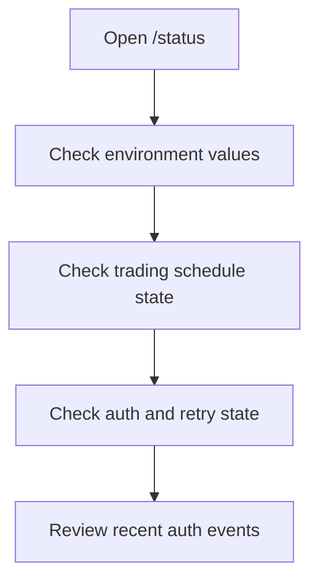
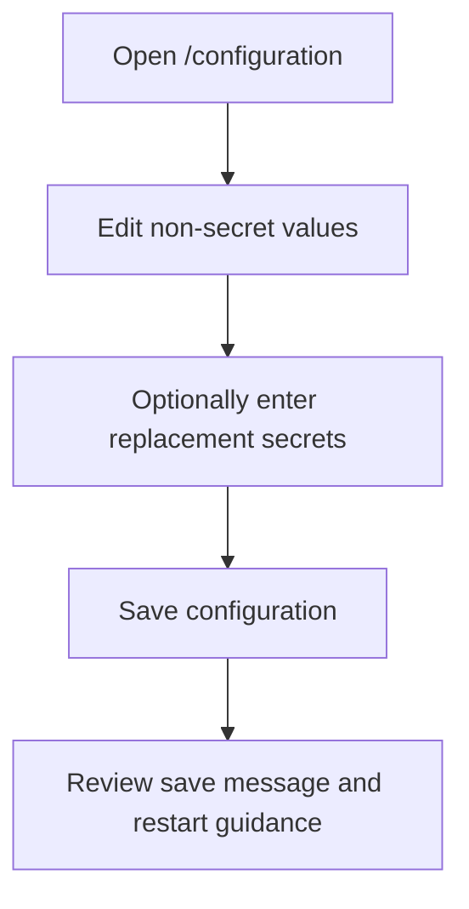
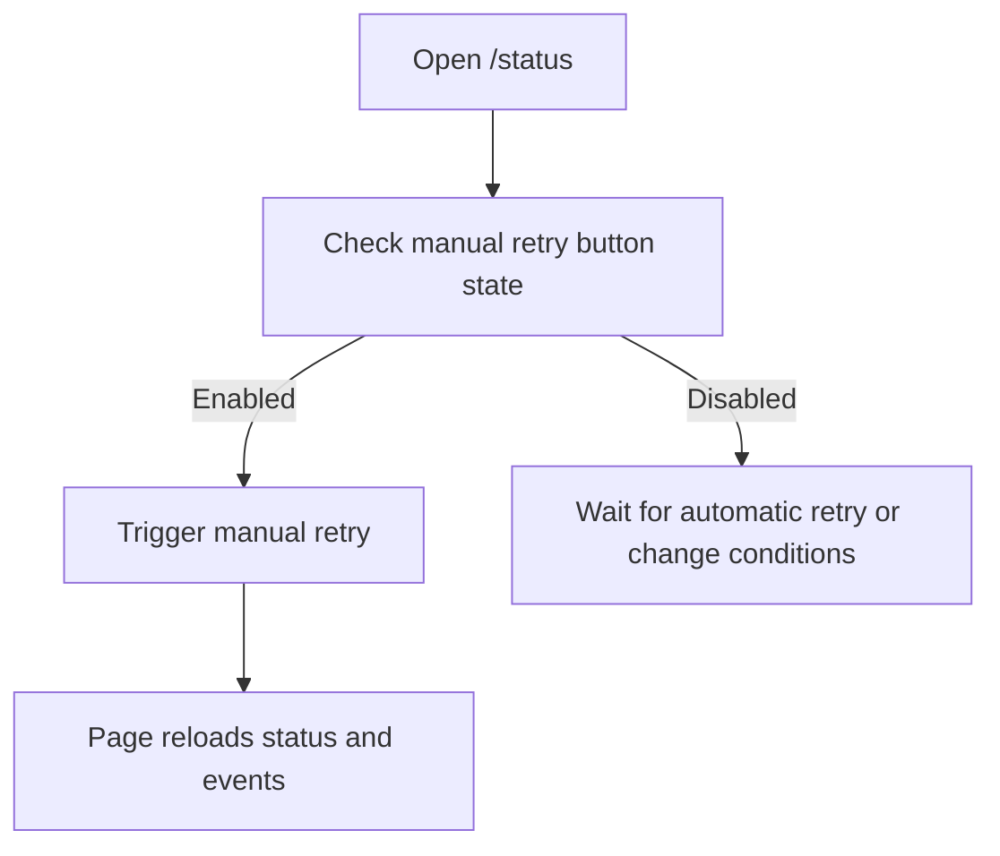

# Operator guide

This guide explains how the current Blazor operator UI works, what information each page shows, and how the existing workflows behave.

## Operator UI summary

The current UI is a Blazor Server app with a public entry surface and three protected operator pages:

- `/`
- `/status`
- `/configuration`
- `/administration/authentication`

The left navigation changes based on the signed-in operator role.

## Navigation

| Route | Purpose |
| --- | --- |
| `/` | Public landing page for anonymous users and signed-in home page for operators. |
| `/status` | Runtime status, trading-schedule state, auth state, retry state, and recent auth events. |
| `/configuration` | Operator-managed configuration, notification settings, trading-schedule values, and write-only IG credential updates. |
| `/administration/authentication` | Administrator-only summary of the configured auth provider, role claim type, and protected API audience. |
| `/authentication/sign-in` | Starts sign-in. In automated local tests this also lists the seeded local test users. |
| `/authentication/sign-out` | Ends the platform session and returns to the landing page. |
| `/authentication/access-denied` | Dedicated denied-access page for signed-in users who lack the required platform role. |

## Sign-in and sign-out

Anonymous users land on `/` and use the sign-in link to start authentication.

- in lightweight local test runs, `/authentication/sign-in` lists the seeded local users used by automated tests
- in container-assisted local runs, sign-in redirects the browser to Keycloak
- sign-out ends the platform session only and returns the operator to `/`

If a pre-provisioned user authenticates without a platform role, the UI routes the user to `/authentication/access-denied`.

## Status page

The status page is the main runtime dashboard.

### Environment panel

The environment panel shows:

- platform environment
- broker environment
- live option availability

This makes the currently active context easy to verify before any operator action.

### Trading schedule panel

The trading schedule panel shows:

- whether the schedule is active
- the current schedule reason
- daily start and end time
- configured trading days
- weekend behavior
- configured bank holidays
- configured time zone

This explains whether the platform considers itself in schedule or out of schedule.

### Auth state panel

The auth state panel shows:

- session status
- whether the platform is degraded
- blocked reason
- retry phase
- automatic attempt number
- next retry time

When the platform is degraded, the page also shows a warning banner.

### Manual retry button

The manual retry button is visible only to `Operator` and `Administrator` users on the status page.

It is enabled only when:

- the retry limit has been reached
- the current trading schedule is active
- the session is degraded in a way that allows manual retry
- a retry is not already in progress

When manual retry succeeds, the page displays the new retry-cycle identifier returned by the API.

When manual retry is not allowed, the button stays disabled and the API protects the rule on the server side as well.

### Recent auth events table

The bottom of the page shows recent auth events filtered from the event history.

Each row includes:

- occurrence time
- event type
- summary

Only redacted event details are exposed.

This table can now show both broker-auth supervision events and operator-session audit events, including sign-in, sign-out, access-denied, and delegated-scope acquisition failures.

## Configuration page

The configuration page is the main operator-edit surface.

It is designed for safe review and update of configuration without exposing stored secrets.
It is available only to `Operator` and `Administrator` users.

## Authentication administration page

The authentication administration page is an `Administrator`-only surface.

It shows:

- the active authentication provider
- the role claim type used by the app
- the protected API audience expected by bearer validation

The current release does not manage users or roles in-app, so this page is informational rather than a full administration console.

## Configuration sections

### Environments

The environments section lets the operator review or change:

- platform environment
- broker environment

Important behavior:

- the `Live` broker option is shown but disabled when the platform environment is `Test`
- changing startup-fixed values can set `RestartRequired`
- the page explains that startup-fixed changes apply on the next platform start

### Trading schedule

The trading schedule section lets the operator review or update:

- start of day
- end of day
- trading days
- weekend behavior
- bank holidays
- time zone

The page accepts comma-separated values for trading days and bank holidays.

### Retry policy

The retry policy section exposes the operator-managed values used by runtime supervision:

- initial delay seconds
- max automatic retries
- multiplier
- max delay seconds
- periodic delay minutes

### Notifications

The notifications section exposes:

- provider
- email recipient

The application records notification activity even when real delivery transports are not configured.

### IG credentials

The credentials section uses write-only secret handling.

The operator can see only whether each value is present:

- API key present or missing
- identifier present or missing
- password present or missing

The operator cannot read the stored values.

To replace a secret, the operator enters a new value in the corresponding field and saves the form.

## Save behavior

When the operator saves configuration:

1. the UI sends a `PUT /api/platform/configuration` request
2. the API validates the request
3. the configuration store persists the update
4. the API returns a redacted updated configuration snapshot
5. the page reloads from the returned model and shows a save result message

If the updated values require restart to take effect at runtime, the page displays restart guidance.

## Operator workflow examples

### Review current status

### Update configuration safely

### Trigger manual retry

## Common operator-visible states

| State | What it means |
| --- | --- |
| `Active` | The platform currently considers auth-dependent runtime behavior healthy for the active schedule. |
| `Degraded` | The platform is running, but auth-dependent behavior is impaired. |
| `OutOfSchedule` | The trading schedule is currently inactive, so no active broker connection is expected. |
| `Blocked` | A forbidden combination, such as Test platform plus Live broker, has been prevented. |

## Safety rules surfaced in the UI

The UI reflects these key guardrails:

- anonymous users stay on public content until they sign in
- signed-in users without a required role are sent to the dedicated access-denied page
- stored secrets are never shown after capture
- the live broker option is disabled in the Test platform environment
- manual retry is unavailable until automatic retry exhaustion has occurred
- restart-required state is shown when startup-fixed configuration has changed
- degraded auth state does not make the whole UI unavailable

## Troubleshooting from the UI

### The status page shows `Degraded`

Check these items first:

- whether the trading schedule is active
- whether any credentials are missing
- whether the blocked reason explains the issue
- whether retry scheduling is active
- whether manual retry has become available

### The configuration page says restart is required

This means a startup-fixed setting changed. The new value is persisted, but the currently running runtime state continues using the prior startup-applied environment selection until the next application start.

### The manual retry button is disabled

This usually means one of these conditions is true:

- the trading schedule is inactive
- the retry limit has not been reached yet
- the session is not in the right degraded state
- a retry is already in progress

## Related documents

- [Application overview](application-overview.md)
- [API reference](api-reference.md)
- [Runtime behavior](runtime-behavior.md)
