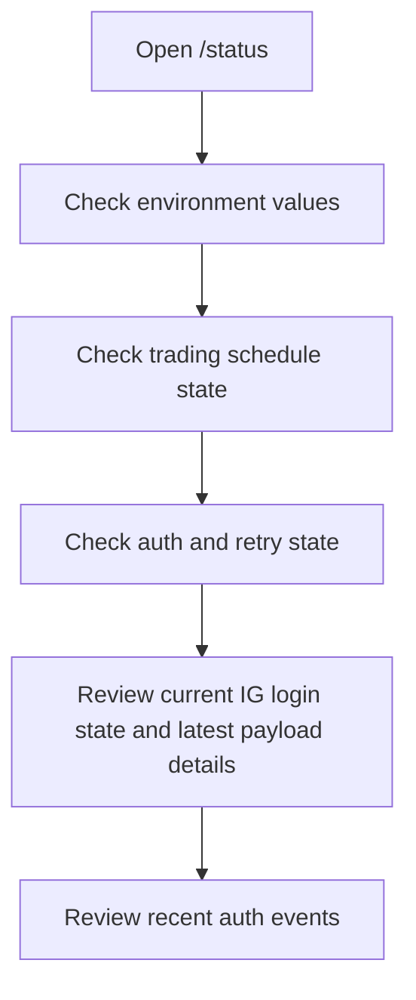
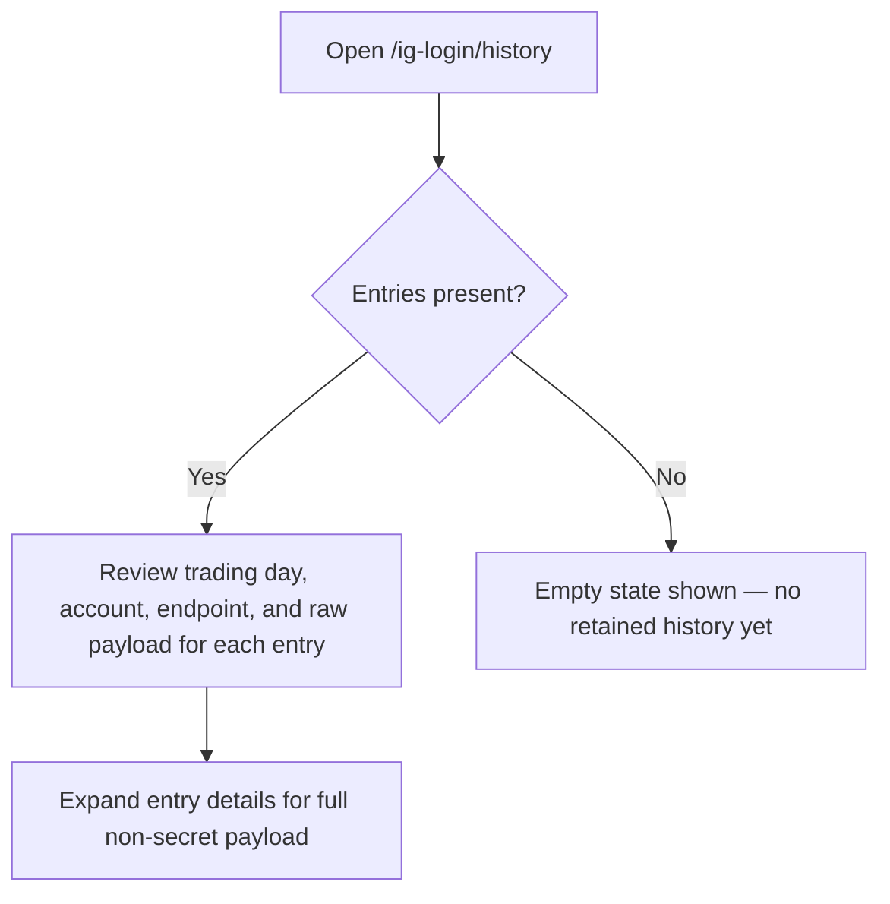
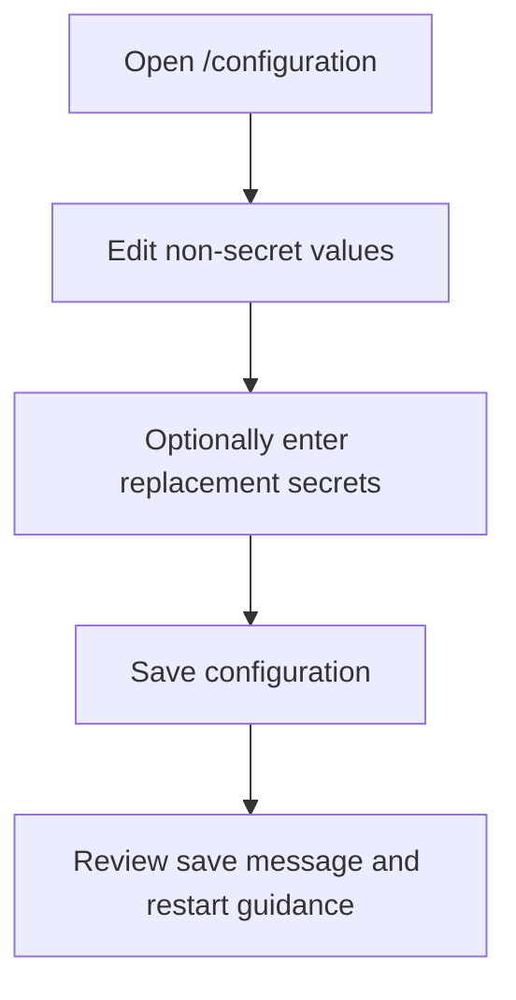
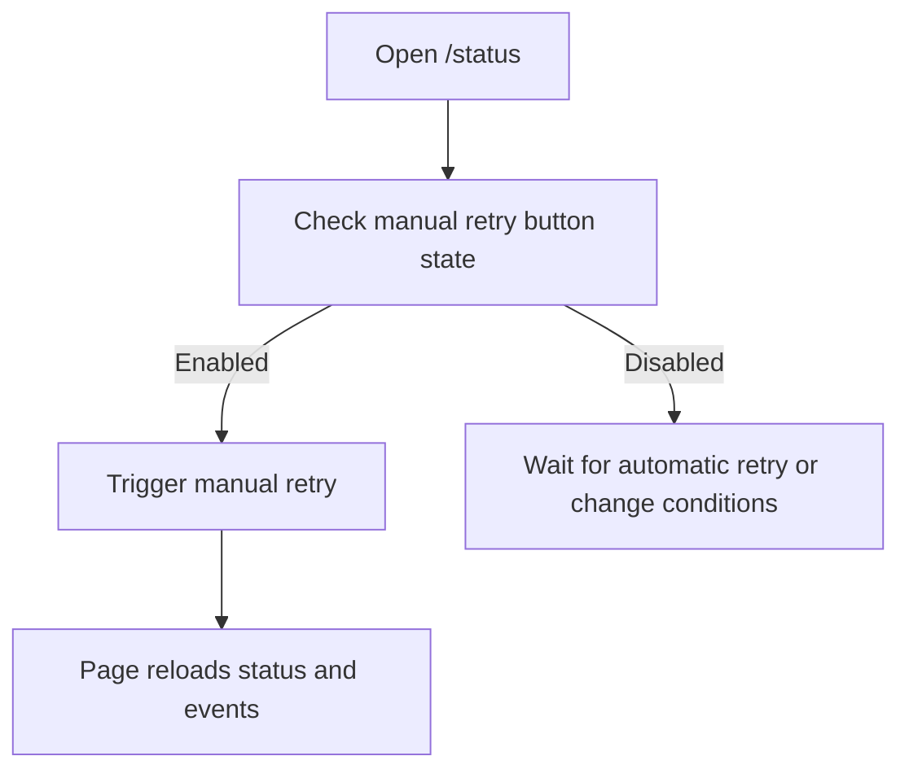

# Operator guide

This guide explains how the current Blazor operator UI works, what information each page shows, and how the existing workflows behave.

## Operator UI summary

The current UI is a Blazor Server app with a sign-in-first browser flow and three protected operator pages:

- `/`
- `/status`
- `/ig-login/history`
- `/configuration`
- `/administration/authentication`

When launched from the Aspire dashboard, the Operator UI link opens the home route (`/`).

The signed-in operator experience now uses a shared shell with:

- a compact top header with the site title on the left
- the current operator identity, sign-in or sign-out action, and theme toggle on the right
- a centered environment badge when runtime environment information is available
- a left navigation area that preserves route order and can be collapsed on desktop and laptop widths

The left navigation still changes based on the signed-in operator role.

## Navigation

| Route | Purpose |
| --- | --- |
| `/` | UI entry route. It redirects anonymous users to sign-in on first access and shows the signed-in home overview for authenticated operators. |
| `/status` | Runtime status, trading-schedule state, auth state, current IG login state, latest successful non-secret payload details, and recent auth events. |
| `/ig-login/history` | Retained daily first-successful non-secret IG login payloads within the 90-day retention window. Distinct from the current-state latest payload on `/status`. |
| `/configuration` | Operator-managed configuration, notification settings, trading-schedule values, and write-only IG credential updates. |
| `/administration/authentication` | Administrator-only summary of the configured auth provider, role claim type, and protected API audience. |
| `/account-preferences` | Operator-only live Test-account trailing-stops control and read-only verified observations. The feature does not authorize real orders or monetary exposure. |
| `/authentication/sign-in` | Starts sign-in. In automated local tests this also lists the seeded local test users. |
| `/authentication/sign-out` | Requires an authenticated browser session, accepts an antiforgery-protected POST from the shared header, and ends the platform session before returning to the UI entry route, which prompts for sign-in again. |
| `/authentication/access-denied` | Dedicated denied-access page for signed-in users who lack the required platform role. |

## Sign-in and sign-out

When the app is first opened in a fresh browser session, the UI entry route immediately sends the browser to sign-in before any operator content is shown.

The signed-out header action uses the same shared sign-in entry behavior and explicitly requests `prompt=login`, so starting sign-in from the header also requires an interactive authentication step instead of silently reusing an existing identity-provider session.

If the browser still has an authenticated platform cookie but no longer has a usable delegated access token, the UI treats that session as stale, clears the platform cookie, and sends the browser back through sign-in instead of rendering a broken signed-in shell.

- in lightweight local test runs, `/authentication/sign-in` lists the seeded local users used by automated tests
- in container-assisted local runs, sign-in redirects the browser to Keycloak
- sign-out requires an authenticated browser session, submits an antiforgery-protected POST from the shared header, clears the platform cookie, and, for OpenID Connect providers, ends the identity-provider session before returning the operator to `/`

If a pre-provisioned user authenticates without a platform role, the UI routes the user to `/authentication/access-denied`.

Signed-in operators can switch between the dark and light themes from the shared header. The UI defaults to the dark theme when no browser preference has been stored yet, and the selected theme is restored in the same browser on later visits.

## Home overview

The home page now acts as a lightweight operator overview after sign-in.

### Signed-out presentation

When the operator is signed out, `/` does not render a public landing surface. Instead, it redirects straight to the sign-in flow. The shared signed-in navigation shell is not shown before sign-in.

### Signed-in overview content

When the operator is signed in with a platform role, the home page shows:

- an operational summary card with platform environment, broker environment, session status, and schedule state
- a compact active-alert and notable-event summary list
- a recent activity list based on the latest auth event history

The overview remains summary-first. It does not introduce home-page quick actions.

## Status page

The status page is the main runtime dashboard.

It now uses grouped accordion sections so operators can focus on higher-priority information first while still keeping multiple sections open at the same time.

### Environment panel

The environment panel shows:

- platform environment
- broker environment
- live option availability

This makes the currently active context easy to verify before any operator action.

### Trading schedule panel

The trading schedule panel shows:

- whether the schedule is active
- the current schedule reason
- daily start and end time
- configured trading days
- weekend behavior
- configured bank holidays
- configured time zone

This explains whether the platform considers itself in schedule or out of schedule.

### Auth state panel

The auth state panel shows:

- session status
- whether the platform is degraded
- blocked reason
- retry phase
- automatic attempt number
- next retry time

When the platform is degraded, the page also shows a warning banner.

### IG login panel

The IG login panel keeps the current broker-login view separate from the generic auth supervision summary.

It shows:

- the current IG login state label used by the UI (`Active`, `Retrying`, `Failed`, `Blocked`, `Not signed in`, or `Out of schedule`)
- schedule context and the current schedule reason
- retry context for the current login state
- last login attempt time
- last successful login time
- latest failure summary when one exists

The latest failure summary is classified into clear operator-facing messages such as invalid credentials, forbidden access, request timeout, rate limiting, broker unreachability, or an unexpected broker response. These messages remain secret-safe and never include the configured API key, identifier, password, `CST`, or `X-SECURITY-TOKEN` values.

When the state is `OutOfSchedule`, the blocked reason shown in the status and IG login panels is the current governing inactive reason. A normal rollover from one inactive reason to another is non-fatal: the platform refreshes the persisted reason and validation timestamp without creating a retry, notification, or failure summary. Continued inactivity with the same reason follows the same no-side-effect path.

When a successful IG login payload has been captured, the same panel also exposes an expandable **Latest successful IG login payload details** area.

The expandable details show:

- capture time and trading day
- current account identifier
- Lightstreamer endpoint when supplied
- session expiry when supplied
- stored non-secret response headers
- the raw non-secret payload JSON captured from the latest successful login

Session tokens returned by IG are intentionally excluded from the details area. The expandable payload shows only the approved non-secret snapshot fields persisted by the backend.

The details area is intentionally current-state-focused. It shows the latest successful payload only and does not replace the future retained-history experience.

### IG Demo proof data panel

The status page also includes an accordion section titled **IG Demo proof data**.

It appears alongside the IG login panel as a standard grouped status section. Operators can leave it collapsed when they only need a quick login summary or expand it when they want to review the latest read-only proof snapshot.

When no proof data has been captured yet, the expanded panel shows the empty-state message: **No IG Demo proof data has been retrieved yet**.

When proof data is available, the panel shows:

- **Preferred account** — the display name of the account marked as preferred in the IG Demo account list, or the first account when no preference is set
- **Account ID** — the IG account identifier for the preferred account
- **Balance** — the preferred account balance in the account's base currency, formatted to two decimal places
- **Open positions** — the number of currently open positions in the Demo account
- **Retrieved at** — the local time when the proof data was last successfully captured

The hint text shown in the panel is: **Data sourced from IG Demo (read-only). No trades or orders have been placed.**

The proof-data view is refreshed after each successful Demo auth tick. It is not continuously polled.

The latest snapshot is durable platform state. Restarting the API does not
clear the displayed proof values when the persistent SQL resource is
available. The values disappear only when no snapshot has been captured or
when the platform database, including its local Docker volume, is reset.
The in-memory proof store is reserved for isolated tests and is not selected by
the running API.

## IG login history page

The IG login history page (`/ig-login/history`) shows retained daily first-successful non-secret login payloads within the 90-day retention window.

It is accessible to all signed-in operators with the `Viewer` role or higher and is listed in the left navigation panel.

### What it shows

- A list of retained daily entries, newest trading day first.
- For each entry:
  - The trading day the retained snapshot corresponds to.
  - The current account identifier at the time of login.
  - The Lightstreamer endpoint, when supplied by the broker.
  - The session expiry time, when returned by the broker.
  - Stored non-secret response headers.
  - The raw non-secret JSON payload from the successful login.

### Empty state

When no retained history has been captured yet — for example, on a fresh environment or before the first successful login — the page shows a clear empty-state message rather than a blank surface.

### Distinction from the status page

| Surface | Shows |
| --- | --- |
| `/status` IG login panel | **Current** login state, latest attempt time, and expandable **latest** successful non-secret payload. |
| `/ig-login/history` | **Retained daily** first-successful snapshots from previous trading days within the 90-day window. |

The history page is for review and troubleshooting of historical login payloads. It is not the source of truth for current auth state.

### Secret safety

The history page only displays non-secret fields. Credentials, session tokens, and equivalent protected values are excluded at the point of capture and are never returned by the history endpoint.

### Manual retry button

The manual retry button is visible only to `Operator` and `Administrator` users on the status page.

It is enabled only when:

- the retry limit has been reached
- the current trading schedule is active
- the session is degraded in a way that allows manual retry
- a retry is not already in progress

When manual retry succeeds, the page displays the new retry-cycle identifier returned by the API.

When manual retry is not allowed, the button stays disabled and the API protects the rule on the server side as well.

### Recent auth events table

The recent auth events section is now lower-priority and collapsed by default.

When expanded, it shows recent auth events filtered from the event history.

Refreshing the status page or expanding recent events is read-only. These
queries do not trigger broker authentication, reconciliation, notifications,
or database writes. On a new environment the status page can report that
runtime state is missing until the supervised startup/reconciliation path has
created the first projection; refreshing the page does not create it. The
status freshness timestamp reflects the last persisted validation, not the
time of the browser request.

Each row includes:

- occurrence time
- event type
- summary

Only redacted event details are exposed.

Sensitive credential, token, authorization, connection, and protected-value
metadata is replaced with `[redacted]` before operational JSON is persisted.
Matching is case-insensitive. Ordinary and unknown metadata remains available
for diagnosis, and raw bearer tokens or sensitive text assignments are scrubbed
by the Infrastructure redaction mechanism.

This table can now show both broker-auth supervision events and operator-session audit events, including sign-in, sign-out, access-denied, and delegated-scope acquisition failures.

## Configuration page

The configuration page groups startup-fixed runtime choices under an **Environment** section.

This section currently allows operators to change:

- platform environment
- broker environment

The configuration page is the main operator-edit surface.

It is designed for safe review and update of configuration without exposing stored secrets.
It is available only to `Operator` and `Administrator` users.

It now uses grouped accordion sections aligned with the status page so the form remains easier to scan without losing in-progress edits while sections are expanded or collapsed.

## Protected credential and key-ring operations

IG credentials are encrypted with the shared ASP.NET Data Protection key ring
stored in the durable `platformdb` database. Operators can replace credentials
through the configuration page, but existing secret values are never displayed
back to the UI or included in status, audit, notification, or diagnostic data.

The platform rotates Data Protection keys on a 90-day default lifetime while
retaining older keys so existing protected credentials remain decryptable. A
deployment may set `DataProtection:KeyLifetimeDays` to a positive value. Do not
delete the SQL data or key material as a routine troubleshooting action: loss
of the key ring invalidates protected local credentials and cookies, after
which credentials must be entered again and affected browser sessions must
sign in again.

## Authentication administration page

The authentication administration page is an `Administrator`-only surface.

It shows:

- the active authentication provider
- the role claim type used by the app
- the protected API audience expected by bearer validation

The current release does not manage users or roles in-app, so this page is informational rather than a full administration console.

## Configuration sections

### Environments

The environments section lets the operator review or change:

- platform environment
- broker environment

Important behavior:

- the `Live` broker option is shown but disabled when the platform environment is `Test`
- changing startup-fixed values can set `RestartRequired`
- changing only schedule, retry, notification, or credentials does not require restart when both environment selections remain unchanged
- the page explains that startup-fixed changes apply on the next platform start
- UI theme switching is provided from the shared header control rather than from the configuration form

### Trading schedule

The trading schedule section lets the operator review or update:

- start of day
- end of day
- trading days
- weekend behavior
- bank holidays
- time zone

The page accepts comma-separated values for trading days and bank holidays.

The save operation requires a later end time, at least one trading day, and a time zone known by the running platform. The selected environment combination is checked by the Application use case, so the `Test` platform cannot activate the `Live` broker.

At runtime, reconciliation and manual retry use the same Application-owned schedule policy. An inactive schedule blocks activity before broker access, and an active Test platform targeting the Live broker is classified as blocked before provider transport runs.

### Retry policy

The retry policy section exposes the operator-managed values used by runtime supervision:

- initial delay seconds
- max automatic retries
- multiplier
- max delay seconds
- periodic delay minutes

The initial delay must be positive, the multiplier must be at least `2`, and max delay must be greater than or equal to initial delay.

Automatic retry timing starts at the configured initial delay and increases by
the configured multiplier for each subsequent attempt. The configured maximum
delay is a hard cap. When a retry cycle resets its attempt counter, timing starts
again at the initial delay. These calculations are owned by the Application
policy; runtime clocks and waiting remain host mechanisms.

### Notifications

The notifications section exposes:

- provider
- email recipient

The supported providers are `RecordedOnly`, `Smtp`, and `AzureCommunicationServicesEmail`.

The application records notification activity even when real delivery transports are not configured.

Notification delivery is best-effort at-least-once. A `Failed`, `Skipped`, or
`TimedOut` record describes the provider attempt and does not confirm recipient
delivery. The next supervised retry can create another attempt, and repeated
attempts are intentionally retained for diagnosis. The platform does not
provide a durable cross-process idempotency key or exactly-once external
delivery guarantee.

### IG credentials

The credentials section uses write-only secret handling.

The operator can see only whether each value is present:

- API key present or missing
- identifier present or missing
- password present or missing

The operator cannot read the stored values.

To replace a secret, the operator enters a new value in the corresponding field and saves the form.

## Save behavior

When the operator saves configuration:

1. the UI sends a `PUT /api/platform/configuration` request
2. the API validates transport shape and maps the request to the Application use case
3. the Application validates configuration invariants before any store or reconciliation call
4. the SQL configuration store atomically persists the configuration, supplied protected credentials, and audit record
5. after a successful commit, the Application dispatches reconciliation so runtime state is refreshed from durable values
6. the API returns a redacted updated configuration snapshot
7. the page reloads from the returned model and shows a save result message

Invalid values return the normal validation error surface and leave the existing configuration unchanged. Invalid persisted or bootstrap configuration is an operator error and fails closed at startup; it is not silently replaced with defaults.

A database failure during the local commit leaves the prior configuration and
credential set in place and does not start reconciliation. IG and notification
provider calls occur after the local commit and may be retried by the next
serialized reconciliation if an external effect is interrupted.

If the updated values require restart to take effect at runtime, the page displays restart guidance.

## Operator workflow examples

### Review current status

```mermaid
flowchart TD
    Open[Open /status] --> CheckEnv[Check environment values]
    CheckEnv --> CheckSchedule[Check trading schedule state]
    CheckSchedule --> CheckAuth[Check auth and retry state]
    CheckAuth --> CheckIgLogin[Review current IG login state and latest payload details]
    CheckIgLogin --> ReviewEvents[Review recent auth events]
```

### Review retained IG login history

```mermaid
flowchart TD
    OpenHistory[Open /ig-login/history] --> CheckEntries{Entries present?}
    CheckEntries -->|Yes| ReviewEntry[Review trading day, account, endpoint, and raw payload for each entry]
    CheckEntries -->|No| EmptyState[Empty state shown — no retained history yet]
    ReviewEntry --> ExpandDetails[Expand entry details for full non-secret payload]
```

### Update configuration safely

```mermaid
flowchart TD
    OpenConfig[Open /configuration] --> EditValues[Edit non-secret values]
    EditValues --> ReplaceSecrets[Optionally enter replacement secrets]
    ReplaceSecrets --> Save[Save configuration]
    Save --> Result[Review save message and restart guidance]
```

### Trigger manual retry

```mermaid
flowchart TD
    ViewStatus[Open /status] --> CheckEligibility[Check manual retry button state]
    CheckEligibility -->|Enabled| Trigger[Trigger manual retry]
    Trigger --> Refresh[Page reloads status and events]
    CheckEligibility -->|Disabled| Wait[Wait for automatic retry or change conditions]
```

## Common operator-visible states

| State | What it means |
| --- | --- |
| `Active` | The platform currently considers auth-dependent runtime behavior healthy for the active schedule. |
| `Degraded` | The platform is running, but auth-dependent behavior is impaired. |
| `OutOfSchedule` | The trading schedule is currently inactive, so no active broker connection is expected. |
| `Blocked` | A forbidden combination, such as Test platform plus Live broker, has been prevented. |

## Safety rules surfaced in the UI

The UI reflects these key guardrails:

- anonymous users stay on public content until they sign in
- signed-in users without a required role are sent to the dedicated access-denied page
- stored secrets are never shown after capture
- the live broker option is disabled in the Test platform environment
- manual retry is unavailable until automatic retry exhaustion has occurred
- restart-required state is shown when startup-fixed configuration has changed
- degraded auth state does not make the whole UI unavailable

## Troubleshooting from the UI

### The status page shows `Degraded`

Check these items first:

- whether the trading schedule is active
- whether any credentials are missing
- whether the blocked reason explains the issue
- whether retry scheduling is active
- whether manual retry has become available

### The status page shows `Missing`

`stateAvailability: Missing` means the database has no persisted runtime state
yet. Reading the status page does not create that state and does not contact IG.
The API-owned reconciliation supervisor or an explicit manual/startup command
must establish the first runtime projection. Until then, freshness is shown as
`lastReconciledAtUtc: null`.

Refreshing status or events is safe during this interval: reads do not write,
send notifications, or change authentication transitions.

### The API does not become ready after an upgrade

API startup applies the Infrastructure-owned SQL migration lifecycle, bootstrap
configuration, retention cleanup, and then the initial authentication
reconciliation before readiness can become healthy. A migration or initialization
failure stops startup and keeps `/health/ready` unavailable; this is intentional
and prevents traffic from reaching a partially initialized platform.

If the error reports missing or incompatible migration history, do not delete the
persistent SQL resource as a first response. Follow the explicit database
transition procedure for the affected schema, preserve data where possible, and
restart only after the migration history is compatible.

Migration failure recovery is deliberately explicit:

1. Keep the SQL resource and its existing tables, rows, and migration history.
2. Capture the startup error and inspect the affected schema object and
    `__EFMigrationsHistory` with the approved database procedure.
3. Correct or remove only the incompatible or partial object after confirming
    that the change is safe for the retained data and the target migration.
4. Restart the application. The initializer resumes from the recorded migration
    history, applies the remaining migrations, and then runs bootstrap configuration
    and retention.
5. Confirm that `/health/ready` is healthy before allowing normal traffic.

Do not delete migration history, guess a baseline, or reset a persistent database
to make startup pass. The disposable database reset used by integration tests and
the local Docker reset procedure are not production recovery procedures.

If logs report that platform reconciliation is already owned by another replica,
allow the supervisor to retry on its next tick. This is expected during
overlapping replica startup or manual retry requests. If ownership does not
recover after the owning replica is stopped, inspect SQL connectivity and
connection-pool health before restarting the remaining API replica; the
session-owned lock is released when its SQL connection ends.

An `OutOfSchedule` reason change during normal reconciliation is not a startup
failure and does not require a retry or notification investigation. Genuine
startup migration, configuration, persistence, or policy failures remain
fail-fast: startup does not become ready until the failing condition is
corrected and initialization and reconciliation complete successfully.

### The configuration page says restart is required

This means a startup-fixed setting changed. The new value is persisted, but the currently running runtime state continues using the prior startup-applied environment selection until the next application start.

Changing only schedule, retry, notification, or credential settings does not
produce this guidance when the platform and broker environment selections stay
the same.

### The manual retry button is disabled

This usually means one of these conditions is true:

- the trading schedule is inactive
- the retry limit has not been reached yet
- the session is not in the right degraded state
- a retry is already in progress

### The IG login history page is empty

This is expected when:

- the platform has not yet completed a successful IG login for any retained trading day
- the environment has been freshly provisioned and no first-successful snapshot has been captured
- all retained entries have aged outside the 90-day retention window

To populate history, a successful IG login must occur during an active trading-schedule period. The retention processor removes entries older than the configured `Retention:OperationalRecordsDays` automatically. Entries exactly at the cleanup cutoff remain until a later run, and the current `Latest` snapshot is never removed by age-based cleanup. A missing, invalid, negative, or zero value uses the 90-day default rather than disabling retention.

## Related documents

- [Application overview](application-overview.md)
- [API reference](api-reference.md)
- [Runtime behavior](runtime-behavior.md)

## Account Preferences page

`/account-preferences` is available only to Operators and Administrators. It
shows `Live trailing stops control for the configured account.` The page states
that the control does not authorize real orders or monetary exposure.

Initial load reads SQL state. The page labels the operator value `Desired setting` and the external fact `Last observed at IG`, with verification status and retry information beside them. Saving commits desired state and shows `Pending` while background verification runs; it does not wait for a provider read. `InSync`, `Drifted`, `VerificationFailed`, and `Unsupported` remain distinct states.

If the initial preference load fails, the page does not expose an editable
default Boolean or a Save action. Save confirmation is a persistent,
dismissible status message separate from application status. Dismissing the
confirmation restores focus to the Save action. A confirmed save with a
history refresh failure reports `Trailing stops preference saved and
confirmed. Observed history could not be refreshed.` The separate history
section remains read-only evidence of verified reads and confirmed updates,
never a cached live value.

History is bounded and keyset-paged with an opaque cursor. Equal values remain
separate observations, while failed or unknown provider outcomes are not shown
as preference observations. Cursors are partition-bound and invalid membership
is rejected rather than silently restarting from the first page. The feature is
Test-only; Live requires a
separate safety delivery for credentials, authorization, allowance handling,
and monetary-risk controls. Online history retention uses
`Retention:OperationalRecordsDays`; archive/export is deferred.

