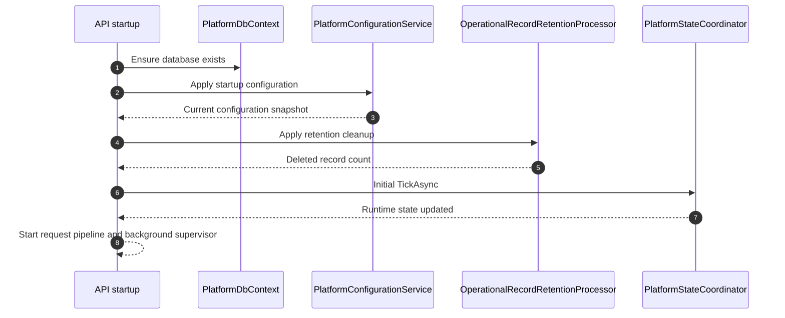
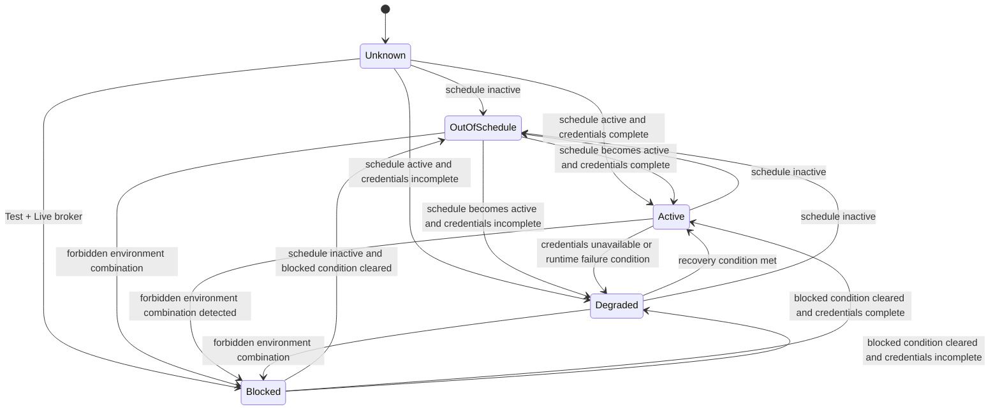
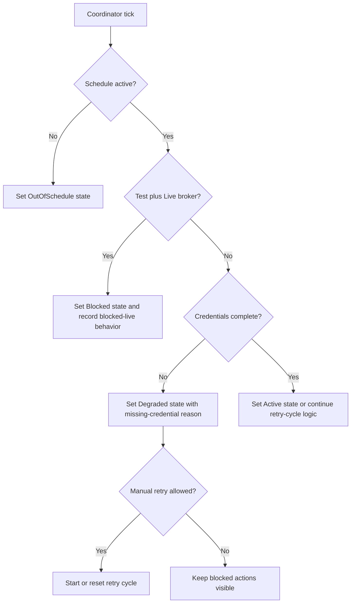

# Runtime behavior

This document explains how the current application behaves at startup and while it is running. It focuses on schedule evaluation, auth state, retry handling, notifications, and record retention.

## Runtime model summary

The current runtime model is a supervised control loop.

Alongside the broker-auth supervision model, the platform now also applies a separate operator access model:

- `/` stays public for anonymous users
- signed-in operators receive role-based UI navigation
- signed-in operators receive a shared shell with a compact header, environment badge, and per-browser light or dark theme preference
- protected Web routes and API endpoints fail closed when authentication or authorization is missing
- the Blazor host propagates delegated bearer tokens to the API
- higher scopes are requested only when privileged areas are entered

The refreshed UI defaults to dark theme when no browser preference exists. Theme selection is stored only as non-sensitive browser state and is applied immediately from the shared header and configuration page.

At startup and during background execution, the application:

1. loads configuration
2. evaluates whether the trading schedule is active
3. checks whether the selected environment combination is allowed
4. evaluates whether required credentials are present
5. updates runtime auth state
6. records events and notifications when state changes matter

## Startup sequence

At API startup, the application performs the following sequence:

## Background supervision

A hosted background service runs once per second and calls the coordinator.

This gives the application a lightweight heartbeat that keeps runtime state fresh without requiring an incoming request.

## Trading schedule behavior

The trading schedule gate determines whether the platform is inside the configured operating window.

### Inputs

- configured start of day
- configured end of day
- configured trading days
- configured weekend behavior
- configured bank holidays
- configured time zone
- current UTC time

### Outcomes

The schedule gate returns:

- `IsActive`
- a human-readable reason

### Example reasons

- trading schedule is active
- trading schedule is inactive for the current time window
- trading schedule is inactive for the current day
- trading schedule is inactive for the configured bank holiday

## Auth-state behavior

The current implementation does not yet perform real broker authentication.

Instead, it models the auth state needed by the rest of the control plane. The coordinator uses environment rules, schedule rules, and credential presence to decide what the runtime auth state should be.

This runtime auth-state model is distinct from the operator sign-in model:

- operator sign-in uses standards-based OIDC/OAuth flows through Keycloak locally and Azure-aligned configuration for Microsoft Entra ID
- automated tests may opt into the synthetic test provider through explicit test-harness composition
- operator role boundaries are enforced independently of the simulated broker auth-state projection

## State transitions

## Blocked-live rule

The most important safety rule currently implemented is the blocked-live rule.

When:

- platform environment is `Test`
- broker environment is `Live`

then the runtime state becomes blocked.

Effects:

- the live broker option remains visible
- the live broker option is unavailable
- the status surface shows the blocked reason
- blocked-live notifications and events can be recorded
- manual retry is not allowed

## Missing-credential behavior

When the trading schedule is active but required credentials are incomplete:

- the platform enters a degraded state
- the blocked reason becomes `IG demo credentials are incomplete.`
- retry progress remains cleared instead of pretending a real retry cycle is active
- the operator UI remains available
- auth-dependent actions stay blocked
- only one failure notification is recorded per retry cycle or process behavior boundary tested by the suite

This distinction matters because the current implementation avoids implying that the system is actively contacting IG when it does not yet have the credentials required to do so.

## Retry behavior

The retry model has two phases in the current domain model:

- `InitialAutomatic`
- `Periodic`

The retry state also supports `None` when no retry cycle is active.

### Backoff policy

The retry-delay calculation uses:

- initial delay seconds
- multiplier
- max delay seconds
- max automatic retries
- periodic delay minutes

The current default values are:

- initial delay: `1` second
- multiplier: `2`
- max delay: `60` seconds
- max automatic retries: `5`
- periodic delay: `5` minutes

### Delay examples

| Attempt | Delay with defaults |
| --- | --- |
| 1 | 1 second |
| 2 | 2 seconds |
| 3 | 4 seconds |
| 4 | 8 seconds |
| 5 | 16 seconds |
| 8 | 60 seconds cap |

## Manual retry behavior

Manual retry is a controlled action rather than a generic force-refresh.

It is only allowed when:

- the trading schedule is active
- the state is degraded in a manual-retry-eligible way
- the automatic retry limit has been reached

When manual retry is accepted:

- a new retry-cycle identifier is created
- the retry phase is reset to `InitialAutomatic`
- the automatic attempt counter is reset
- the next retry time is scheduled
- a manual-retry-requested event is recorded

## Event recording

Operational events are stored for later review.

### Current event categories

- `auth`
- `notification`

### Example event types seen in the code and tests

- `AuthAttempted`
- `ManualRetryRequested`
- `BlockedLiveAttempt`
- operator session audit events such as `OperatorSignInCompleted`, `OperatorSignOutCompleted`, `OperatorAccessDenied`, and `OperatorTokenAcquisitionFailed`
- notification-related event types such as `AuthFailure`, `AuthRecovered`, and `RetryLimitReached`

Event details are redacted before storage and before they are returned through the API.

### Operator authentication audit history

The auth event history now includes persisted operator-session audit events alongside broker-auth supervision events.

- successful sign-in writes an auth event with correlation data and redacted scope metadata
- successful sign-out writes an auth event before the platform cookie is cleared
- authenticated access-denied redirects write an auth event for the rejected protected surface
- missing delegated scopes during Web-to-API token use write an auth event without exposing the raw access token

This keeps the auth event stream aligned with the 90-day operational retention model while still excluding tokens, secrets, and raw protocol payloads.

## Notification behavior

Notification dispatch is routed through a provider abstraction.

### Providers currently registered

- `RecordedOnly`
- `Smtp`
- `AzureCommunicationServicesEmail`

### Current behavior

- `RecordedOnly` logs and records the notification without external delivery
- `Smtp` sends mail only when SMTP settings are configured
- `AzureCommunicationServicesEmail` sends mail only when ACS settings are configured
- missing transport configuration causes a safe `Skipped` result instead of a false success

### Notification record contents

Notification records keep:

- notification type
- platform environment
- broker environment
- recipient
- summary
- dispatch status
- provider
- correlation id
- retry-cycle id when applicable

## Configuration update behavior

When configuration is updated:

1. the current configuration row is loaded or created
2. new values are written
3. startup-fixed changes determine whether `RestartRequired` should be set
4. credentials are updated only when replacement values are supplied
5. a configuration audit record is written
6. secrets are redacted from audit detail payloads
7. the coordinator ticks again so runtime state reflects the latest settings

## Startup-fixed changes

The implementation distinguishes between persisted configuration and currently applied runtime startup state.

When platform or broker environment values change:

- the update is persisted immediately
- `RestartRequired` is set
- the currently running runtime view can continue exposing the startup-applied values until startup configuration is applied again
- the UI tells the operator that the changes will apply on the next start

## Retention behavior

The retention processor deletes expired operational records based on `Retention:OperationalRecordsDays`.

The default retention window is `90` days.

The processor currently applies retention to:

- operational events
- configuration audits
- notification records

## Local infrastructure behavior

### When SQL is available

- the API uses SQL Server
- configuration and operational data are durable
- AppHost can create the database automatically

### When SQL is not available

- the API falls back to the in-memory provider
- behavior still works for local exploration and tests
- persisted data does not survive process restart

## Runtime behavior in one diagram

## Related documents

- [Operator guide](operator-guide.md)
- [API reference](api-reference.md)
- [Architecture](architecture.md)
