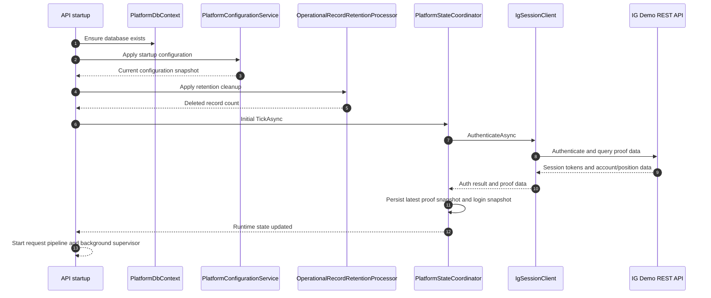
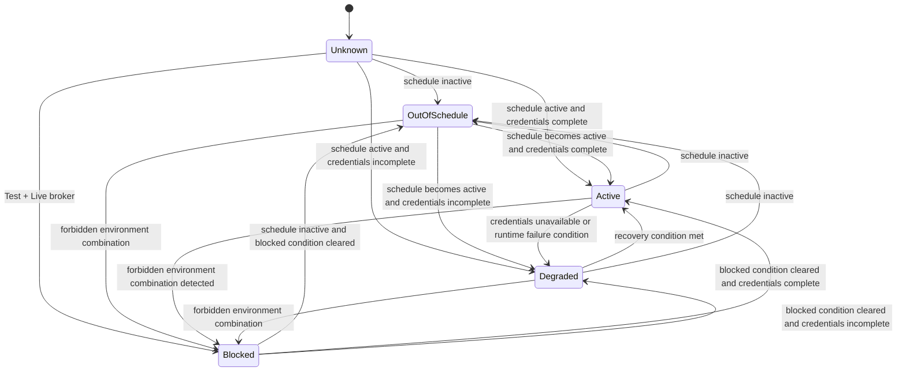
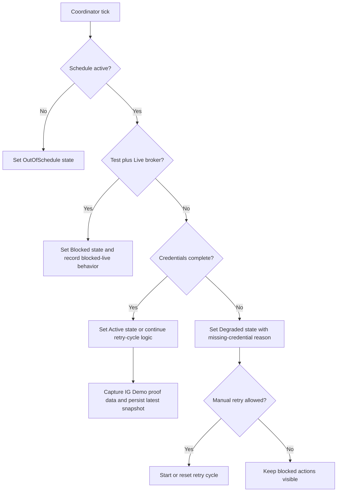

# Runtime behavior

This document explains how the current application behaves at startup and while it is running. It focuses on schedule evaluation, auth state, retry handling, notifications, and record retention.

## Runtime model summary

The current runtime model is a supervised control loop.

Alongside the broker-auth supervision model, the platform now also applies a separate operator access model:

- `/` is a sign-in-first entry route that redirects anonymous users, including requests with stale cookies, to sign-in
- signed-in operators receive role-based UI navigation
- signed-in operators receive a shared shell with a compact header, environment badge, and per-browser light or dark theme preference
- protected Web routes and API endpoints fail closed when authentication or authorization is missing
- the Blazor host propagates delegated bearer tokens to the API
- higher scopes are requested only when privileged areas are entered

The refreshed UI defaults to dark theme when no browser preference exists. Theme selection is stored only as non-sensitive browser state and is applied immediately from the shared header.

At startup and during background execution, the application:

1. loads configuration
2. evaluates whether the trading schedule is active
3. checks whether the selected environment combination is allowed
4. evaluates whether required credentials are present
5. updates runtime auth state
6. retrieves read-only IG Demo proof data (account, balance, positions) after a successful session and persists the result as a non-secret `IgProofDataSnapshot`
7. captures a secret-safe IG login snapshot after a successful backend auth transition
8. records events and notifications when state changes matter

## Startup sequence

At API startup, the application performs the following sequence:

```mermaid
sequenceDiagram
    autonumber
    participant App as API startup
    participant Db as PlatformDbContext
    participant Config as PlatformConfigurationService
    participant Retention as OperationalRecordRetentionProcessor
    participant Coordinator as PlatformStateCoordinator
    participant IgSessionClient as IgSessionClient
    participant IgDemo as IG Demo REST API

    App->>Db: Ensure database exists
    App->>Config: Apply startup configuration
    Config-->>App: Current configuration snapshot
    App->>Retention: Apply retention cleanup
    Retention-->>App: Deleted record count
    App->>Coordinator: Initial TickAsync
    Coordinator->>IgSessionClient: AuthenticateAsync
    IgSessionClient->>IgDemo: Authenticate and query proof data
    IgDemo-->>IgSessionClient: Session tokens and account/position data
    IgSessionClient-->>Coordinator: Auth result and proof data
    Coordinator->>Coordinator: Persist latest proof snapshot and login snapshot
    Coordinator-->>App: Runtime state updated
    App-->>App: Start request pipeline and background supervisor
```

## Background supervision

A hosted background service runs once per second and calls the coordinator.

This gives the application a lightweight heartbeat that keeps runtime state fresh without requiring an incoming request.

## Trading schedule behavior

The trading schedule gate determines whether the platform is inside the configured operating window.

### Inputs

- configured start of day
- configured end of day
- configured trading days
- configured weekend behavior
- configured bank holidays
- configured time zone
- current UTC time

### Outcomes

The schedule gate returns:

- `IsActive`
- a human-readable reason

### Example reasons

- trading schedule is active
- trading schedule is inactive for the current time window
- trading schedule is inactive for the current day
- trading schedule is inactive for the configured bank holiday

## Auth-state behavior

The runtime coordinator applies environment rules, schedule rules, and credential presence to decide what the auth state should be.

This runtime auth-state model is distinct from the operator sign-in model:

- operator sign-in uses standards-based OIDC/OAuth flows through Keycloak locally and Azure-aligned configuration for Microsoft Entra ID
- automated tests may opt into the synthetic test provider through explicit test-harness composition
- operator role boundaries are enforced independently of the broker auth-state projection

When a backend auth transition succeeds, the coordinator now persists:

- one latest successful IG login snapshot for the active broker environment
- one retained first-successful snapshot per trading day

Retained daily snapshots older than 90 days are removed by the shared retention processor, while the independently addressable latest snapshot remains available.

The current status projection now also reads the latest successful snapshot back into `GET /api/platform/status` so the Web UI can show the current IG login state and expand the latest non-secret payload details without calling a second latest-snapshot endpoint.

The same status projection also surfaces the latest `IgProofDataSnapshot` as `LatestProofData` when the platform has already captured read-only Demo proof data for the active broker environment.

The latest snapshot projection currently includes:

- snapshot identifier and capture time
- trading day
- current account identifier
- Lightstreamer endpoint when supplied
- session expiry when supplied
- approved non-secret response headers
- the raw non-secret payload JSON

Protected values such as credentials, `CST`, `X-SECURITY-TOKEN`, and equivalent secrets remain excluded before persistence and before the status response is built.

## Broker authentication execution

When the trading schedule is active and credentials are complete, the platform now authenticates against IG by:

- loading the selected environment's protected API key, identifier, and password through the runtime credential service
- calling the IG session client instead of constructing a simulated authentication response
- sanitizing the broker response before any operational-event payload is recorded
- persisting only the approved non-secret snapshot fields from a successful response

The returned `CST` and `X-SECURITY-TOKEN` values remain in memory only for the current authentication flow. They are not stored on runtime-state entities, login snapshots, status payloads, or operational-event details.

### Failure classification

When IG authentication fails, the degraded-state summary is classified into one of these operator-visible categories:

- invalid or rejected credentials
- access forbidden
- request rate limit exceeded
- unexpected broker response
- request timed out
- broker unreachable
- unexpected error

These summaries are secret-safe and feed the same degraded-state path that maintains retry scheduling and failure notification behavior.

### Opt-in real IG smoke validation

Deterministic automated coverage continues to use test doubles by default.

Real IG smoke validation remains opt-in only. Supply credentials through user secrets or environment variables outside source control, then run the targeted broker-auth validation locally when you explicitly want to verify live Demo connectivity. Do not enable this path in the default `dotnet test` workflow.

## State transitions

```mermaid
stateDiagram-v2
    [*] --> Unknown
    Unknown --> OutOfSchedule: schedule inactive
    Unknown --> Blocked: Test + Live broker
    Unknown --> Degraded: schedule active and credentials incomplete
    Unknown --> Active: schedule active and credentials complete

    OutOfSchedule --> Active: schedule becomes active and credentials complete
    OutOfSchedule --> Degraded: schedule becomes active and credentials incomplete
    OutOfSchedule --> Blocked: forbidden environment combination

    Active --> OutOfSchedule: schedule inactive
    Active --> Degraded: credentials unavailable or runtime failure condition
    Active --> Blocked: forbidden environment combination detected

    Degraded --> Active: recovery condition met
    Degraded --> OutOfSchedule: schedule inactive
    Degraded --> Blocked: forbidden environment combination

    Blocked --> OutOfSchedule: schedule inactive and blocked condition cleared
    Blocked --> Active: blocked condition cleared and credentials complete
    Blocked --> Degraded: blocked condition cleared and credentials incomplete
```

## Blocked-live rule

The most important safety rule currently implemented is the blocked-live rule.

When:

- platform environment is `Test`
- broker environment is `Live`

then the runtime state becomes blocked.

Effects:

- the live broker option remains visible
- the live broker option is unavailable
- the status surface shows the blocked reason
- blocked-live notifications and events can be recorded
- manual retry is not allowed

## Missing-credential behavior

When the trading schedule is active but required credentials are incomplete:

- the platform enters a degraded state
- the blocked reason becomes `IG demo credentials are incomplete.`
- retry progress remains cleared instead of pretending a real retry cycle is active
- the operator UI remains available
- auth-dependent actions stay blocked
- only one failure notification is recorded per retry cycle or process behavior boundary tested by the suite

This distinction matters because the current implementation avoids implying that the system is actively contacting IG when it does not yet have the credentials required to do so.

## Retry behavior

The retry model has two phases in the current domain model:

- `InitialAutomatic`
- `Periodic`

The retry state also supports `None` when no retry cycle is active.

### Backoff policy

The retry-delay calculation uses:

- initial delay seconds
- multiplier
- max delay seconds
- max automatic retries
- periodic delay minutes

The current default values are:

- initial delay: `1` second
- multiplier: `2`
- max delay: `60` seconds
- max automatic retries: `5`
- periodic delay: `5` minutes

### Delay examples

| Attempt | Delay with defaults |
| --- | --- |
| 1 | 1 second |
| 2 | 2 seconds |
| 3 | 4 seconds |
| 4 | 8 seconds |
| 5 | 16 seconds |
| 8 | 60 seconds cap |

## Manual retry behavior

Manual retry is a controlled action rather than a generic force-refresh.

It is only allowed when:

- the trading schedule is active
- the state is degraded in a manual-retry-eligible way
- the automatic retry limit has been reached

When manual retry is accepted:

- a new retry-cycle identifier is created
- the retry phase is reset to `InitialAutomatic`
- the automatic attempt counter is reset
- the next retry time is scheduled
- a manual-retry-requested event is recorded

## Event recording

Operational events are stored for later review.

### Current event categories

- `auth`
- `notification`

### Example event types seen in the code and tests

- `AuthAttempted`
- `Authenticated`
- `FailureDetected`
- `Recovered`
- `SessionExpired`
- `TradingScheduleInactive`
- `BlockedLiveAttempt`
- `SnapshotCaptured` (recorded when a successful IG login snapshot is persisted, including trading day and account identifier in the details; no protected values included)
- `ManualRetryRequested`
- operator session audit events such as `OperatorSignInCompleted`, `OperatorSignOutCompleted`, `OperatorAccessDenied`, and `OperatorTokenAcquisitionFailed`
- notification-related event types such as `AuthFailure`, `AuthRecovered`, and `RetryLimitReached`

Event details are redacted before storage and before they are returned through the API.

### Operator authentication audit history

The auth event history now includes persisted operator-session audit events alongside broker-auth supervision events.

- successful sign-in writes an auth event with correlation data and redacted scope metadata
- successful sign-out writes an auth event before the platform cookie is cleared
- authenticated access-denied redirects write an auth event for the rejected protected surface
- missing delegated scopes during Web-to-API token use write an auth event without exposing the raw access token

This keeps the auth event stream aligned with the 90-day operational retention model while still excluding tokens, secrets, and raw protocol payloads.

## Notification behavior

Notification dispatch is routed through a provider abstraction.

### Providers currently registered

- `RecordedOnly`
- `Smtp`
- `AzureCommunicationServicesEmail`

### Current behavior

- `RecordedOnly` logs and records the notification without external delivery
- `Smtp` sends mail only when SMTP settings are configured
- `AzureCommunicationServicesEmail` sends mail only when ACS settings are configured
- missing transport configuration causes a safe `Skipped` result instead of a false success

### Notification record contents

Notification records keep:

- notification type
- platform environment
- broker environment
- recipient
- summary
- dispatch status
- provider
- correlation id
- retry-cycle id when applicable

## Configuration update behavior

When configuration is updated:

1. the current configuration row is loaded or created
2. new values are written
3. startup-fixed changes determine whether `RestartRequired` should be set
4. credentials are updated only when replacement values are supplied
5. a configuration audit record is written
6. secrets are redacted from audit detail payloads
7. the coordinator ticks again so runtime state reflects the latest settings

## Startup-fixed changes

The implementation distinguishes between persisted configuration and currently applied runtime startup state.

When platform or broker environment values change:

- the update is persisted immediately
- `RestartRequired` is set
- the currently running runtime view can continue exposing the startup-applied values until startup configuration is applied again
- the UI tells the operator that the changes will apply on the next start

## Retention behavior

The retention processor deletes expired operational records based on `Retention:OperationalRecordsDays`.

The default retention window is `90` days.

The processor currently applies retention to:

- operational events
- configuration audits
- notification records
- retained daily IG login snapshots (the `RetainedDailyFirstSuccessful` kind; the independently addressable latest snapshot is not subject to automatic age-based removal)

### IG login snapshot retention

Two kinds of IG login snapshot are stored:

| Kind | Meaning | Retention |
| --- | --- | --- |
| `Latest` | The most recent successful login result for the active broker environment. | Always retained; overwritten by a newer successful login. |
| `RetainedDailyFirstSuccessful` | The first successful login result for each trading day. One entry per day. | Removed after 90 days by the retention processor. |

The retained daily snapshots are accessible through `GET /api/platform/ig-login/history`. The latest snapshot is included directly in `GET /api/platform/status` so the UI can expand payload details without a second read call.

## Local infrastructure behavior

### When SQL is available

- the API uses SQL Server
- configuration and operational data are durable
- AppHost can create the database automatically

### When SQL is not available

- the API falls back to the in-memory provider
- behavior still works for local exploration and tests
- persisted data does not survive process restart

## Runtime behavior in one diagram

```mermaid
flowchart TD
    Tick[Coordinator tick] --> Schedule{Schedule active?}
    Schedule -->|No| OutOfSchedule[Set OutOfSchedule state]
    Schedule -->|Yes| Combination{Test plus Live broker?}
    Combination -->|Yes| Blocked[Set Blocked state and record blocked-live behavior]
    Combination -->|No| Credentials{Credentials complete?}
    Credentials -->|No| Degraded[Set Degraded state with missing-credential reason]
    Credentials -->|Yes| Active[Set Active state or continue retry-cycle logic]
    Active --> ProofData[Capture IG Demo proof data and persist latest snapshot]
    Degraded --> ManualRetry{Manual retry allowed?}
    ManualRetry -->|Yes| RetryCycle[Start or reset retry cycle]
    ManualRetry -->|No| Wait[Keep blocked actions visible]
```

## Related documents

- [Operator guide](operator-guide.md)
- [API reference](api-reference.md)
- [Architecture](architecture.md)
