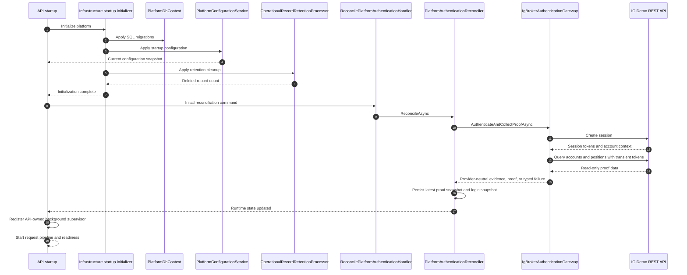
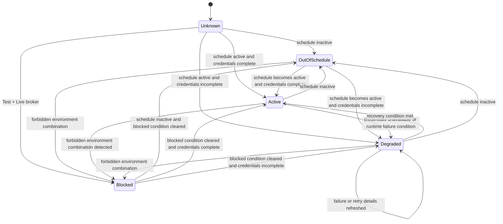
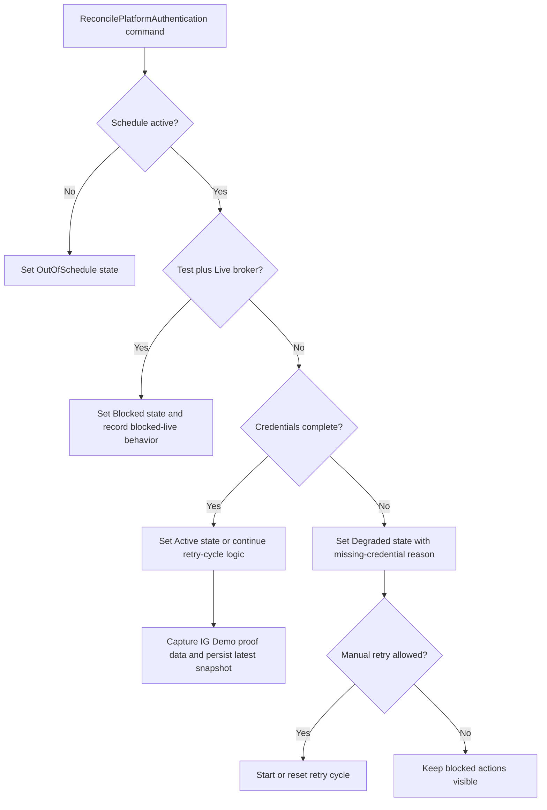

---
title: Runtime behavior
description: Startup, supervision, broker authentication, retry, notification, and retention behavior
author: TNC Trading
ms.date: 2026-07-27
ms.topic: concept
---

This document explains how the current application behaves at startup and while it is running. It focuses on schedule evaluation, auth state, retry handling, notifications, and record retention.

## Trailing-stops observation retention and environment guard

Trailing-stops preference observations are retained online according to
`Retention:OperationalRecordsDays`. The startup retention processor deletes
observations strictly older than the configured cutoff from SQL Server and its
in-memory test provider; observations at the cutoff are preserved. A missing,
invalid, negative, or zero value uses the 90-day default. Archive/export is
deferred from the initial delivery.

The feature presents the legacy broker environment key `Demo` as `Test` without
rewriting historical records. It supports the Test account only. This control
does not authorize real orders or monetary exposure, and Live execution remains
blocked until a separate Live safety delivery provides explicit authorization
and risk controls.

## Account Details capture

After a durable successful IG Demo login, Application requests a best-effort
automatic Account Details capture. The first successful capture for the
configured trading day is stored using the existing trading-schedule time
zone, rather than UTC midnight. A failed automatic capture does not invalidate
login success and is eligible for another attempt after a later successful
login. Once the daily snapshot exists, subsequent successful logins do not
issue another automatic accounts request for that environment and trading day.

An Operator can request a deliberate refresh through the API. Same-process
requests coalesce, while the SQL Server application lock coordinates replicas
per broker environment. Automatic contention yields so login remains
successful; manual contention returns `409 Conflict` with the newest known
timestamp. Each successful response is validated before one SQL transaction
inserts an immutable retrieval header and all account children. The 90-day
operational retention process removes expired retrievals and cascades their
children while preserving the newest successful retrieval in each environment.
The additive EF migration is applied before bootstrap configuration and
retention; incompatible migration history remains fail-closed for operator
correction.

## Runtime model summary

The current runtime model is a supervised control loop.

Alongside the broker-auth supervision model, the platform now also applies a separate operator access model:

- `/` is a sign-in-first entry route that redirects anonymous users, including requests with stale cookies, to sign-in
- signed-in operators receive role-based UI navigation
- signed-in operators receive a shared shell with a compact header, environment badge, and per-browser light or dark theme preference
- protected Web routes and API endpoints fail closed when authentication or authorization is missing
- the Blazor host propagates delegated bearer tokens to the API
- higher scopes are requested only when privileged areas are entered

The refreshed UI defaults to dark theme when no browser preference exists. Theme selection is stored only as non-sensitive browser state and is applied immediately from the shared header.

At startup and during background execution, the application:

1. loads configuration
2. evaluates whether the trading schedule is active
3. checks whether the selected environment combination is allowed
4. evaluates whether required credentials are present
5. updates runtime auth state
6. invokes the Application-owned broker authentication gateway, whose Infrastructure adapter authenticates and retrieves read-only IG Demo proof data in one operation
7. persists provider-neutral proof and login snapshots after a successful backend auth transition
8. records events and notifications when state changes matter

The latest IG Demo proof snapshot is durable. Infrastructure stores one
provider-neutral row per broker environment in SQL Server and replaces that
row after a newer successful proof query. A new API process reads the stored
snapshot before any later proof query succeeds, so a restart does not erase the
last known proof data. A missing row remains an explicit empty state; proof
query failure after authentication does not overwrite an existing snapshot.
Production dependency injection uses the SQL adapter, so this guarantee also
applies to the running API rather than only to direct adapter tests.

For an operator-triggered retry, `TriggerManualAuthRetryHandler` performs this
sequence directly. It loads runtime state and configuration, rejects inactive
schedules, blocked Test-to-Live targets, or an unreached retry limit without a
write, then commits the initial manual-cycle intent before broker I/O. A broker
success or typed provider failure is applied to state and committed through the
operation-specific committer. Notification delivery remains outside the local
SQL consistency unit. Cancellation from the request or broker propagates to the
caller rather than becoming a 409 conflict.

## Phase 0 migration decisions

These decisions define the intended runtime contract for the migration. Items
marked provisional require product or deployment confirmation and are not
implemented behavior unless another section explicitly says they are current.

* Reconciliation has one serialized writer for startup, scheduled, manual, and
    configuration-triggered execution. All automatic calls enter through the
    `ReconcilePlatformAuthenticationHandler`; manual retry uses the same
    application writer gate. The existing blocking startup call and one-second
    supervisor remain current behavior until the hosting phase changes them.
* A reconciliation outcome may update configuration-derived state, runtime
    state, retry metadata, snapshots, operational events, audit records, and
    notification records in one local database consistency unit. External IG and
    notification calls are outside that unit. The implementation does not yet
    claim atomicity across every current write path.
* Status and event queries are non-mutating projection reads. They return the
    latest persisted state and events without authenticating, notifying,
    inserting, saving, transitioning, or reconciling. A status response exposes
    `stateAvailability` (`Available` or `Missing`) and `lastReconciledAtUtc`;
    missing runtime state is returned explicitly rather than being created.
    Events are returned newest first, with event ID as the deterministic tie
    breaker. Freshness comes from the persisted last-validation timestamp;
    reads do not claim or create a newer timestamp.
* Startup readiness remains blocking until an explicit `Starting` or unavailable
    API contract is approved. Readiness must not imply that an external IG call
    is healthy when startup reconciliation is unavailable.
* Recovery after a process or external-effect failure comes from the next
    supervised reconciliation and persisted retry or outcome state. The platform
    does not promise exactly-once IG or notification delivery.

The command returns the persisted runtime outcome after the writer completes:
session status, degraded state, a secret-safe failure summary, and the last
validated timestamp. IG authentication and proof-data calls, together with
notification dispatch, occur outside the local persistence writes; the next
serialized reconciliation recovers from an interrupted external effect.

### Invalid stored configuration

Invalid persisted configuration is an explicit operator error. Startup should
fail closed with a diagnostic that identifies the invalid setting without
revealing credentials. Automatic repair or default replacement is not selected
because it could change trading behavior without operator approval. The
validation and startup error contract is enforced by the Application configuration
invariants when updates are handled; persisted/bootstrap parsing retains the
fail-closed startup behavior for invalid stored values.

## Startup sequence

At API startup, the application performs the following sequence:

```mermaid
sequenceDiagram
    autonumber
    participant App as API startup
    participant Startup as Infrastructure startup initializer
    participant Db as PlatformDbContext
    participant Config as PlatformConfigurationService
    participant Retention as OperationalRecordRetentionProcessor
    participant Reconcile as ReconcilePlatformAuthenticationHandler
    participant Reconciler as PlatformAuthenticationReconciler
    participant BrokerGateway as IgBrokerAuthenticationGateway
    participant IgDemo as IG Demo REST API

    App->>Startup: Initialize platform
    Startup->>Db: Apply SQL migrations
    Startup->>Config: Apply startup configuration
    Config-->>App: Current configuration snapshot
    Startup->>Retention: Apply retention cleanup
    Retention-->>Startup: Deleted record count
    Startup-->>App: Initialization complete
    App->>Reconcile: Initial reconciliation command
    Reconcile->>Reconciler: ReconcileAsync
    Reconciler->>BrokerGateway: AuthenticateAndCollectProofAsync
    BrokerGateway->>IgDemo: Create session
    IgDemo-->>BrokerGateway: Session tokens and account context
    BrokerGateway->>IgDemo: Query accounts and positions with transient tokens
    IgDemo-->>BrokerGateway: Read-only proof data
    BrokerGateway-->>Reconciler: Provider-neutral evidence, proof, or typed failure
    Reconciler->>Reconciler: Persist latest proof snapshot and login snapshot
    Reconciler-->>App: Runtime state updated
    App->>App: Register API-owned background supervisor
    App-->>App: Start request pipeline and readiness
```

IG Demo is the only supported broker target. The adapter rejects Live before a
network call, retrieves protected broker credentials only after that check,
consumes provider tokens only during the operation, and discards them before
returning. Authentication failure categories are translated into
the existing operator-safe summaries. A proof query failure remains non-fatal
after authentication succeeds, preserving the active-session behavior.

## Background supervision

The API-owned hosted supervisor runs reconciliation once per second through the
`ReconcilePlatformAuthenticationHandler`. Each tick creates and disposes its own
dependency-injection scope. A transient tick failure is logged and the loop
continues to the next cadence; cancellation during a tick or delay stops the
loop promptly. Application owns no background-service scheduling.

The first reconciliation is blocking startup work. The host does not complete
startup and readiness cannot become healthy until that initial command returns
successfully. This preserves the startup contract while later ticks provide a
lightweight heartbeat that keeps runtime state fresh without an incoming request.

## Configuration update consistency

Configuration updates use a commit-then-reconcile sequence. The SQL adapter
stages the operator configuration, any supplied protected IG credentials, and
the secret-safe configuration audit together; relational `SaveChangesAsync`
commits them as one local transaction. The Application handler does not invoke
reconciliation until that commit succeeds. A persistence failure therefore
does not trigger a reconciliation against uncommitted values, and the next
serialized supervisor tick can recover after an interrupted post-commit
external effect.

IG authentication and notification dispatch remain outside the SQL transaction.
They are not exactly-once operations: their durable outcome is recorded where
the current workflow supports it, and the next serialized reconciliation is
the recovery path for an interrupted external call.

## Proof-data persistence boundary

Proof data is part of the platform database consistency boundary. The
`EfPlatformIgProofDataStore` adapter writes the latest snapshot through the
same `PlatformDbContext` transaction used by the reconciliation outcome, while
the Application contract remains a provider-neutral snapshot and store port.
The AppHost SQL resource uses a persistent container lifetime and the schema
includes the source-controlled `IgProofData` migration. Deleting the SQL
volume deletes the proof snapshot along with the other platform state; the
platform does not claim recovery after database loss.

## Schema lifecycle boundary

Infrastructure contains source-controlled EF Core migrations generated from the
SQL Server `PlatformDbContext` model. The Infrastructure startup initializer
applies those migrations before configuration and retention, and the API does not
resolve the context or concrete retention processor. In-memory schema creation is
reserved for isolated automated tests. A persistent database without compatible
migration history is not silently deleted or guessed into compatibility; the
initializer fails startup with an explicit operator transition message.

### Migration failure and recovery

The initializer preserves database evidence when a migration fails. Migration
history already committed before the failure remains recorded, and the conflicting
or partial schema object is not dropped. Bootstrap configuration and retention do
not run after the schema step fails, so `/health/ready` remains unavailable.

Recovery requires an explicit operator correction of the affected schema. After
the correction, restart the application or its host. The initializer re-reads the
existing migration history, applies the remaining migrations, and then continues
with bootstrap configuration and retention. Disposable SQL databases created by
the integration fixture are reset by test cleanup and are not a production
recovery procedure.

## Trading schedule behavior

The framework-neutral Application trading schedule policy determines whether the platform is inside the configured operating window. It also owns the precedence between an inactive schedule and the Test-platform/Live-broker safety block. Reconciliation and manual retry consume the same typed policy decision before any broker call.

### Inputs

- configured start of day
- configured end of day
- configured trading days
- configured weekend behavior
- configured bank holidays
- configured time zone
- current UTC time

### Outcomes

The schedule gate returns:

- `IsActive`
- a human-readable reason

The tick decision then returns one of these actions:

- `Allowed`
- `BlockedBySchedule`, with the schedule reason
- `BlockedLive` when an active Test platform targets the Live broker

Infrastructure supplies persisted configuration and runtime projections, but it does not classify these schedule actions. Provider transport, persistence, notification delivery, and host cadence remain outside the policy.

Manual retry uses the same precedence. Its expected rejection reasons are
`ScheduleInactive`, `BlockedLive`, and `RetryLimitNotReached`; these are typed
Application outcomes and are translated to the existing HTTP conflict contract
at the API boundary.

### Example reasons

- trading schedule is active
- trading schedule is inactive for the current time window
- trading schedule is inactive for the current day
- trading schedule is inactive for the configured bank holiday

## Auth-state behavior

The feature-local reconciler applies the schedule policy result, then submits each
authentication-state change to the framework-neutral Application transition
policy. The policy accepts only the documented graph, derives degraded and
active-session invariants, and updates the state as one controlled operation.
An invalid source and target pair is rejected with a typed result before any
runtime-state field changes. Persistence, provider calls, retry timing,
notifications, and clocks remain outside the transition policy.

This runtime auth-state model is distinct from the operator sign-in model:

- operator sign-in uses standards-based OIDC/OAuth flows through Keycloak locally and Azure-aligned configuration for Microsoft Entra ID
- automated tests may opt into the synthetic test provider through explicit test-harness composition
- operator role boundaries are enforced independently of the broker auth-state projection

When a backend auth transition succeeds, the reconciler now persists:

- one latest successful IG login snapshot for the active broker environment
- one retained first-successful snapshot per trading day

Retained daily snapshots older than 90 days are removed by the shared retention processor, while the independently addressable latest snapshot remains available.

The current status projection now also reads the latest successful snapshot back into `GET /api/platform/status` so the Web UI can show the current IG login state and expand the latest non-secret payload details without calling a second latest-snapshot endpoint.

The same status projection also surfaces the latest `IgProofDataSnapshot` as `LatestProofData` when the platform has already captured read-only Demo proof data for the active broker environment.

Status and event requests are separate projection reads. Their handlers depend
only on feature-local read ports, and their Infrastructure adapters use
no-reconciliation, no-notification, and no-write paths. Missing runtime state
remains an explicit projection result; freshness is the persisted
`LastValidatedAtUtc` value. Event reads preserve newest-first ordering with
event ID as the deterministic tie breaker.

The latest snapshot projection currently includes:

- snapshot identifier and capture time
- trading day
- current account identifier
- Lightstreamer endpoint when supplied
- session expiry when supplied
- approved non-secret response headers
- the raw non-secret payload JSON

Protected values such as credentials, `CST`, `X-SECURITY-TOKEN`, and equivalent secrets remain excluded before persistence and before the status response is built.

## Broker authentication execution

When the trading schedule is active and credentials are complete, the platform now authenticates against IG by:

- loading the selected environment's protected API key, identifier, and password through the runtime credential service
- calling the IG session client instead of constructing a simulated authentication response
- sanitizing the broker response before any operational-event payload is recorded
- persisting only the approved non-secret snapshot fields from a successful response

The returned `CST` and `X-SECURITY-TOKEN` values remain in memory only for the current authentication flow. They are not stored on runtime-state entities, login snapshots, status payloads, or operational-event details.

### Failure classification

When IG authentication fails, the degraded-state summary is classified into one of these operator-visible categories:

- invalid or rejected credentials
- access forbidden
- request rate limit exceeded
- unexpected broker response
- request timed out
- broker unreachable
- unexpected error

These summaries are secret-safe and feed the same degraded-state path that maintains retry scheduling and failure notification behavior.

### Opt-in real IG smoke validation

Deterministic automated coverage continues to use test doubles by default.

Real IG smoke validation remains opt-in only. Supply credentials through user secrets or environment variables outside source control, then run the targeted broker-auth validation locally when you explicitly want to verify live Demo connectivity. Do not enable this path in the default `dotnet test` workflow.

## State transitions

```mermaid
stateDiagram-v2
    [*] --> Unknown
    Unknown --> OutOfSchedule: schedule inactive
    Unknown --> Blocked: Test + Live broker
    Unknown --> Degraded: schedule active and credentials incomplete
    Unknown --> Active: schedule active and credentials complete

    OutOfSchedule --> Active: schedule becomes active and credentials complete
    OutOfSchedule --> Degraded: schedule becomes active and credentials incomplete
    OutOfSchedule --> Blocked: forbidden environment combination

    Active --> OutOfSchedule: schedule inactive
    Active --> Degraded: credentials unavailable or runtime failure condition
    Active --> Blocked: forbidden environment combination detected

    Degraded --> Active: recovery condition met
    Degraded --> Degraded: failure or retry details refreshed
    Degraded --> OutOfSchedule: schedule inactive
    Degraded --> Blocked: forbidden environment combination

    Blocked --> OutOfSchedule: schedule inactive and blocked condition cleared
    Blocked --> Active: blocked condition cleared and credentials complete
    Blocked --> Degraded: blocked condition cleared and credentials incomplete
```

When reconciliation finds that the trading schedule is still inactive, an
existing `OutOfSchedule` state is refreshed in place. `BlockedReason` reflects
the current governing inactive reason and may roll over without changing the
status from `OutOfSchedule`. `LastValidatedAtUtc` is refreshed with the instant
captured for that reconciliation. `LastTransitionAtUtc`, retry and session
state, and other transition metadata remain unchanged.

This same-state refresh does not request an `OutOfSchedule -> OutOfSchedule`
transition. The strict state graph therefore continues to omit that self-edge.
`TradingScheduleInactive` events and retry cleanup are entry-transition side
effects only. Continued inactivity adds no event or notification.

## Blocked-live rule

The most important safety rule currently implemented is the blocked-live rule.

When:

- platform environment is `Test`
- broker environment is `Live`

then the runtime state becomes blocked.

Effects:

- the live broker option remains visible
- the live broker option is unavailable
- the status surface shows the blocked reason
- blocked-live notifications and events can be recorded
- manual retry is not allowed

## Missing-credential behavior

When the trading schedule is active but required credentials are incomplete:

- the platform enters a degraded state
- the blocked reason becomes `IG demo credentials are incomplete.`
- retry progress remains cleared instead of pretending a real retry cycle is active
- the operator UI remains available
- auth-dependent actions stay blocked
- only one failure notification is recorded per retry cycle or process behavior boundary tested by the suite

This distinction matters because the current implementation avoids implying that the system is actively contacting IG when it does not yet have the credentials required to do so.

## Shared Data Protection key ring

API and Web use the same Data Protection application name and persist their
keys in the `DataProtectionKeys` table in the durable SQL `platformdb` database.
This keeps authentication cookies and protected IG credential ciphertext
readable when either host process is replaced or restarted. The Infrastructure
startup migration creates the table before normal API startup continues.

New keys use a 90-day lifetime by default. The lifetime can be changed with
`DataProtection:KeyLifetimeDays` in deployment configuration, but it must be a
positive number. Rotation adds a new active key while retaining older keys for
unprotect operations; rotating keys therefore does not re-encrypt existing
credential rows automatically. Deleting the key table, database, or its
protected key material invalidates ciphertext that depends on those keys and
requires the affected credentials or cookies to be replaced.

The SQL integration test proves that a second provider instance can unprotect a
value after a new key is generated. This is the implemented durability
guarantee; it does not claim backup, cross-region replication, or recovery from
loss of the configured SQL database.

## Retry behavior

The retry model has two phases in the current domain model:

- `InitialAutomatic`
- `Periodic`

The retry state also supports `None` when no retry cycle is active.

### Backoff policy

The framework-neutral Application retry timing policy calculates automatic
retry delays from:

- initial delay seconds
- multiplier
- max delay seconds
- max automatic retries
- periodic delay minutes

The first attempt uses the initial delay. Each later attempt multiplies the
previous delay until the configured maximum is reached. The maximum is a hard
cap, including for very large attempt numbers. Resetting an attempt counter
causes the next calculation to use the initial delay again.

The `PlatformAuthenticationReconciler` invokes this policy when it schedules a
retry and applies the returned delay to the current clock value. The policy does not read a clock,
wait, mutate retry state, decide authentication transitions or exhaustion,
persist records, call IG, deliver notifications, or control host cadence.

The current default values are:

- initial delay: `1` second
- multiplier: `2`
- max delay: `60` seconds
- max automatic retries: `5`
- periodic delay: `5` minutes

### Delay examples

| Attempt | Delay with defaults |
| --- | --- |
| 1 | 1 second |
| 2 | 2 seconds |
| 3 | 4 seconds |
| 4 | 8 seconds |
| 5 | 16 seconds |
| 8 | 60 seconds cap |

## Manual retry behavior

Manual retry is a controlled action rather than a generic force-refresh.

It is only allowed when:

- the trading schedule is active
- the state is degraded in a manual-retry-eligible way
- the automatic retry limit has been reached

When manual retry is accepted:

- a new retry-cycle identifier is created
- the retry phase is reset to `InitialAutomatic`
- the automatic attempt counter is reset
- the next retry time is scheduled
- a manual-retry-requested event is recorded

## Event recording

Operational events are stored for later review.

### Current event categories

- `auth`
- `notification`

### Example event types seen in the code and tests

- `AuthAttempted`
- `Authenticated`
- `FailureDetected`
- `Recovered`
- `SessionExpired`
- `TradingScheduleInactive`
- `BlockedLiveAttempt`
- `SnapshotCaptured` (recorded when a successful IG login snapshot is persisted, including trading day and account identifier in the details; no protected values included)
- `ManualRetryRequested`
- operator session audit events such as `OperatorSignInCompleted`, `OperatorSignOutCompleted`, `OperatorAccessDenied`, and `OperatorTokenAcquisitionFailed`
- notification-related event types such as `AuthFailure`, `AuthRecovered`, and `RetryLimitReached`

Event details are redacted before storage and before they are returned through the API.
The Application policy classifies structured field and metadata names as
sensitive or non-sensitive using the existing case-insensitive fragments.
Infrastructure then applies the redaction marker, traverses and serializes JSON,
and scans plain text and bearer-token content. Unknown and ordinary metadata
remain visible, while the established sensitive-name behavior and serialized
output remain unchanged.

### Operator authentication audit history

The auth event history now includes persisted operator-session audit events alongside broker-auth supervision events.

The API adapter retains HTTP binding, supported-event validation, correlation extraction, and claim fallback. The Application `RecordAuthAuditEvent` handler owns the event summary/severity rules, obtains the current platform and broker environment through its configuration port, and sends one persistence intent through its operation-specific commit port. Configuration lookup, cancellation, and persistence failures are allowed to propagate to the existing API error handling rather than producing a false success.

- successful sign-in writes an auth event with correlation data and redacted scope metadata
- successful sign-out writes an auth event before the platform cookie is cleared
- authenticated access-denied redirects write an auth event for the rejected protected surface
- missing delegated scopes during Web-to-API token use write an auth event without exposing the raw access token

This keeps the auth event stream aligned with the 90-day operational retention model while still excluding tokens, secrets, and raw protocol payloads.

## Notification behavior

Notification dispatch is routed through a provider abstraction.

### Providers currently registered

- `RecordedOnly`
- `Smtp`
- `AzureCommunicationServicesEmail`

### Current behavior

- `RecordedOnly` logs and records the notification without external delivery
- `Smtp` sends mail only when SMTP settings are configured
- `AzureCommunicationServicesEmail` sends mail only when ACS settings are configured
- missing transport configuration causes a safe `Skipped` result instead of a false success
- a handled provider failure is recorded as a `Failed` attempt and the next supervised dispatch may try delivery again
- repeated dispatches are recorded as separate attempts, even when their correlation and retry-cycle identifiers match

Notification delivery is best-effort at-least-once from the platform's perspective. Provider I/O occurs before the notification record is saved and remains outside the local SQL consistency unit. The record describes the attempt, not a durable confirmation that the recipient received the message. The current implementation has no cross-process idempotency key or outbox, so duplicate external delivery is possible after a retry or process interruption. Degraded-auth transition suppression is a separate process-local guard and does not change this delivery guarantee.

Reconciliation and manual authentication retry are serialized across API
replicas with a SQL Server session-owned application lock. The lock is acquired
before the write workflow and released after it completes. A replica that finds
the lock owned by another session fails that overlapping attempt and the
supervisor retries on the next tick; SQL Server releases ownership when the
owning connection ends.

### Notification record contents

Notification records keep:

- notification type
- platform environment
- broker environment
- recipient
- summary
- dispatch status
- provider
- correlation id
- retry-cycle id when applicable

## Configuration update behavior

When configuration is updated:

1. the API checks transport shape and enum syntax
2. the Application use case validates schedule times, trading days, time zone, retry bounds, provider selection, environment compatibility, and actor identity
3. invalid input returns a typed validation outcome before the configuration row, credentials, audit, or reconciliation can be changed
4. the `UpdatePlatformConfigurationHandler` sends the valid update to the
    feature-owned commit port
5. the current configuration row is loaded or created and new values are
    written
6. Application policy classifies startup-fixed environment differences and
    Infrastructure persists whether `RestartRequired` should be set
7. credentials are updated only when replacement values are supplied
8. a configuration audit record is written and secrets are redacted from its
    detail payload
9. configuration, supplied credentials, and the audit are flushed by the
    existing single local `SaveChangesAsync` operation
10. the explicit reconciliation command runs only after that commit succeeds

The handler propagates cancellation and commit failures. In either case it
does not dispatch reconciliation or return a successful update response.

This Application-owned validation applies equally to HTTP, Web, startup, and
other callers. Unknown time zones, empty trading-day selections, invalid retry
bounds, unsupported notification providers, and `Test` plus `Live` selections
are rejected without persistence. Stored or bootstrap configuration that is
already invalid continues to fail closed at startup rather than being repaired
implicitly.

## Startup-fixed changes

The implementation distinguishes between persisted configuration and currently applied runtime startup state.

When platform or broker environment values change:

- the update is persisted immediately
- `RestartRequired` is set
- the currently running runtime view can continue exposing the startup-applied values until startup configuration is applied again
- the UI tells the operator that the changes will apply on the next start

Changes to trading schedule, retry, notification, or credential values do not
require a restart when the platform and broker environments are unchanged. An
initial configuration with no prior startup-fixed state also does not require a
restart. Restart classification is an Application rule; SQL persistence, audit
mapping, and actual host startup remain outward mechanisms.

## Retention behavior

The retention processor deletes expired operational records based on `Retention:OperationalRecordsDays`.

The Application-owned policy calculates the cutoff from the current UTC time.
A positive configured value supplies the retention window; a missing, invalid,
negative, or zero value preserves the existing `90`-day default. Retention is
therefore not disabled by setting the value to zero.

Only timestamps strictly older than the cutoff are eligible. A record exactly
at the cutoff remains current and is retained. Infrastructure translates this
plan into EF or SQL queries and executes deletion; it does not decide the
window, boundary, or eligible record families.

The processor currently applies retention to:

- operational events
- configuration audits
- notification records
- retained daily IG login snapshots (the `RetainedDailyFirstSuccessful` kind; the independently addressable latest snapshot is not subject to automatic age-based removal)

### IG login snapshot retention

Two kinds of IG login snapshot are stored:

| Kind | Meaning | Retention |
| --- | --- | --- |
| `Latest` | The most recent successful login result for the active broker environment. | Always retained; overwritten by a newer successful login. |
| `RetainedDailyFirstSuccessful` | The first successful login result for each trading day. One entry per day. | Removed after 90 days by the retention processor. |

The retained daily snapshots are accessible through `GET /api/platform/ig-login/history`. The latest snapshot is included directly in `GET /api/platform/status` so the UI can expand payload details without a second read call.

## Local infrastructure behavior

### When SQL is available

- the API uses SQL Server
- configuration and operational data are durable
- AppHost can create the database automatically

### When SQL is not available

- the API falls back to the in-memory provider
- behavior still works for local exploration and tests
- persisted data does not survive process restart

## Runtime behavior in one diagram

```mermaid
flowchart TD
    Tick[ReconcilePlatformAuthentication command] --> Schedule{Schedule active?}
    Schedule -->|No| OutOfSchedule[Set OutOfSchedule state]
    Schedule -->|Yes| Combination{Test plus Live broker?}
    Combination -->|Yes| Blocked[Set Blocked state and record blocked-live behavior]
    Combination -->|No| Credentials{Credentials complete?}
    Credentials -->|No| Degraded[Set Degraded state with missing-credential reason]
    Credentials -->|Yes| Active[Set Active state or continue retry-cycle logic]
    Active --> ProofData[Capture IG Demo proof data and persist latest snapshot]
    Degraded --> ManualRetry{Manual retry allowed?}
    ManualRetry -->|Yes| RetryCycle[Start or reset retry cycle]
    ManualRetry -->|No| Wait[Keep blocked actions visible]
```

## Related documents

- [Operator guide](operator-guide.md)
- [API reference](api-reference.md)
- [Architecture](architecture.md)

## Account Preferences authority and failure behavior

Account Preferences is separate from Account Details. SQL owns the desired
trailing-stops value and IG supplies an account-bound observation. The page and
`GET /api/platform/account-preferences` read SQL only, so desired state remains
available during IG failure.

An update commits desired state and audit, advances its revision, marks the row
`Pending`, and nudges verification. Durable due work is processed after usable
authentication and restart. Recoverable failures retry after 5 seconds, 30
seconds, 2 minutes, and 10 minutes. Verification is observe-only and records
`InSync`, `Drifted`, `VerificationFailed`, or `Unsupported`.

Explicit remediation is separate and revision-bound. It checks the account,
performs one GET, at most one PUT, and a confirming GET in the same session.
Account mismatch and stale revisions remain visible as safe failures. The SQL
lease prevents competing replicas, while the revision guard prevents late work
overwriting newer intent. A future order boundary must recheck fresh `InSync`
evidence, desired revision, target account, and session generation after
reauthentication, account changes, schedule exit, or expiry. The current
product has no order submission, so startup verification is not trade readiness.
